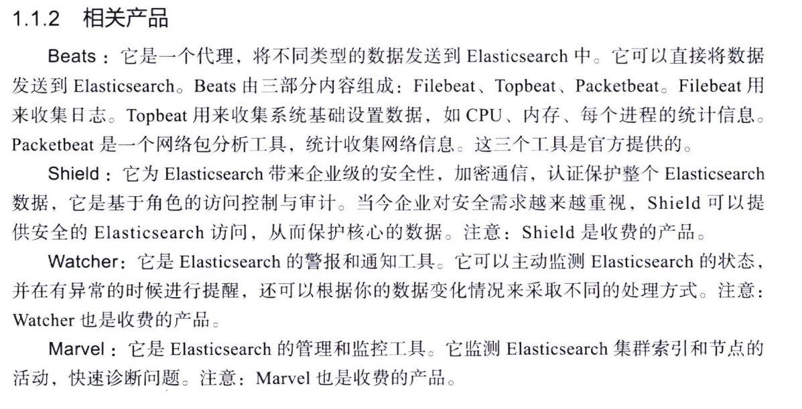
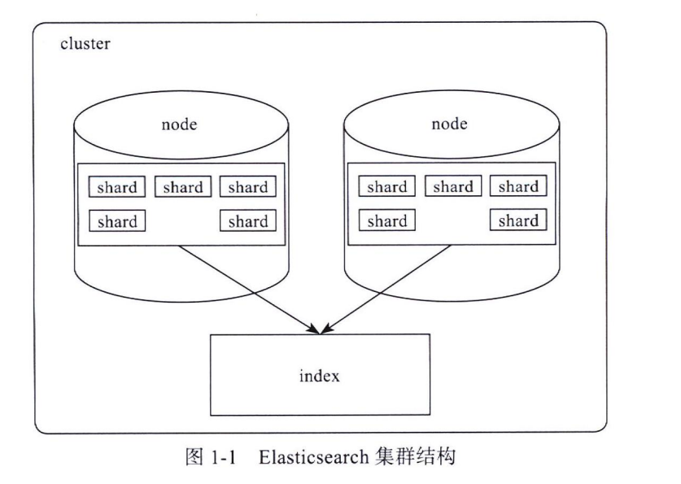
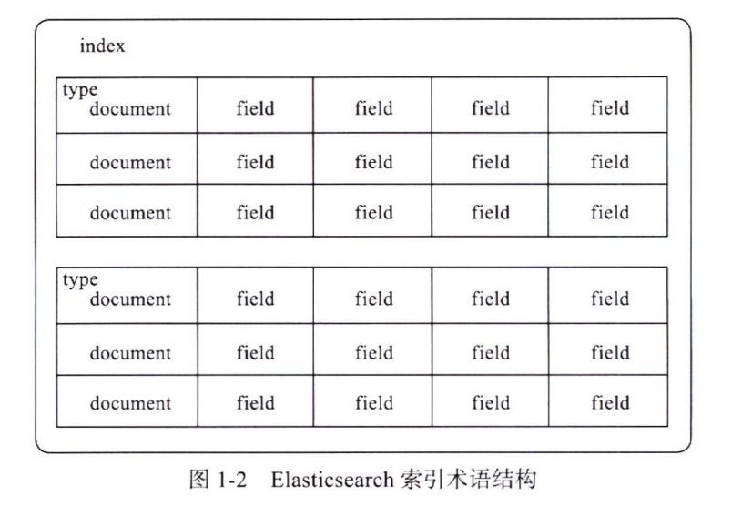
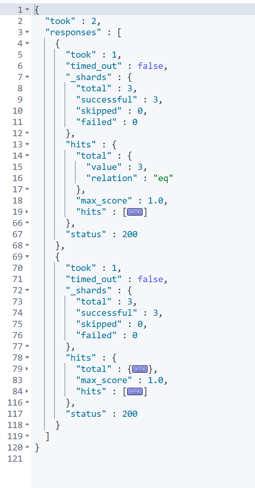
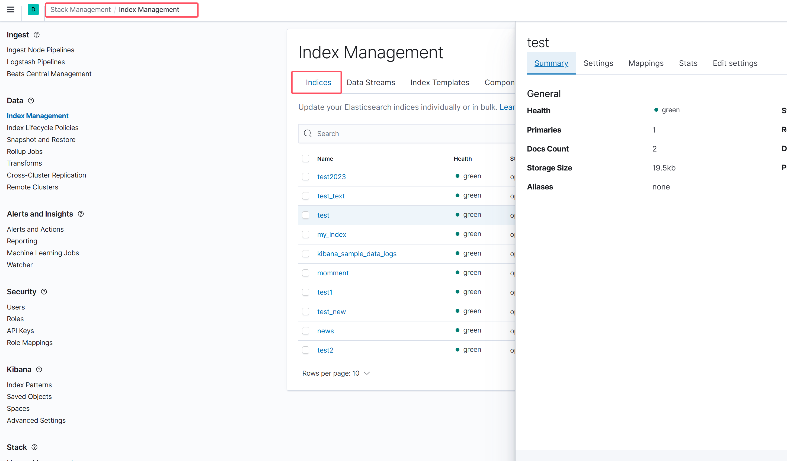
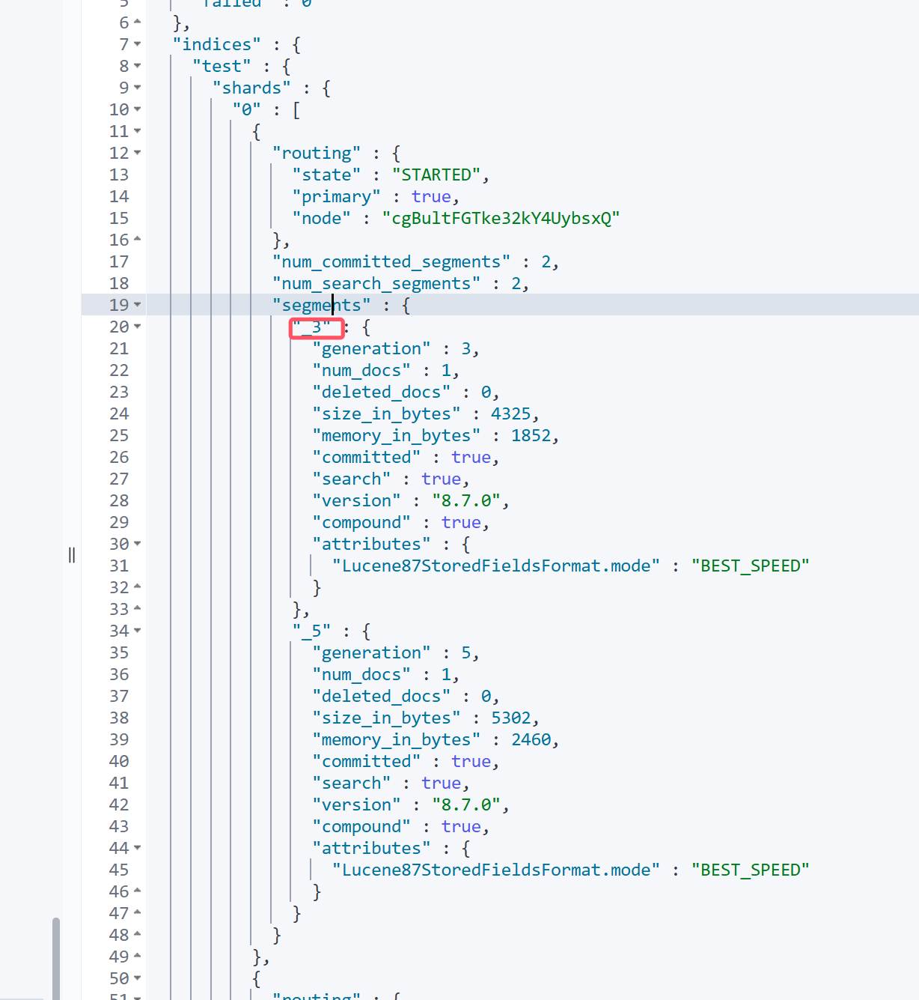
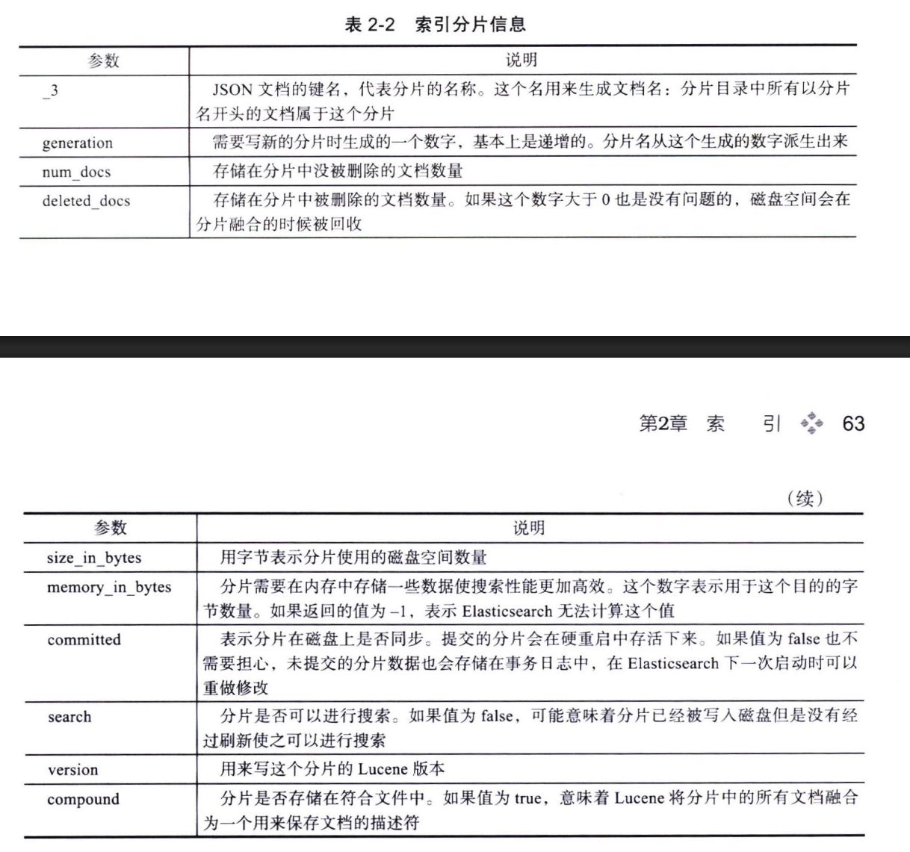
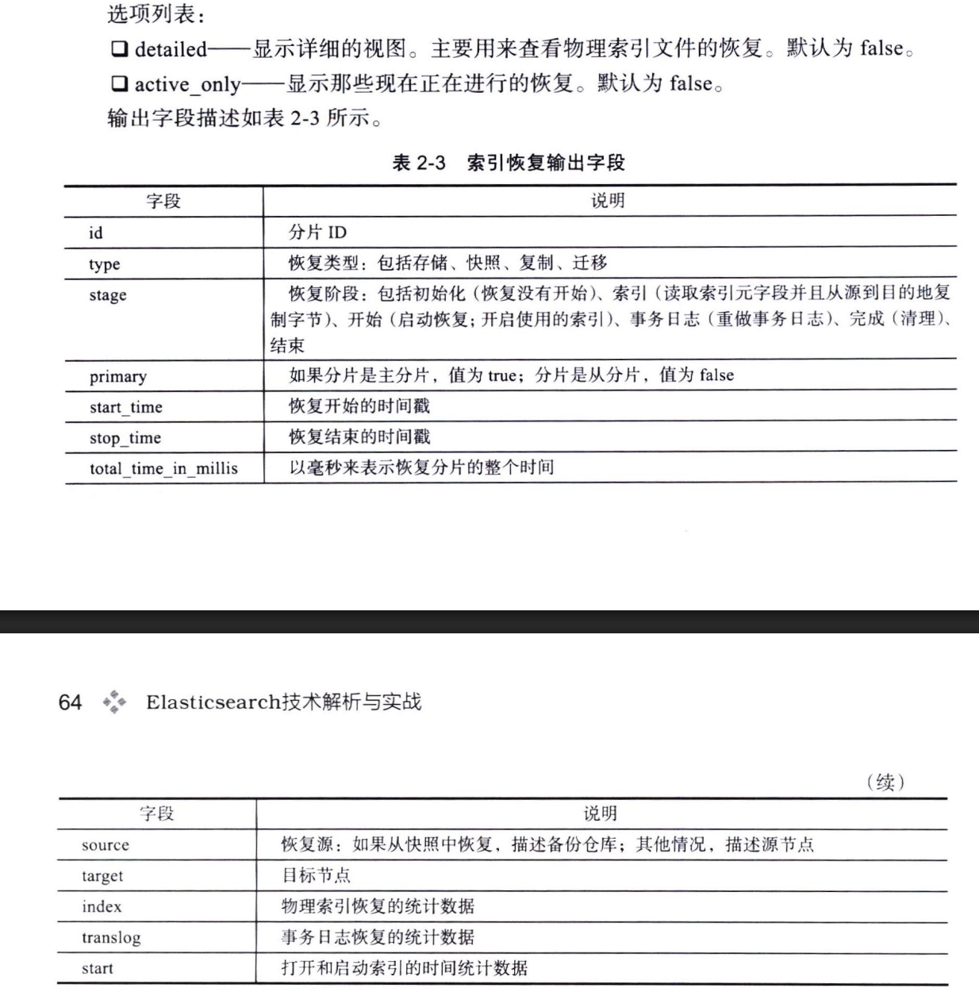

# 书籍介绍


> 17年的老书，主要用来过一些基础。

本书主要内容包括:

第1章“Elasticsearch 入门”,介绍 Elasticsearch 是什么、Apache Lucene 的基础知识、 Elasticsearch 的术语、JSON 介绍、Elasticsearch 的安装运行、Elasticsearch 的 HTTP 接口和 Elasticsearch 的 Java API 接口。 


第2章“索引”,介绍和 Elasticsearch 索引相关的接口,包括索引管理、索引映射管理、 索引别名、索引设置、索引监控、索引其他重要接口以及文档管理 


第3章“映射”,介绍 Elasticsearch 文档的内部结构,Elasticsearch 支持的字段类型,除 此之外,本章还将展示 Elasticsearch 内置的元字段,映射的参数和动态映射功能。

 

第4章“搜索”,详细介绍和搜索相关的知识,包括搜索的详细参数,搜索的评分机制、 滚动查询、系统内部隐藏内容的查询、搜索模板等;接着介绍 Elasticsearch 的**领域查询语言 DSL (Domain-specific Language)**相关的知识点;最后介绍 Elasticsearch 的精简查询接口。 


第5章“聚合”,聚合可以对文档中的数据进行统计汇总、分组等,通过聚合可以完成 很多的统计功能,该章介绍聚合相关的知识,包括度量聚合、分组聚合和管道聚合。 


第6章“集群管理”,详细介绍和集群相关的内容,包括集群的监控、集群分片迁移、 集群的节点配置、集群发现、集群平衡的原理和配置。


第7章“索引分词器”,介绍 Elasticsearch 的分词器和分词的原理,以及如何添加新的 分词器等;还介绍 Elasticsearch 的插件相关知识,包括插件安装等。 


第8章“高级配置”,介绍 Elasticsearch 的高级配置,包括网络配置、脚本配置、快照 和恢复配置、线程池配置和索引配置。


第9章“告警、监控和权限管理”,介绍 Elasticsearch 官方支持的几个比较好的插件: Watcher、Marvel、Shield,它们可以对 Elasticsearch 进行告警、监控和权限管理。 


第10章“ELK 应用”,介绍 Elasticsearch 与另外两个产品 Logstash 和 Kibana 如何组合 使用, Logstash 是对日志进行收集和处理,Kibana 是对存储在 Elasticsearch 中的索引进行展 示和报表分析;最后通过一个简单的示例来介绍 ELK 几个产品是如何关联的。


# 第1章 Elasticsearch 入门

## 1.1 es是什么

Elasticsearch (ES)是一个基于Lucene 构建的开源、分布式、RESTful 接口**全文搜索引擎**。

Elasticsearch 还是一个**分布式文档数据库**,其中每个字段均是被索引的数据且可被搜索, 它能够扩展至数以百计的服务器存储以及处理 PB级的数据。

优点：

- **横向可扩展性**:只需要增加一台服务器,做一点儿配置,启动一下 Elasticsearch 进 程就可以并入集群。 
- **分片机制提供更好的分布性**:同一个索引分成多个分片(sharding),这点类似于 HDFS 的块机制;分而治之的方式可提升处理效率。
- **高可用**:提供复制(replica)机制,一个分片可以设置多个复制,使得某台服务器在 岩机的情况下,集群仍旧可以照常运行,并会把服务器宕机丢失的数据信息复制恢 复到其他可用节点上。 
- **使用简单**:只需一条命令就可以下载文件,然后很快就能搭建一个站内搜索引擎。

相关产品：




## 1.2 全文搜索

> **全文搜索**是指计算机搜索程序通过扫描文章中的每一个词,对每一个词建立一个索引, 指明该词在文章中出现的次数和位置,当用户查询时,搜索程序就根据事先建立的索引进 行查找,并将查找的结果反馈给用户。

### Lucene 倒排索引（inverted index）

> 不是由记录来确定属性值,而是由属性值 来确定记录的位置,因而称为倒排索引。
>
> 倒排索引：包含属性值x的文档有 文档1、文档2
>
> ”正排索引“：文档1包含属性值x、y


例子：

```
假设有两篇文章1和文章2
文章1的内容为:Tom lives in Guangzhou, I live in Guangzhou too.
文章2的内容为:He once lived in Shanghai.
```

1、分词并建立索引


> 以live 这行为例,我们说明一下该结构:live 在文章1中出现了2次,文章2中出现 了一次,它的出现位置为“2,5,2”这表示什么呢?我们需要结合文章号和出现频率来分析, 文章1中出现了2次,那么“2,5”就表示 live在文章1中出现的两个位置,文章2中出现 了一次,剩下的“2”就表示 live 是文章 2中的第2个关键字。


2、数据结构实现

实现时,Lucene 将上面三列分别作为**词典文件(Term Dictionary)、频率文件(frequencies)、 位置文件(positions)** 保存。其中词典文件不仅保存了每个关键词,还保留了指向频率文件和 位置文件的指针,通过指针可以找到该关键字的频率信息和位置信息。

Lucene 中使用了 **felid** 的概念,用于表达信息所在位置(如标题中、文章中、URL 中)。（即字段名）


3、压缩算法

为了减小索引文件的大小,Lucene 对索引还使用了压缩技术。 

首先,对词典文件中的关键词（文本）进行了压缩,关键词压缩为<前缀长度,后缀>,例如: 当前词为“阿拉伯语”,上一个词为“阿拉伯”,那么“阿拉伯语”压缩为<3,语 > 

其次大量用到的是对数字的压缩,数字只保存与上一个值的差值(这样可以减少数字的 长度,进而减少保存该数字需要的字节数)。例如当前文章号是16389(不压缩要用3个字 节保存),上一文章号是16382,压缩后保存7(只用一个字节)。


## 1.3 Elasticsearch 术语及概念

1、索引词(term) 

在 Elasticsearch 中索引词(term)是一个能够被索引的精确值。foo、Foo、FOO几个单 词是不同的索引词。索引词(term)是可以通过 term 查询进行准确的搜索。


2、文本 (text) 

文本是一段普通的非结构化文字。通常,文本会被分析成一个个的索引词,存储在 Elasticsearch 的索引库中。


3、分析 (analysis) 

> 其实就是分词

分析是将文本转换为索引词的过程,分析的结果依赖于分词器。比


4、集群(cluster) 

集群由一个或多个节点组成,对外提供服务,对外提供索引和搜索功能。在所有节点, 一个集群有一个唯一的名称默认为“Elasticsearch”。此名称是很重要的,因为每个节点只 能是集群的一部分,当该节点被设置为相同的集群名称时,就会自动加入集群。请注意,一个节点只能加入一个集群。此外,你还可以拥有多个独立的集群,每个集群都有其不同的集群名称。




5、节点(node) 

一个节点是一个逻辑上独立的服务,它是集群的一部分,可以存储数据,并参与集群的索引和搜索功能。

在网络中 Elasticsearch 集群通过节点名称进行管理和通信。一个节点可以被配置加入一个特定的集 群。默认情况下,每个节点会加入名为 Elasticsearch。


6、路由(routing) 

当存储一个文档的时候,它会存储在唯一的主分片中,具体哪个分片是通过散列值进行 选择。默认情况下,这个值是由文档的ID 生成。如果文档有一个指定的父文档,则从父文 档ID 中生成,该值可以在存储文档的时候进行修改。


7、分片(shard) 

分片是单个 Lucene 实例,这是 Elasticsearch 管理的比较底层的功能。索引是指向主分片和副本分片的逻辑空间。

分片主要有两个很重要的原因是:

- 允许水平分割扩展数据。
- 允许分配和并行操作(可能在多个节点上)从而提高性能和吞吐量。

> 有文档存储数量限制,你可以在一个 单一的Lucene 索引中存储的最大值为 lucene-5843,极限是2147483519 (= integer. max_value - 128, 2^31-128)个文档。
>
> _cat/shards 监控分片的大小


8、主分片(primary shard) 

每个文档都存储在一个分片中,当你存储一个文档的时候,系统会首先存储在主分片 中,然后会复制到不同的副本中。默认情况下,一个索引有5个主分片。你可以事先制定分 片的数量,当分片一旦建立,则分片的数量不能修改。


9、副本分片(replica shard) 每一个分片有零个或多个副本。

副本主要是主分片的复制,其中有两个目的: 

- 增加高可用性:当主分片失败的时候,可以从副本分片中选择一个作为主分片。 
- 提高性能:当查询的时候可以到主分片或者副本分片中进行查询。默认情况下,一 个主分片配有一个副本,但副本的数量可以在后面动态地配置增加。副本分片必须部署在不同的节点上,不能部署在和主分片相同的节点上。


10、复制(replica) 

复制是一个非常有用的功能,不然会有**单点问题**（单服务不可用造成的问题）。当网络中的某个节点出现问题的时候,复制可以对故障进行转移,保证系统的高可用。因此,Elasticsearch 允许你创建一个或 多个拷贝,你的索引分片就形成了所谓的副本或副本分片。


11、索引 (index) 

索引是具有相同结构的文档集合。


12、类型(type) 

在索引中,可以定义一个或多个类型,**类型是索引的逻辑分区**。

在一般情况下,一种类 型被定义为具有一组公共字段的文档。例如,让我们假设你运行一个博客平台,并把所有的 数据存储在一个索引中。在这个索引中,你可以定义一种类型为用户数据,一种类型为博客 数据,另一种类型为评论数据。==》es7.0后去掉了type配置，固定为_doc


13、文档 (document) 

文档是存储在 Elasticsearch 中的一个 JSON 格式的字符串。




14、映射(mapping) 

映射像关系数据库中的表结构,每一个索引都有一个映射,它定义了索引中的每一个字段类型（properitis）,以及一个索引范围内的设置。

一个映射可以事先被定义,或者在第一次存储文档的 时候自动识别


15、字段(field) 

文档中包含零个或者多个字段,字段可以是一个简单的值(例如字符串、整数、日期), 也可以是一个数组或对象的嵌套结构。


16、来源字段(source field) 

默认情况下,你的原文档将被存储在_source 这个字段中,当你查询的时候也是返回这 个字段。


17、主键(ID) 

ID 是一个文件的唯一标识,如果在存库的时候没有提供ID,系统会自动生成一个ID, 文档的 index/type/id 必须是唯一的


## 1.4  API对外接口

### API约定

#### 多索引参数

```bash
# 查询多个指定索引
GET /index1,index2,index3/_search
{
  "query": { "match_all": {} }
}

# 使用通配符
GET /test*/_search                    # 所有test开头的索引
GET /log-2024-*/_search              # 2024年所有日志索引

# 排除特定索引
GET /test*,-test3/_search            # 所有test开头，排除test3
GET /2024-*, -2024-12*/_search       # 2024年数据，排除12月

# _all 查询所有索引（慎用，性能影响大）
GET /_all/_search
{
  "query": { "match_all": {} },
  "size": 10  # 限制结果数
}

# 查询指定多个索引模式
GET /prod*,dev*,test*/_search
```

多索引查询还支持以下参数: 

- ignore unavailable :当索引不存在或者关闭的时候,是否忽略这些索引,值为true 和false 
- allow_no_indices :当使用通配符查询所有索引的时候,当有索引不存在的时候是否 返回查询失败。值为true 和 false。 
- expand wildcards :控制通配符索引表达式匹配具体哪一类的索引,值为 open. close, none, all open 表示只支持开启状态的索引, close 表示只支持关闭状态的索 引, none 表示不可用, all 表示同时支持 open 和 close 索引。

ignore unavailable 

```bash
# 忽略不存在的索引（默认false）
GET /existing_index,non_existent_index/_search?ignore_unavailable=true
{
  "query": { "match_all": {} }
}

# 响应：只返回existing_index的结果，不报错

# 如果设为false（默认）
GET /existing_index,non_existent_index/_search?ignore_unavailable=false
# 响应：404错误，索引不存在
```

**allow_no_indices**

```bash
# 通配符匹配不到索引时的行为（默认true）
GET /non_existent_*/_search?allow_no_indices=true
# 响应：返回空结果，不报错

GET /non_existent_*/_search?allow_no_indices=false  
# 响应：404错误，没有匹配的索引
```

**expand_wildcards**

```bash
# 控制通配符匹配的索引状态
GET /test*/_search?expand_wildcards=open          # 只匹配开启的索引
GET /test*/_search?expand_wildcards=closed       # 只匹配关闭的索引  
GET /test*/_search?expand_wildcards=all          # 匹配所有状态索引
GET /test*/_search?expand_wildcards=none         # 禁用通配符
```


#### 日期筛选

> 日期筛选可以限定时间序列索引的搜索范围
>
> ==》索引名称必须包含日期模式（如 `test-2024.01.15`）

```
日期筛选的语法为:
<static_name{date_math_expr{date_format|time_zone}}>

语法解释:
static_name:索引的名称:
date_math_expr:动态日期计算表达式;
date format:日期格式:
time_zone:时区,默认为 UTC。
```

示例：

```bash
curl -XGET '127.0.0.1:9200/<logstash-{now%2Fd-2d}>/_search' {
"query" : {...}
}
```


#### 通用参数

> pretty 参数

?pretty=true时,请求的返回值是经过格 式化后的JSON 数据，format=yaml  --》 YAML格式

> human 参数

human=true 的时候输出更适合人类阅读的数据, 但这会消耗更多的资源,默认是 false

> 日期表达式

大多数参数接受格式化日期表达式,如范围查询 gt(大于) 和lt(小于), 或在日期聚合中用 from to 来表达时间范围。表达式设定的日期为 now 或者日期字符串加 +1h   -1h   /h分别表示 增加一小时。 减少一个小时。 上一个小时。 支持的时间单位为:y(年)、M(月)、w(周)、d(日)、h(小时)、m(分钟)、s(秒)。

> 响应过滤(filter_path)

所有的返回值可以通过 filter_path 来减少返回值的内容,多 个值可以用逗号分开。例：

```bash
GET /test/_search?filter_path=took,hits.hits._id,hits.hits._score,,hits.hits._source.name
==》
{
  "took" : 0,
  "hits" : {
    "hits" : [
      {
        "_id" : "1",
        "_score" : 1.0,
        "_source" : {
          "name" : "abw"
        }
      },
      {
        "_id" : "2",
        "_score" : 1.0,
        "_source" : {
          "name" : "狂神说java"
        }
      }
    ]
  }
}

# 它也支持通配符*匹配任何部分字段的名称,我们可以用两个通配符** 来匹配不确定名称的字段
GET /test/_search?filter_path=hits.hits._source.**
==》
{
  "hits" : {
    "hits" : [
      {
        "_source" : {
          "name" : "abw",
          "age" : 10,
          "desc" : "还行",
          "tags" : [
            "技术宅",
            "帅哥",
            "渣男"
          ]
        }
      },
      {
        "_source" : {
          "name" : "狂神说java",
          "age" : 10,
          "desc" : "还行",
          "tags" : [
            "技术宅",
            "帅哥",
            "渣男"
          ],
          "title" : "love China"
        }
      }
    ]
  }
}

```


> flat_settings参数

```bash
flat_settings参数不能用在 _searchAPI 中。flat_settings是用于集群设置和索引设置相关的API，用于使返回紧凑

1. 获取集群设置（正确用法）
GET /_cluster/settings?flat_settings=true
2. 获取索引设置（正确用法）
GET /test/_settings?flat_settings=true
3. 获取索引映射（正确用法）
GET /test/_mapping?flat_settings=true
```

## 1.5 批量操作

### _bulk

####  **基本语法结构**

```json
POST /{index}/_bulk
{ "action": { "metadata" } }   # 第1行：操作指令
{ "data" }                    # 第2行：数据文档
{ "action": { "metadata" } }   # 第3行：操作指令  
{ "data" }                    # 第4行：数据文档
```

#### **四种操作类型**

**1. index - 索引文档（存在则覆盖）**

```json
POST /orders/_bulk
{"index": {"_id": "1", "routing": "customer_100"}}
{"order_id":"ORD001","customer_id":100,"product_name":"Laptop","amount":999.99}
{"index": {"_id": "2", "routing": "customer_100"}}
{"order_id":"ORD002","customer_id":100,"product_name":"Mouse","amount":29.99}
```

**2. create - 创建文档（存在则报错）**

```json
POST /orders/_bulk  
{"create": {"_id": "3", "routing": "customer_200"}}
{"order_id":"ORD003","customer_id":200,"product_name":"Keyboard","amount":79.99}
```

**3. update - 更新文档**

```json
POST /orders/_bulk
{"update": {"_id": "1", "routing": "customer_100"}}
{"doc": {"status": "shipped", "shipped_at": "2024-01-16"}}
```

**4. delete - 删除文档**

```json
POST /orders/_bulk
{"delete": {"_id": "2", "routing": "customer_100"}}
```


#### **NDJSON格式要求**

> NDJSON 是一种简单的格式，每个JSON对象用换行符分隔：

```json
// ✅ 正确：严格的换行分隔
{"index":{}}
{"field":"value"}
{"index":{}}
{"field":"value"}

// ❌ 错误：缺少换行
{"index":{}}{"field":"value"}

// ❌ 错误：多出逗号
{"index":{}},
{"field":"value"}
```

==》 在代码中传参是通过[]数组传递。

```php
    public function getActionAndMetaData($index, $type, $id) {
        return '{"update":{"_index":"' . $index . '","_type":"' . $type . '","_id":' . $id . '}}';
    }
    
     public function getOptionalSource($id, $updateTime) {
        return '{"doc":{"id":"' . $id . ',"updateTime":' . $updateTime . '},"upsert":{"id":"' . $id . '", ',"updateTime":' . $updateTime . '}}';
    }
    
         foreach ($infos as $info) {
            $data[] = $this->getActionAndMetaData('search_index', '_doc', $info['infoId']);
            $data[] = $this->getOptionalSource($info['infoId'],  $time);
        }
```


### _msearch API（多搜索）

```
POST /_msearch
{"index": "orders"}
{"query": {"match": {"customer_id": 100}}, "size": 10}
{"index": "orders"}
{"query": {"match": {"customer_id": 200}}, "size": 10}

```




### _mget 多文档查询

#### **1. 基本语法（全路径查询）**

```json
POST /_mget
{
  "docs": [
    {
      "_index": "secisland",
      "_type": "_doc",  # ES 7.x 固定为 _doc
      "_id": "1"
    },
    {
      "_index": "secisland", 
      "_type": "_doc",
      "_id": "2"
    }
  ]
}

==》
{
  "docs" : [
    {
      "_index" : "secisland",
      "_type" : "_doc",
      "_id" : "1",
      "found" : false
    },
    {
      "_index" : "secisland",
      "_type" : "_doc",
      "_id" : "2",
      "_version" : 1,
      "_seq_no" : 6,
      "_primary_term" : 1,
      "found" : true,
      "_source" : {
        "counter" : 2,
        "tags" : [
          "green"
        ]
      }
    }
  ]
}
```

#### **2. 简化语法**

**方式1：指定索引和类型**

```json
# 而是7.0 可以不指定type  POST /secisland/_mget
POST /secisland/_doc/_mget
{
  "docs": [
    {"_id": "1"},
    {"_id": "2"}
  ]
}
```

**方式2：使用ids数组（最简）**

```json
POST /secisland/_doc/_mget
{
  "ids": ["1", "2"]
}
```


# 第2章 索引

## 2.1 索引管理

### 2.1.1 CURD索引

创建索引的时候可以通过修改 number_of_shards 和 number_of_replicas 参数的数量来修 改分片和副本的数量。在默认的情况下分片的数量是5个,副本的数量是1个。

```bash
# 例如,创建三个主分片,两个副本分片的索引。
PUT /secisland/
{
  "settings": {
    "index": {
      "number_of_shards": 3,
      "number_of_replicas": 2
    }
  }
}

可简写为：
{"settings": {"number_of_shards": 3, "number_of_replicas": 2}
}


# 修改副本数量
PUT /secisland/_settings/
{
  "number_of_replicas": 2
}
```


mapping设置：

```bash
POST /secisland/_mapping/
{
  "properties": {
    "logType": {
      "type": "keyword"
    }
  }
}

# es 2.0 版本：
POST /secisland/_mapping/
{
  "secilog": {
    "properties": {
      "logType": {
        "type": "text",
        "index": "not_analyzed"
      }
    }
  }
}

```

注：**Elasticsearch 5.x+ 的重要变化**

1. **移除了类型（Type）**
   - 旧版本：`index/type`结构
   - 新版本：每个索引只有一个隐式的 `_doc`类型
2. **字段类型变化**
   - `string`类型拆分为 `text`和 `keyword`
   - `index: not_analyzed`被 `type: keyword`替代
   - `index: analyzed`被 `type: text`替代
3. **映射API变化**
   - 不再需要在mapping中指定type名称


```bash
DELETE /secisland/
GET /secisland/

# 判断类型是否存在
HEAD /secisland
==>200 - OK
==>{"statusCode":404,"error":"Not Found","message":"404 - Not Found"}
```


### 2.1.2 打开/关闭索引

打开关闭索引接口允许关闭一个打开的索引或者打开一个已经关闭的索引。关闭的索 引只能显示索引元数据信息,不能够进行读写操作。

```bash
# 打开/关闭索引的方式是{ 索引名 }/_close 或者/{ 索引名 }/_open
 
POST /secisland/_close
 
# 关闭后不能：搜索、索引文档、更新文档
PUT /secisland/_doc/1
{
  "logType": 1
}
 {
  "error" : {
    "root_cause" : [
      {
        "type" : "index_closed_exception",
        "reason" : "closed",
        "index_uuid" : "Qc6-xbtPSw6vKysolY04sw",
        "index" : "secisland"
      }
    ],
    "type" : "index_closed_exception",
    "reason" : "closed",
    "index_uuid" : "Qc6-xbtPSw6vKysolY04sw",
    "index" : "secisland"
  },
  "status" : 400
}

```


#### **索引关闭的影响**

**1. 资源占用大幅减少**

- **内存释放**：字段数据、索引缓存被清除
- **磁盘IO**：不再有索引刷新、合并操作
- **文件句柄**：索引文件句柄被释放
- **集群负载**：分片分配、恢复等操作停止

**2. 操作限制**

- **❌ 不能**：搜索、索引文档、更新文档
- **❌ 不能**：执行聚合分析
- **❌ 不能**：修改映射和设置（需先打开）
- **✅ 可以**：查看索引元数据、设置、映射
- **✅ 可以**：删除关闭的索引
- **✅ 可以**：打开索引恢复使用


#### **如何判断索引状态**

**方法1：使用_cat API（最直观）**

```bash
GET /_cat/indices/secisland?v&h=index,status,health,pri,rep,docs.count,store.size

# 返回示例：
# index       status  health pri rep docs.count store.size
# test_index  close   -      3   2   0          0b
# open_index  open    green  3   2   1000000    1.2gb
```

**状态说明：**

- `status=open`：索引已打开
- `status=close`：索引已关闭
- `health=-`：关闭的索引没有健康状态

**方法2：查看索引详情**

```json
GET /secisland/_stats
==》
{
  "error" : {
    "root_cause" : [
      {
        "type" : "index_closed_exception",
        "reason" : "closed",
        "index_uuid" : "Qc6-xbtPSw6vKysolY04sw",
        "index" : "secisland"
      }
    ],
    "type" : "index_closed_exception",
    "reason" : "closed",
    "index_uuid" : "Qc6-xbtPSw6vKysolY04sw",
    "index" : "secisland"
  },
  "status" : 400
}
```

- **如果索引打开**：返回详细的统计信息
- **如果索引关闭**：返回错误 `index_closed_exception`

**方法3：使用集群状态API**

```json
GET /_cluster/state?filter_path=metadata.indices.secisland.state

# 返回示例：
{
  "metadata": {
    "indices": {
      "test_index": {
        "state": "close"  # 或 "open"
      }
    }
  }
}
```


### 2.1.3 kibana中类似head的索引管理

#### s**tack Management 模块**

Kibana 的图形化管理界面（**推荐用于日常监控**）：

**访问路径：**

```markdown
Kibana左侧菜单 → Stack Management → Index Management
```

**功能包括：**

- **索引列表**：查看所有索引的状态、文档数、大小等
- **索引详情**：点击索引名查看详细设置、映射、统计信息
- **索引生命周期管理**：配置 ILM 策略
- **模板管理**：查看和创建索引模板
- **数据流管理**：管理数据流（Elasticsearch 7.9+）




## 2.2 索引映射管理(_mapping)

```bash
# 更新索引映射
POST /secisland/_mapping/
{
  "properties": {
    "logType": {
      "type": "keyword"
    }
  }
}

#获取映射
GET /secisland/_mapping/
==>
{
  "secisland" : {
    "mappings" : {
      "dynamic_templates" : [],
      "properties" : {
        "logType" : {
          "type" : "text"
        }
      }
    }
  }
}


# 获取字段映射 获取文档字段接口允许你搜索一个或多个字段 host:port/{index}/{type}/_mapping/field/{field}
GET /secisland/_mapping/field/logType
==>
{
  "secisland" : {
    "mappings" : {
      "logType" : {
        "full_name" : "logType",
        "mapping" : {
          "logType" : {
            "type" : "text"
          }
        }
      }
    }
  }
}


```


**为什么字段映射API返回复杂结构？**

**原因1：支持嵌套字段和对象字段**

对于复杂结构，字段映射API能更好地展示层次关系：

```json
# 假设有这样的映射
{
  "user": {
    "type": "object",
    "properties": {
      "name": { "type": "text" },
      "address": {
        "type": "object", 
        "properties": {
          "city": { "type": "keyword" }
        }
      }
    }
  }
}

# 字段映射API返回
GET /index/_mapping/field/user.name
{
  "index": {
    "mappings": {
      "user.name": {
        "full_name": "user.name",     # 点分表示法
        "mapping": {
          "name": {
            "type": "text"
          }
        }
      }
    }
  }
}
```

**原因2：保持API一致性**

字段映射API需要处理各种复杂场景，统一的结构更易于解析。


## 2.3 索引别名(_alias)

Elasticsearch 的别名机制有点像数据库中的视 图。例如:为索引 test1 增加一个别名 alias1。

### 基本使用


创建别名：

```bash
# PUT 创建别名
PUT /secisland/_alias/2013
{
  "routing": "1",
  "filter": {
    "term": {
      "year": 2013
    }
  }
}

# 1. 为索引增加别名 为单个索引增加别名
POST /_aliases
{
  "actions": [
    {
      "add": {
        "index": "secisland",
        "alias": "alias1"
      }
    }
  ]
}

# 2. 删除别名
POST /_aliases
{
  "actions": [
    {
      "remove": {
        "index": "test1",
        "alias": "alias1"
      }
    }
  ]
}

# 3. 修改别名（先删后加）
POST /_aliases
{
  "actions": [
    {
      "remove": {
        "index": "test1",
        "alias": "alias1"
      }
    },
    {
      "add": {
        "index": "test1", 
        "alias": "alias2"
      }
    }
  ]
}
# 4. 一个别名关联多个索引
## 方式1：分别添加
POST /_aliases
{
  "actions": [
    {
      "add": {
        "index": "test1",
        "alias": "alias1"
      }
    },
    {
      "add": {
        "index": "test2", 
        "alias": "alias1"
      }
    }
  ]
}
## 方式2：使用 indices 数组（推荐）
POST /_aliases
{
  "actions": [
    {
      "add": {
        "indices": ["test1", "test2"],
        "alias": "alias1"
      }
    }
  ]
}
## 方式3：使用通配符
POST /_aliases
{
  "actions": [
    {
      "add": {
        "index": "test*",
        "alias": "all_test_indices"
      }
    }
  ]
}
```


查看别名：

```bash
# 1. 查看所有别名（最常用）
GET /_cat/aliases?v
alias                    index                           filter routing.index routing.search is_write_index
alias1                   secisland                       -      -             -              -


GET /secisland/_alias
==》
{
  "secisland" : {
    "aliases" : {
      "alias1" : { }
    }
  }
}

```


删除别名：

```
DELETE /secisland/_alias/alias1
```


### 过滤索引别名

==》其实就是通过filter将特定条件的文档作为索引别名的内容，类似于过滤出了个子集。

```bash
# 1. 创建索引并设置映射
PUT /test1
{
  "mappings": {
    "properties": {
      "user": {
        "type": "keyword"
      }
    }
  }
}

# 2. 创建带过滤条件的别名
POST /_aliases
{
  "actions": [
    {
      "add": {
        "index": "test1",
        "alias": "alias2",
        "filter": {
          "term": {
            "user": "kimchy"
          }
        }
      }
    }
  ]
}


```


例子：

```bash
# 创建用户索引
PUT /users
{
  "mappings": {
    "properties": {
      "user_id": {
        "type": "integer"
      },
      "status": {
        "type": "keyword"
      },
      "region": {
        "type": "keyword"
      }
    }
  }
}

# 创建多个过滤别名
POST /_aliases
{
  "actions": [
    {
      "add": {
        "index": "users",
        "alias": "active_users",
        "filter": {
          "term": {
            "status": "active"
          }
        }
      }
    },
    {
      "add": {
        "index": "users",
        "alias": "us_users",
        "filter": {
          "term": {
            "region": "US"
          }
        }
      }
    },
    {
      "add": {
        "index": "users",
        "alias": "user_100",
        "routing": "100",
        "filter": {
          "term": {
            "user_id": 100
          }
        }
      }
    }
  ]
}

# 插入mock数据
POST /users/_bulk
{"index":{}}
{"user_id":1,"status":"active","region":"US"}
{"index":{}}
{"user_id":2,"status":"active","region":"EU"}
{"index":{}}
{"user_id":3,"status":"inactive","region":"US"}
{"index":{}}
{"user_id":4,"status":"active","region":"ASIA"}
{"index":{}}
{"user_id":5,"status":"suspended","region":"US"}
{"index":{}}
{"user_id":6,"status":"active","region":"EU"}
{"index":{}}
{"user_id":7,"status":"active","region":"ASIA"}
{"index":{}}
{"user_id":8,"status":"inactive","region":"US"}
{"index":{}}
{"user_id":9,"status":"active","region":"EU"}
{"index":{}}
{"user_id":10,"status":"active","region":"US"}
{"index":{}}
{"user_id":100,"status":"active","region":"US"}
{"index":{}}
{"user_id":101,"status":"inactive","region":"EU"}
{"index":{}}
{"user_id":102,"status":"active","region":"ASIA"}


# 搜索活跃用户
GET /active_users/_search
{
  "query": {
    "match_all": {}
  }
}

# 搜索美国用户
GET /us_users/_search
{
  "size": 10
}

```


### 路由索引

```bash
# 1、创建带路由功能的订单索引
PUT /orders
{
  "mappings": {
    "properties": {
      "order_id": {
        "type": "keyword"
      },
      "customer_id": {
        "type": "integer"
      },
      "product_name": {
        "type": "keyword"
      },
      "amount": {
        "type": "float"
      },
      "status": {
        "type": "keyword"
      },
      "created_at": {
        "type": "date"
      }
    }
  },
  "settings": {
    "number_of_shards": 3
  }
}

# 2. 插入模拟订单数据（使用路由）
POST /orders/_bulk
{"index": {"routing": "customer_100"}}
{"order_id":"ORD001","customer_id":100,"product_name":"Laptop","amount":999.99,"status":"completed","created_at":"2024-01-10"}
{"index": {"routing": "customer_100"}}
{"order_id":"ORD002","customer_id":100,"product_name":"Mouse","amount":29.99,"status":"completed","created_at":"2024-01-12"}
{"index": {"routing": "customer_200"}}
{"order_id":"ORD003","customer_id":200,"product_name":"Keyboard","amount":79.99,"status":"pending","created_at":"2024-01-11"}
{"index": {"routing": "customer_200"}}
{"order_id":"ORD004","customer_id":200,"product_name":"Monitor","amount":299.99,"status":"shipped","created_at":"2024-01-09"}
{"index": {"routing": "customer_300"}}
{"order_id":"ORD005","customer_id":300,"product_name":"Tablet","amount":399.99,"status":"completed","created_at":"2024-01-08"}
{"index": {"routing": "customer_100"}}
{"order_id":"ORD006","customer_id":100,"product_name":"Headphones","amount":149.99,"status":"completed","created_at":"2024-01-15"}

# 3. 创建路由别名
# 为客户100创建路由别名
POST /_aliases
{
  "actions": [
    {
      "add": {
        "index": "orders",
        "alias": "customer_100_orders",
        "routing": "customer_100"
      }
    }
  ]
}

# 查询路由别名
GET /customer_100_orders/_search
{
  "query": {
    "term": {
      "status": "completed"
    }
  }
}
```


## 2.4 索引配置(_settings)

### 配置操作

```bash
# 获取配置
GET /secisland/_settings
{
  "secisland" : {
    "settings" : {
      "index" : {
        "verified_before_close" : "true",
        "refresh_interval" : "30s",
        "translog" : {
          "sync_interval" : "5s",
          "durability" : "async"
        },
        "provided_name" : "secisland",
        "max_result_window" : "65536",
        "creation_date" : "1767084188580",
        "unassigned" : {
          "node_left" : {
            "delayed_timeout" : "5m"
          }
        },
        "analysis" : {
          "analyzer" : {
            "content" : {
              "type" : "custom",
              "tokenizer" : "whitespace"
            }
          }
        },
        "number_of_replicas" : "2",
        "uuid" : "O5uIVeZ2S2e7DGJC_hBbRg",
        "version" : {
          "created" : "7100199"
        },
        "routing" : {
          "allocation" : {
            "include" : {
              "_tier_preference" : "data_content"
            }
          }
        },
        "number_of_shards" : "5"
      }
    }
  }
}


# 更新索引配置
PUT /secisland/_settings
{
"index" : {"number_of_replicas" : 4}
}

# 更新分词器
POST /secisland/_close
PUT /secisland/_settings
{
  "index": {
    "analysis": {
      "analyzer": {
        "content": {
          "type": "custom",
          "tokenizer": "standard"
        }
      }
    }
  }
}
POST /secisland/_open

```


### 索引分析

索引分析(analysis)是这样一个过程:首先,把一个文本块分析成一个个单独的词 (term),为了后面的倒排索引做准备。然后标准化这些词为标准形式,提高它们的“可搜索性”。

这些工作是分析器(analyzers)完成的。

一个分析器(analyzers)是一个组合,用于将 三个功能放到一起: 

- **字符过滤器**:字符串经过字符过滤器(character filter)处理,它们的工作是在标记化 之前处理字符串。字符过滤器能够去除 HTML 标记,或者转换“&”为“and" 
- **分词器**:分词器(tokenizer)被标记化成独立的词。一个简单的分词器(tokenizer) 可以根据空格或逗号将单词分开。 
- **标记过滤器**:每个词都通过所有标记过滤(token_filters)处理,它可以修改词(例如 将 "Quick" 转为小写),去掉词(例如连接词像“a”、“and”、“ the”等),或者增加 词(例如同义词像“jump”和“leap")。


示例：

```bash
POST /_analyze
{
  "char_filter": [
    "html_strip"
  ],
  "tokenizer": "keyword",
  "filter": [ //tokn过滤器
    "uppercase"
  ],
  "text": "This is a <b>test</b>"
}


==》
{
  "tokens" : [
    {
      "token" : "THIS IS A TEST",
      "start_offset" : 0,
      "end_offset" : 21,
      "type" : "word",
      "position" : 0
    }
  ]
}
```

"explain" : true 返回详情

```bash

POST /_analyze
{
  "tokenizer": "keyword",
  "filter": [
    "uppercase"
  ],
  "char_filter": [
    "html_strip"
  ],
  "text": "This is a <b>test</b>",
  "explain" : true
}

==》
{
  "detail" : {
    "custom_analyzer" : true,
    "charfilters" : [
      {
        "name" : "html_strip",
        "filtered_text" : [
          "This is a test"
        ]
      }
    ],
    "tokenizer" : {
      "name" : "keyword",
      "tokens" : [
        {
          "token" : "This is a test",
          "start_offset" : 0,
          "end_offset" : 21,
          "type" : "word",
          "position" : 0,
          "bytes" : "[54 68 69 73 20 69 73 20 61 20 74 65 73 74]",
          "positionLength" : 1,
          "termFrequency" : 1
        }
      ]
    },
    "tokenfilters" : [
      {
        "name" : "uppercase",
        "tokens" : [
          {
            "token" : "THIS IS A TEST",
            "start_offset" : 0,
            "end_offset" : 21,
            "type" : "word",
            "position" : 0,
            "bytes" : "[54 48 49 53 20 49 53 20 41 20 54 45 53 54]",
            "positionLength" : 1,
            "termFrequency" : 1
          }
        ]
      }
    ]
  }
}


```


### 索引模板

#### 1、基本操作

索引模板就是创建好一个索引参数设置(settings)和映射(mapping)的模板,

在创建新索引的时候指定模板名称就可以使用模板定义好的参数设置和映射。

es6.0 用_template， es7.0 后用 _index_template：

```bash
DELETE /_template/template_1
DELETE /_template/template_2

# 创建可组合模板1
PUT /_index_template/template_1
{
  "index_patterns": ["te*"],
  "priority": 1,
  "template": {
    "settings": {
      "number_of_shards": 2,
      "number_of_replicas": 1,
      "index.refresh_interval": "30s"
    },
    "mappings": {
      "properties": {
        "timestamp": {
          "type": "date"
        },
        "message": {
          "type": "text"
        }
      }
    },
    "aliases": {
      "all_test_indices": {}
    }
  }
}

# 创建可组合模板2
PUT /_index_template/template_2
{
  "index_patterns": ["te*"],
  "priority": 2,
  "template": {
    "settings": {
      "number_of_shards": 3,
      "index.refresh_interval": "10s"
    },
    "mappings": {
      "properties": {
        "timestamp": {
          "type": "date",
          "format": "yyyy-MM-dd HH:mm:ss"
        },
        "level": {
          "type": "keyword"
        },
        "message": {
          "type": "text",
          "analyzer": "standard"
        }
      }
    }
  }
}

# 查看索引模板
GET /_index_template

# 创建匹配 te* 模式的索引
PUT /test-merge-index

# 查看索引设置（合并后的结果），优先使用priority大的template_2
GET /test-merge-index/_settings 

# 查看映射（合并后的结果）
GET /test-merge-index/_mapping
```


es 6.0 

```bash
# 1.创建索引模板
# Deprecation: Deprecated field [template] used, replaced by [index_patterns]
PUT /_template/template_1
{
  "index_patterns": "te*",
  "settings": {
    "number_of_shards": 1
  },
  "mappings": {
    "_source": {
      "enabled": false
    }
  }
}

# 2. 获取索引模板
GET /_template/template_1
==》
{
  "template_1" : {
    "order" : 0,
    "index_patterns" : [
      "te*"
    ],
    "settings" : {
      "index" : {
        "number_of_shards" : "1"
      }
    },
    "mappings" : {
      "_source" : {
        "enabled" : false
      }
    },
    "aliases" : { }
  }
}

# 3. 删除索引模板 template_1 为之前创建的索引模板名称。
DELETE /_template/template_1


```


#### 2、多个模板匹配

多个模板匹配 有这样一种情况: template_1、template_2两个模板,使用te*会匹配2个模板,最后**合并两个模板的配置**。

如果配置重复，**es7.0 看priority参数，使用优先级大的**。

如果是es6.0，设置 order 属性, order 是从0开始的数字, 先匹配 order 数字小的,再匹配数字大的,如果有相同的属性配置,后匹配的会覆盖之前的配置（也是用order大的）。


## 2.5 索引监控(_stats等)

在 Elasticsearch 中,系统提供了接口来监控索引的状态,包括索引的统计信息、**碎片信息**、恢复的状态和分片的信息,利用这些接口可以随时监控系统索引的状态。

### 2.5.1 索引统计(_stats)

```bash
# 获取所有聚合以及索引的统计数据:
GET /_stats

# 获取指定索引的统计数据:
GET /test/_stats
```

主要看indeces 索引中的total字段：

```bash
文档统计（docs）
"docs": {
  "count": 4,           // 索引中总文档数：4个文档
  "deleted": 0          // 已标记删除的文档数：0个（软删除）
}
存储统计（store）
"store": {
  "size_in_bytes": 20050,       // 索引在磁盘上的总大小：约20KB
  "reserved_in_bytes": 0        // 为索引预留的磁盘空间：0字节
}
索引操作统计（indexing）
"indexing": {
  "index_total": 23,            // 索引操作总次数：23次
  "index_time_in_millis": 11,  // 索引操作总耗时：11毫秒
  "index_current": 0,          // 当前正在进行的索引操作：0个
  "index_failed": 0,           // 失败的索引操作：0次
  "delete_total": 0,           // 删除操作总次数：0次
  "delete_time_in_millis": 0,  // 删除操作总耗时：0毫秒
  "delete_current": 0,         // 当前正在进行的删除操作：0个
  "noop_update_total": 0,      // 无实际变化的更新操作：0次
  "is_throttled": false,       // 索引是否被限流：否
  "throttle_time_in_millis": 0 // 限流总时间：0毫秒
}
获取操作统计（get）
"get": {
  "total": 7,                   // Get操作总次数：7次
  "time_in_millis": 4,          // Get操作总耗时：4毫秒
  "exists_total": 7,            // 检查文档存在的操作：7次
  "exists_time_in_millis": 4,   // 存在检查总耗时：4毫秒
  "missing_total": 0,           // 文档不存在的次数：0次
  "missing_time_in_millis": 0,  // 检查不存在的耗时：0毫秒
  "current": 0                  // 当前正在进行的Get操作：0个
}
搜索统计（search）
"search": {
  "open_contexts": 0,           // 打开的搜索上下文数：0个
  "query_total": 350,           // 查询总次数：350次
  "query_time_in_millis": 31,   // 查询阶段总耗时：31毫秒
  "query_current": 0,           // 当前正在进行的查询：0个
  "fetch_total": 350,          // 获取结果总次数：350次
  "fetch_time_in_millis": 220, // 获取结果总耗时：220毫秒
  "fetch_current": 0,          // 当前正在进行的获取：0个
  "scroll_total": 0,           // 滚动搜索总次数：0次
  "scroll_time_in_millis": 0,  // 滚动搜索总耗时：0毫秒
  "scroll_current": 0,         // 当前活跃的滚动搜索：0个
  "suggest_total": 0,           // 搜索建议总次数：0次
  "suggest_time_in_millis": 0, // 搜索建议总耗时：0毫秒
  "suggest_current": 0         // 当前正在进行的搜索建议：0个
}
段合并统计（merges）
"merges": {
  "current": 0,                     // 当前正在进行的段合并：0个
  "current_docs": 0,              // 当前合并涉及的文档数：0个
  "current_size_in_bytes": 0,     // 当前合并的数据大小：0字节
  "total": 0,                      // 段合并总次数：0次
  "total_time_in_millis": 0,       // 段合并总耗时：0毫秒
  "total_docs": 0,                // 合并涉及的文档总数：0个
  "total_size_in_bytes": 0,       // 合并的数据总大小：0字节
  "total_stopped_time_in_millis": 0,    // 合并被停止的总时间：0毫秒
  "total_throttled_time_in_millis": 0,  // 合并被限流的总时间：0毫秒
  "total_auto_throttle_in_bytes": 41943040  // 自动限流阈值：40MB
}
刷新统计（refresh）
"refresh": {
  "total": 33,                    // 刷新操作总次数：33次
  "total_time_in_millis": 50,     // 刷新总耗时：50毫秒
  "external_total": 21,           // 外部触发的刷新次数：21次
  "external_total_time_in_millis": 44,  // 外部刷新总耗时：44毫秒
  "listeners": 0                  // 刷新监听器数量：0个
}
刷盘统计（flush）
"flush": {
  "total": 7,                     // 刷盘操作总次数：7次
  "periodic": 0,                  // 定期刷盘次数：0次
  "total_time_in_millis": 157     // 刷盘总耗时：157毫秒
}
预热统计（warmer）
"warmer": {
  "current": 0,                   // 当前正在进行的预热：0个
  "total": 19,                    // 预热操作总次数：19次
  "total_time_in_millis": 0       // 预热总耗时：0毫秒
}
查询缓存（query_cache）
"query_cache": {
  "memory_size_in_bytes": 0,      // 查询缓存内存使用：0字节
  "total_count": 0,               // 查询缓存总条目数：0个
  "hit_count": 0,                // 缓存命中次数：0次
  "miss_count": 0,               // 缓存未命中次数：0次
  "cache_size": 0,               // 当前缓存大小：0个条目
  "cache_count": 0,              // 缓存过的查询总数：0个
  "evictions": 0                 // 缓存驱逐次数：0次
}
字段数据缓存（fielddata）
"fielddata": {
  "memory_size_in_bytes": 0,     // 字段数据缓存内存使用：0字节
  "evictions": 0                 // 字段数据缓存驱逐次数：0次
}

段信息（segments）
"segments": {
  "count": 4,                     // 索引段数量：4个
  "memory_in_bytes": 8624,        // 段总内存使用：约8.4KB
  "terms_memory_in_bytes": 5696,  // 词项字典内存：约5.6KB
  "stored_fields_memory_in_bytes": 1952,  // 存储字段内存：约1.9KB
  "term_vectors_memory_in_bytes": 0,      // 词项向量内存：0字节
  "norms_memory_in_bytes": 128,          // 归一化因子内存：128字节
  "points_memory_in_bytes": 0,           // 点数据内存：0字节
  "doc_values_memory_in_bytes": 848,      // 文档值内存：848字节
  "index_writer_memory_in_bytes": 0,      // 索引写入器内存：0字节
  "version_map_memory_in_bytes": 0,       // 版本映射内存：0字节
  "fixed_bit_set_memory_in_bytes": 0,     // 位集合内存：0字节
  "max_unsafe_auto_id_timestamp": -1,     // 最大不安全ID时间戳：-1（无）
  "file_sizes": {}               // 文件大小统计（空）
}
事务日志（translog）
"translog": {
  "operations": 0,                // 事务日志中的操作数：0个
  "size_in_bytes": 110,           // 事务日志总大小：110字节
  "uncommitted_operations": 0,    // 未提交的操作数：0个
  "uncommitted_size_in_bytes": 110,  // 未提交的事务日志大小：110字节
  "earliest_last_modified_age": 498511974  // 最早修改时间距今：约5.77天
}
请求缓存（request_cache）
"request_cache": {
  "memory_size_in_bytes": 1256,   // 请求缓存内存使用：约1.2KB
  "evictions": 0,                 // 缓存驱逐次数：0次
  "hit_count": 298,               // 缓存命中次数：298次
  "miss_count": 8                 // 缓存未命中次数：8次
}
恢复统计（recovery）
"recovery": {
  "current_as_source": 0,         // 当前作为恢复源的分片：0个
  "current_as_target": 0,        // 当前作为恢复目标的分片：0个
  "throttle_time_in_millis": 0    // 恢复限流时间：0毫秒
}
堆外缓存（off_heap_cache）
"off_heap_cache": {
  "capacity": 0,                  // 堆外缓存容量：0字节
  "entry_count": 0,               // 缓存条目数：0个
  "free": 0,                      // 剩余空间：0字节
  "hit_count": 0,                 // 命中次数：0次
  "miss_count": 0                 // 未命中次数：0次
}
```


### 2.5.2 索引分片 (_segments)

提供 Lucene 索引所在的分片信息。可以用来提供分片和索引的更多统计信息,可能是 优化信息,删除的“垃圾”数据,等等。

```
GET /test/_segments
```






### 2.5.3 索引恢复(_recovery)

索引恢复接口提供正在进行恢复的索引分片信息。可以报告指定索引或者集群范围的恢复状态。



### 2.5.4 索引分片存储(_shard_stores)

提供索引分片副本的存储信息。存储信息报告分片副本存在的节点、分片副本版本、指 示分片副本最近的状态以及在开启分片索引时遭遇的任何异常。

```
GET /_shard_stores?status=green
```

列出存储信息的分片范围可以通过 status 参数进行修改。默认是 yellow 和 red。还有green 值。


## 2.6 状态管理（_refresh等）

在 Elasticsearch 中还有一些和索引相关的重要接口需要介绍,这些接口包括清除索引缓 存、索引刷新、冲洗索引、合并索引接口等。

**各操作的区别和用途**

| 操作         | 作用                            | 使用场景               | 频率   |
| ------------ | ------------------------------- | ---------------------- | ------ |
| **清除缓存** | 释放内存，清空查询/字段数据缓存 | 内存紧张、查询性能下降 | 按需   |
| **刷新**     | 使新增/更新的文档立即可搜索     | 需要近实时搜索         | 频繁   |
| **刷盘**     | 持久化数据到磁盘，清空事务日志  | 释放内存，数据持久化   | 周期性 |
| **强制合并** | 合并Lucene段，优化存储和查询    | 段过多导致查询慢       | 低频   |


**1. 清除缓存**（_cache/clear）

```json
# 清除所有缓存
POST /secisland/_cache/clear

# 清除特定类型缓存
POST /secisland/_cache/clear?query=true     # 清除查询缓存
POST /secisland/_cache/clear?fielddata=true # 清除字段数据缓存  
POST /secisland/_cache/clear?request=true   # 清除请求缓存

# 清除特定字段缓存
POST /secisland/_cache/clear?fields=field1,field2

# 清除多个索引缓存
POST /secisland,elasticsearch/_cache/clear

# 清除所有索引缓存
POST /_cache/clear
```

**2. 索引刷新**（_refresh）

```json
# 刷新单个索引（使数据可搜索）
POST /secisland/_refresh

# 刷新多个索引
POST /secisland,elasticsearch/_refresh

# 刷新所有索引
POST /_refresh
```

**3. 刷盘（_flush）**

```json
# 冲洗单个索引（持久化数据到磁盘）
POST /secisland/_flush

# 冲洗多个索引  
POST /secisland,elasticsearch/_flush

# 冲洗所有索引
POST /_flush
```

**4. 强制合并（_forcemerge）**

```json
# 基本合并
POST /secisland/_forcemerge

# 完全合并为1个段
POST /secisland/_forcemerge?max_num_segments=1

# 只合并删除文档的段
POST /secisland/_forcemerge?only_expunge_deletes=true

# 合并后不冲洗
POST /secisland/_forcemerge?flush=false

# 组合参数
POST /secisland/_forcemerge?max_num_segments=1&only_expunge_deletes=true

# 合并多个索引
POST /secisland,elasticsearch/_forcemerge

# 合并所有索引
POST /_forcemerge
```


## 2.7 文档管理（CURD操作）

### 2.7.1 增加文档

**1. 基本操作语法**

```json
PUT /{index}/_doc/{id}    # 创建/更新文档（指定ID）
POST /{index}/_doc/       # 创建文档（自动生成ID）
```

**2. 响应字段说明**

```json
{
  "_index" : "test",
  "_type" : "_doc",
  "_id" : "2",
  "_version" : 5,
  "result" : "updated",
  "_shards" : {
    "total" : 2,
    "successful" : 2,
    "failed" : 0
  },
 "_seq_no": 5,           # 序列号
  "_primary_term": 1,     # 主分片任期
}

```

**3. 核心特性**

- **自动创建索引**：索引不存在时自动创建（可配置禁用 action.auto_create_index = false）
- **自动字段映射**：根据JSON值自动推断字段类型（可设置 index.mapper.dynamic 为 false 禁用）
- **版本控制**：每次更新版本号（_version）递增，支持并发控制

```bash
# es旧版本方式（已弃用）
PUT /test/_doc/2?version=2
==》
{
  "error" : {
    "root_cause" : [
      {
        "type" : "action_request_validation_exception",
        "reason" : "Validation Failed: 1: internal versioning can not be used for optimistic concurrency control. Please use `if_seq_no` and `if_primary_term` instead;"
      }
    ],
    "type" : "action_request_validation_exception",
    "reason" : "Validation Failed: 1: internal versioning can not be used for optimistic concurrency control. Please use `if_seq_no` and `if_primary_term` instead;"
  },
  "status" : 400
}


# 正确：新版本方式 ==>通过序列号和主分片任期控制
PUT /test/_doc/2?if_seq_no=5&if_primary_term=1
==》
失败时返回409
{
  "error" : {
    "root_cause" : [
      {
        "type" : "version_conflict_engine_exception",
        "reason" : "[2]: version conflict, required seqNo [14], primary term [1]. current document has seqNo [15] and primary term [1]",
        "index_uuid" : "7RwLm5ChQVeUFbTlpL4e7g",
        "shard" : "0",
        "index" : "test"
      }
    ],
    "type" : "version_conflict_engine_exception",
    "reason" : "[2]: version conflict, required seqNo [14], primary term [1]. current document has seqNo [15] and primary term [1]",
    "index_uuid" : "7RwLm5ChQVeUFbTlpL4e7g",
    "shard" : "0",
    "index" : "test"
  },
  "status" : 409
}
```

- **ID唯一性**：相同ID会更新文档，不同ID创建新文档

- **自动生成ID**：不指定ID时生成唯一ID(随机字符串，非自增)

```bash
POST /test/_doc/
{
....
}

==>
{
  "_index" : "test",
  "_type" : "_doc",
  "_id" : "AIpRc5sBWU_ZLLk5Hn4N",
  "_version" : 1,
  "result" : "created",
  "_shards" : {
    "total" : 2,
    "successful" : 2,
    "failed" : 0
  },
  "_seq_no" : 17,
  "_primary_term" : 1
}
```

**4. 操作类型控制**

```json
PUT /index/_doc/1?op_type=create   # 强制创建（已存在则失败）
PUT /index/_create/1               # 同上，强制创建
```

**5. 高级参数**

- **路由控制**：`?routing=`指定分片路由
- **刷新控制**：`?refresh=`立即刷新
- **一致性**：`?consistency=`写入一致性级别
- **超时设置**：`?timeout=`操作超时时间

**6. 错误场景**

- **版本冲突**：`409 version_conflict_engine_exception`
- **文档已存在**：`409 document_already_exists_exception`（使用op_type=create时）


### 2.7.2 更新删除文档

```
POST /test/_update
DELETET /test/_doc/1
```


#### 使用脚本更新

```bash
# 1. 创建初始文档
PUT /secisland/_doc/1
{
  "counter": 1,
  "tags": ["red"]
}

# 2. ES 7.x 脚本配置（重要变更）
# elasticsearch.yml 配置（不再使用旧参数）
script.allowed_types: inline  # [] 表示允许所有脚本类型（inline、stored、file）
script.allowed_contexts: update # []表示允许所有脚本上下文（update、search、aggs等）


# 3. 使用脚本更新文档
## 数值字段更新
POST /secisland/_update/1
{
  "script": {
    "source": "ctx._source.counter += params.count",
    "lang": "painless",
    "params": {
      "count": 4
    }
  }
}

# 数组字段更新
POST /secisland/_update/1
{
  "script": {
    "source": "ctx._source.tags.add(params.tag)",
    "lang": "painless", 
    "params": {
      "tag": "blue"
    }
  }
}

# 添加新字段
POST /secisland/_update/1
{
  "script": {
    "source": "ctx._source.name_of_new_field = 'value_of_new_field'",
    "lang": "painless"
  }
}

# 删除字段
POST /secisland/_update/1
{
  "script": {
    "source": "ctx._source.remove('name_of_new_field')",
    "lang": "painless"
  }
}

# 条件删除文档
POST /secisland/_update/1
{
  "script": {
    "source": "if (ctx._source.tags.contains(params.tag)) { ctx.op = 'delete' } else { ctx.op = 'none' }",
    "lang": "painless",
    "params": {
      "tag": "blue"
    }
  }
}
```


#### painless脚本

> **Painless** 是 Elasticsearch 专门设计的**安全、高性能的脚本语言**，从 ES 5.0 开始引入，是 ES 7.x 的**默认脚本语言**。

##### 语法

**字段访问**

```java
ctx._source.field_name           // 访问字段
ctx._source.nested.field         // 访问嵌套字段
ctx._source.array_field[0]       // 访问数组元素
```

**数据类型操作**

```java
// 数值操作
ctx._source.counter += 1         // 数值加法
ctx._source.price *= 1.1         // 数值乘法
ctx._source.quantity -= 5        // 数值减法

// 字符串操作
ctx._source.name = "新名称"      // 字符串赋值
ctx._source.desc += " 追加内容"   // 字符串拼接

// 数组操作
ctx._source.tags.add("new_tag")  // 数组添加元素
ctx._source.tags.remove(0)       // 数组删除元素
```

**条件判断**

```java
// if 条件
if (ctx._source.counter > 10) {
    ctx._source.status = "high"
}

// 三元运算符
ctx._source.level = (ctx._source.score > 60) ? "pass" : "fail"
```

**循环遍历**

```java
// 遍历数组
for (tag in ctx._source.tags) {
    // 处理每个标签
}
```


##### 应用场景

**文档更新**

```json
POST /orders/_update/1
{
  "script": {
    "source": "ctx._source.total = ctx._source.quantity * ctx._source.price",
    "lang": "painless"
  }
}
```

**搜索时计算**

```json
GET /products/_search
{
  "query": {
    "script_score": {
      "query": {"match_all": {}},
      "script": {
        "source": "doc['price'].value * params.discount",
        "params": {
          "discount": 0.8
        }
      }
    }
  }
}
```

**聚合计算**

```json
GET /sales/_search
{
  "aggs": {
    "profit": {
      "sum": {
        "script": {
          "source": "doc['revenue'].value - doc['cost'].value"
        }
      }
    }
  }
}
```


### 2.7.3 查询文档

```
GET /test/_doc
```


### 2.7.4 词向量统计（_termvectors）

term vector 是在 Lucene 中的一个概念,就是对于文档的某一列,如 title、body 这种文 本类型的建立词频的多维向量空间,每一个词就是一个维度,这个维度的值就是这个词在 这个列中的频率。

在 Elasticsearch 中 termvectors 返回在索引中特定文档字段的统计信息, termvectors 在 Elasticsearch 中是实时分析的,如果要想不实时分析,可以设置 realtime 参数 为false

#### 示例

```bash
# 步骤1：创建索引
PUT /my_index
{
  "mappings": {
    "properties": {
      "title": {
        "type": "text",
        "term_vector": "with_positions_offsets"
      }
    }
  }
}

# 步骤2：插入数据
POST /my_index/_doc/1
{
  "title": "Elasticsearch is a powerful search engine based on Lucene"
}

# 步骤3：查询词向量
GET /my_index/_doc/1/_termvectors
{
  "fields": ["title"]
}
```


预期响应：

**计算示例**：

- 文档内容：`"Elasticsearch is a powerful search engine based on Lucene"`
- 分词后：`[elasticsearch, is, a, powerful, search, engine, based, on, lucene]`
- **sum_doc_freq = 9**（9个词）
- **doc_count = 1**（只有1个文档）
- **sum_ttf = 9**（9个唯一词项）

```json
{
  "_index": "my_index",
  "_id": "1",
  "_version": 1,
  "found": true,
  "term_vectors": { // 词向量信息
    "title": { // 字段名称
      "field_statistics": { // 字段级统计（全部文档的统计结果）
        "sum_doc_freq": 9, // 所有文档中该字段的总词频
        "doc_count": 1, // 包含该字段的文档数量
        "sum_ttf": 9 // 该字段的总词项数
        }
      },
      "terms": { // 词项详细信息
        "elasticsearch" : {
          "term_freq" : 1,
          "tokens" : [
            {
              "position" : 0,
              "start_offset" : 0,
              "end_offset" : 13
            }
          ]
        },
        // ... 其他词汇
      }
    }
  }
}
```

===> 更新文档后，统计结果好像是累计的。

#### **词向量配置选项**

| 配置值                   | 说明                 |
| ------------------------ | -------------------- |
| `no`                     | 不存储词向量（默认） |
| `yes`                    | 只存储词频           |
| `with_positions`         | 存储词频+位置        |
| `with_offsets`           | 存储词频+偏移量      |
| `with_positions_offsets` | 存储全部信息         |


### 2.7.5 查询更新接口（批量）

> _update_by_query是 Elasticsearch 提供的批量更新功能，可以根据查询条件批量修改匹配的文档，无需逐个更新。

基本语法：

```bash
POST /索引名/_update_by_query
{
  "query": {
    "match_all": {}  // 查询条件
  },
  "script": {
    "source": "ctx._source.field += params.value",
    "lang": "painless",
    "params": {
      "value": 1
    }
  }
}
```


#### **常用查询条件**

**更新所有文档**

```json
POST /my_index/_update_by_query
{
  "query": {
    "match_all": {}
  },
  "script": {
    "source": "ctx._source.status = 'updated'"
  }
}
```

响应格式：

```bash
{
  "took": 150,           // 耗时（毫秒）
  "timed_out": false,    // 是否超时
  "total": 1000,         // 匹配文档总数
  "updated": 1000,       // 成功更新数
  "deleted": 0,          // 删除数（delete_by_query）
  "batches": 10,         // 批次数
  "version_conflicts": 0,// 版本冲突数
  "noops": 0,            // 无操作数
  "retries": 0,          // 重试次数
  "throttled_millis": 0, // 限流时间
  "requests_per_second": -1,
  "failures": []         // 失败列表
}
```


**按条件更新**

```json
POST /my_index/_update_by_query
{
  "query": {
    "term": {
      "status": "pending"
    }
  },
  "script": {
    "source": "ctx._source.status = 'completed'"
  }
}
```

**范围查询更新**

```json
POST /orders/_update_by_query
{
  "query": {
    "range": {
      "price": {
        "gte": 100
      }
    }
  },
  "script": {
    "source": "ctx._source.discount = 0.1"
  }
}
```


# 第3章 映射


## 3.2 字段数据类型

数据类型：

```
核心数据类型包括:
字符串数据类型:string
数字型数据类型:long、integer、short、byte、double、float
日期型数据类型: date
布尔型数据类型: boolean
二进制数据类型:binary


复杂数据类型包括:
数组数据类型:不需要专门的类型来定义数组。
对象数据类型: object,单独的JSON 对象。
■ 嵌套数据类型: nested,关于JSON 对象的数组。


地理数据类型包括:
■ 地理点数据类型: geo_point,经纬点。
■ 地理形状数据类型: geo_shape,多边形的复杂地理形状。


专门数据类型包括:
IPv4 数据类型:IP 协议为IPv4的地址。
完成数据类型: completion,提供自动补全的建议。
单词计数数据类型: token_count,统计字符串中的单词数量。
```


# 第4章 搜索


## 4.1 深入搜索


## 4.2 查询DSL

> DSL (Domain-specific Language）


4.2.4 复合查询


# 第5章 聚合


5.2 度量聚合

5.3 分组聚合

5.4 管道聚合


# 第6章 集群管理

6.1 集群节点监控

6.2 集群分片迁移

6.3 集群节点配置

6.4 节点发现

6.5 集群平衡配置


# 第7章 索引分词器

7.1 分词器的概念

7.2 中文分词器

7.3 插件


# 第8章 高级配置

8.1 网络相关配置

8.2 脚本配置

8.3 快照和恢复配置

8.4 线程池配置

8.5 索引配置


# 第9章 告警 监控和权限管理

9.1 告警

9.2 监控

9.3 权限管理


# 第10章 ELK 应用

10.1 Logstash

10.2 Kibana 配置


