# 0、了解ElasticSearch

## 0.1、百度百科

### 1、简介

> Elasticsearch是一个**基于[Lucene](https://baike.baidu.com/item/Lucene/6753302)的搜索服务器**。
>
> 它提供了一个**分布式多用户能力的[全文搜索引擎](https://baike.baidu.com/item/全文搜索引擎/7847410)**，基于RESTful web接口。
>
> Elasticsearch是用**Java语言开发**的，并作为Apache许可条款下的开放源码发布，是一种流行的企业级搜索引擎。
>
> Elasticsearch用于[云计算](https://baike.baidu.com/item/云计算/9969353)中，能够达到实时搜索，稳定，可靠，快速，安装使用方便。
>
> 官方客户端在Java、.NET（C#）、PHP、Python、Apache Groovy、Ruby和许多其他语言中都是可用的。**根据DB-Engines的排名显示，Elasticsearch是最受欢迎的企业搜索引擎，其次是Apache Solr**，也是基于Lucene。
>
> 

**Elasticsearch是与名为Logstash的数据收集和日志解析引擎以及名为Kibana的分析和可视化平台一起开发的**。这三个产品被设计成一个集成解决方案，称为“==Elastic Stack==”（以前称为“ELK stack”）。

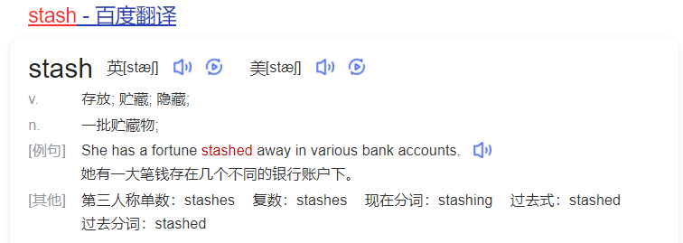


### 2、实现原理

Elasticsearch 的实现原理主要分为以下几个步骤：

- 首先用户将数据提交到**Elasticsearch 数据库**中，
- 再通过**分词控制器**去将对应的语句分词，将其权重和分词结果一并存入数据，
- 当用户搜索数据时候，再根据权重将结果排名，打分，再将返回结果呈现给用户。

#### 补充：

Elasticsearch－基础介绍及索引原理分析：https://www.cnblogs.com/dreamroute/p/8484457.html

[RabbitMQ高可用方案总结](https://www.cnblogs.com/dreamroute/p/6251180.html)

### 3、历史

Shay Banon在2004年创造了Elasticsearch的前身，称为**Compass**。在考虑Compass的第三个版本时，他意识到有必要重写Compass的大部分内容，以“创建一个可扩展的搜索解决方案”。因此，他创建了“一个从头构建的分布式解决方案”，并使用了一个公共接口，即HTTP上的JSON，它也适用于Java以外的编程语言。Shay Banon在2010年2月发布了Elasticsearch的第一个版本

Elasticsearch BV成立于2012年，主要围绕Elasticsearch及相关软件提供商业服务和产品。2014年6月，在成立公司18个月后，该公司宣布通过C轮融资筹集7000万美元。这轮融资由新企业协会(NEA)牵头。其他投资者包括Benchmark Capital和Index Ventures。这一轮融资总计1.04亿美元

2015年3月，Elasticsearch公司更名为Elastic

### 4、相关概念

1. **cluster**：代表一个[集群](https://baike.baidu.com/item/集群)，集群中有多个节点，其中有一个为主节点，这个主节点是可以通过选举产生的，主从节点是对于集群内部来说的。es的一个概念就是去中心化，字面上理解就是无中心节点，这是对于集群外部来说的，因为从外部来看es集群，在逻辑上是个整体，你与任何一个节点的通信和与整个es集群通信是等价的。
2. **shards：代表索引分片，**es可以把一个完整的索引分成多个分片，这样的好处是可以把一个大的索引拆分成多个，分布到不同的节点上。构成分布式搜索。分片的数量只能在索引创建前指定，并且索引创建后不能更改。
3. **replicas：代表索引副本**，es可以设置多个索引的副本，副本的作用一是提高系统的[容错性](https://baike.baidu.com/item/容错性)，当某个节点某个分片损坏或丢失时可以从副本中恢复。二是提高es的查询效率，es会自动对搜索请求进行负载均衡。
4. **recovery：代表数据恢复或叫数据重新分布**，es在有节点加入或退出时会根据机器的负载对索引分片进行重新分配，挂掉的节点重新启动时也会进行数据恢复。
5. **river：代表es的一个数据源**，也是其它存储方式（如：数据库）同步数据到es的一个方法。它是以插件方式存在的一个es服务，通过读取river中的数据并把它索引到es中，官方的river有couchDB的，RabbitMQ的，Twitter的，Wikipedia的。
6. **gateway：代表es索引快照的存储方式**，es默认是先把索引存放到内存中，当内存满了时再持久化到本地硬盘。gateway对索引快照进行存储，当这个es集群关闭再重新启动时就会从gateway中读取索引备份数据。es支持多种类型的gateway，有本地文件系统（默认），[分布式文件系统](https://baike.baidu.com/item/分布式文件系统)，Hadoop的HDFS和amazon的s3[云存储](https://baike.baidu.com/item/云存储)服务。
7. **discovery.zen：代表es的自动发现节点机制**，es是一个基于p2p的系统，它先通过广播寻找存在的节点，再通过[多播](https://baike.baidu.com/item/多播)协议来进行节点之间的通信，同时也支持[点对点](https://baike.baidu.com/item/点对点)的交互。
8. **Transport：代表es内部节点或集群与客户端的交互方式**，默认内部是使用tcp协议进行交互，同时它支持http协议（json格式）、[thrift](https://baike.baidu.com/item/thrift)、servlet、memcached、zeroMQ等的[传输协议](https://baike.baidu.com/item/传输协议)（通过[插件](https://baike.baidu.com/item/插件)方式集成）。

## 0.2、课程介绍

> 课程地址：https://www.bilibili.com/video/BV17a4y1x7zq
>
> 作者：遇见狂神说
>
> 说明：这个是2021年最开始学习ES看的b站课程的笔记


课程共341分钟（6小时左右），分为20节

```bash
## ES简介与历史介绍
1、ElasticSearch课程简介 13:37
2、聊聊Lucene创始人 17:34
3、ElasticSearch概述 10:14
4、Solr和ES的对比及选型 10:40

#安装
5、ES安装及head插件安装 26:42
6、Kibana的安装 12:50

#ES基础
7、ES核心概念理解 13:08
8、IK分词器详解 16:18
9、Rest风格操作 20:59
10、基本操作回顾 18:03
11、花式查询详解43:43

#springboot集成ES
12、SpringBoot集成ES详解 24:10
13、关于索引的API操作详解 10:57
14、关于文档的API操作详解 35:21

##仿京东搜索项目
15、京东搜索：项目搭建 06:00
16、京东搜索：爬取数据 19:47
17、京东搜索：业务编写  18:58
18、京东搜索：前后端交互  10:13
19、京东搜索：关键字高亮实现 09:11


20、狂神聊ES小结02:43
```


> 狂神聊ElasticSearch（库/表/文档记录（7.6后不建议使用文档API）

版本:**ElasticSearch 7.6.1**(全网最新7，2020.4.1号)
6.X 7.X的区别十分大.6.x的API(原生API, RestFul高级!

官网：https://www.elastic.co/cn/downloads/elasticsearch


2021,02,21 最新版本为：

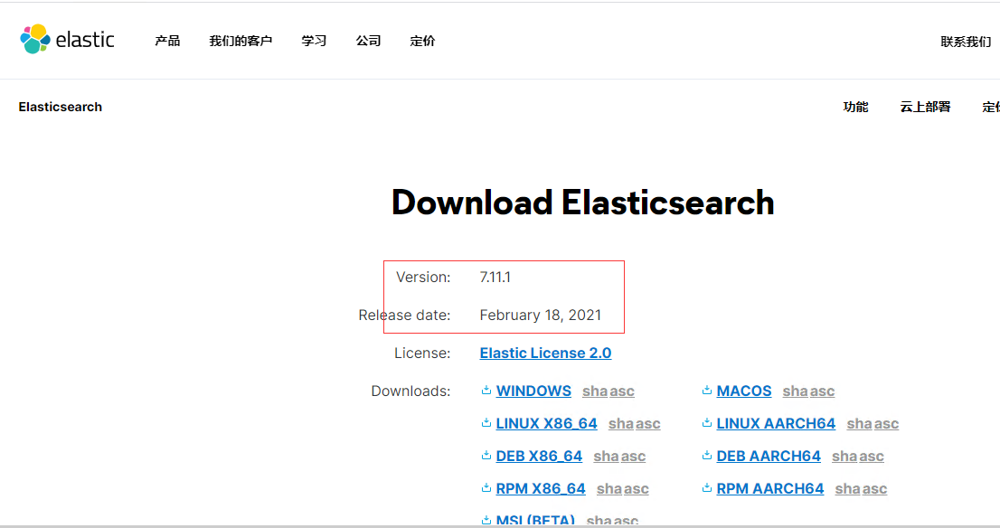


> 我们要讲解什么?

- SQL:like%狂神说%，如果是的大数据，就十分慢!索引!

- ElasticSearch:搜索!(**百度、github、淘宝电商!**),分布式全文搜索

- ELK中的E和K

    

    1、聊一个人
    2、货比三家
    3、安装
    4、生态圈
    5、分词器ik
    6、 RestFul操作ES
    7、CRUD

    8, Springboot集成ElasticSearch(从原理分析!)
    9、爬虫爬取数据!
    10、实战，模拟全文检索!

    以后你只要，需要用到搜索，就可以使用ES!(大数据量的倩况下使用!

学习了ES后，可以用于替代MySQL的数据检索了。


> 笔记参考：https://blog.csdn.net/qq_40649503/article/details/109572150

# 1、ES介绍

## 1.1、聊聊Doug Cutting

```bash
【时间】2021.02.21 周日
【内容】
## ES简介与历史介绍
1、ElasticSearch课程简介 13:37
2、聊聊Lucene创始人 17:34
3、ElasticSearch概述 10:14
4、Solr和ES的对比及选型 10:40

```


> 参考：深入浅出大数据：到底什么是Hadoop？--https://blog.csdn.net/qq_38987057/article/details/86507209

1998年9月4日，Google公司在美国硅谷成立。正如大家所知，它是一家做**搜索引擎**起家的公司。


无独有偶，一位名叫**Doug Cutting的美国工程师**，也迷上了搜索引擎。他做了一个用于**文本搜索的函数库**（姑且理解为软件的功能组件），命名为**Lucene**。


左为Doug Cutting，右为Lucene的LOGO

**Lucene是用JAVA写成的，目标是为各种中小型应用软件加入全文检索功能**。因为好用而且开源（代码公开），非常受程序员们的欢迎。

早期的时候，这个项目被发布在Doug Cutting的个人网站和SourceForge（一个开源软件网站）。后来，2001年底，Lucene成为Apache软件基金会jakarta项目的一个子项目。


**Apache软件基金会**，搞IT的应该都认识

2004年，Doug Cutting再接再励，在Lucene的基础上，和Apache开源伙伴Mike Cafarella合作，开发了一款可以代替当时的主流搜索的开源搜索引擎，命名为**Nutch**。


Nutch是一个建立在Lucene核心之上的网页搜索应用程序，可以下载下来直接使用。它在Lucene的基础上加了网络爬虫和一些网页相关的功能，目的就是从一个简单的站内检索推广到全球网络的搜索上，就像Google一样。

Nutch在业界的影响力比Lucene更大。

大批网站采用了Nutch平台，大大降低了技术门槛，使低成本的普通计算机取代高价的Web服务器成为可能。甚至有一段时间，在硅谷有了一股用Nutch低成本创业的潮流。

**随着时间的推移，无论是Google还是Nutch，都面临搜索对象“体积”不断增大的问题。**

尤其是Google，作为互联网搜索引擎，需要存储大量的网页，并不断优化自己的搜索算法，提升搜索效率。


Google搜索栏

在这个过程中，**Google确实找到了不少好办法，并且无私地分享了出来**。

2003年，Google发表了一篇技术学术论文，公开介绍了自己的**谷歌文件系统GFS（Google File System）**。这是Google公司为了存储海量搜索数据而设计的专用文件系统。

第二年，也就是2004年，Doug Cutting基于Google的GFS论文，实现了分**布式文件存储系统，并将它命名为NDFS（Nutch Distributed File System）**。


还是2004年，Google又发表了一篇技术学术论文，介绍自己的**MapReduce编程模型**。这个编程模型，用于大规模数据集（大于1TB）的并行分析运算。

第二年（2005年），Doug Cutting又基于MapReduce，在Nutch搜索引擎实现了该功能。


2006年，当时依然很厉害的Yahoo（雅虎）公司，招安了Doug Cutting。


这里要补充说明一下雅虎招安Doug的背景：2004年之前，作为互联网开拓者的雅虎，是使用Google搜索引擎作为自家搜索服务的。在2004年开始，雅虎放弃了Google，开始自己研发搜索引擎。所以。。。

**加盟Yahoo之后，Doug Cutting将NDFS和MapReduce进行了升级改造，并重新命名为Hadoop**（NDFS也改名为HDFS，Hadoop Distributed File System）。

这个，就是后来大名鼎鼎的大数据框架系统——**Hadoop**的由来。而Doug Cutting，则被人们称为Hadoop之父。


Hadoop这个名字，实际上是Doug Cutting他儿子的黄色玩具大象的名字。所以，Hadoop的Logo，就是一只奔跑的黄色大象。


我们继续往下说。

还是2006年，Google又发论文了。

这次，它们介绍了自己的**BigTable**。这是一种分布式数据存储系统，一种用来处理海量数据的非关系型数据库。

Doug Cutting当然没有放过，在自己的hadoop系统里面，**引入了BigTable，并命名为HBase**。


好吧，反正就是紧跟Google时代步伐，你出什么，我学什么。

所以，Hadoop的核心部分，基本上都有Google的影子。

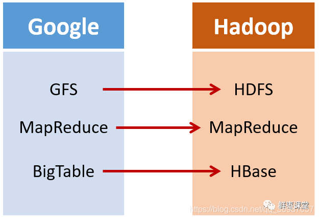

2008年1月，Hadoop成功上位，正式成为Apache基金会的顶级项目。

同年2月，Yahoo宣布建成了一个拥有1万个内核的Hadoop集群，并将自己的搜索引擎产品部署在上面。

7月，Hadoop打破世界纪录，成为最快排序1TB数据的系统，用时209秒。

此后，Hadoop便进入了高速发展期，直至现在。

> 回到主题--Lucene

- Lucene是一套信息检索工具包!jar包!**不包含搜索引擎系统!**
- 包含的:**索引结构!读写索引的工具!排序，搜索规则.…工具类**!
- Lucene和ElasticSearch关系:
    - ElasticSearch是基于Lucene做了一些封装和增强(我们上手是十分简单!


## 1.2、ElastiSearch概述

Elaticsearch.简称为es，es是一个开源的高扩展的**分布式全文检索引擎**，它可以**近乎实时的存储、检索数据:**本身

扩展性很好可以扩展到上百台服务器，处理**PB级别(大数据时代)的数据**.es也使俐ava开发并使用Lucene作为其核

心来实现所有索引和搜索的功能，但是**它的目的是通过简单的RESTful API来隐藏Lucene的复杂性**。从而让全文

搜索变得简单。据国际权威的数据库产品评测机构DB Engines的统计，在2016年1月，ElasticSearch已超过SoIr

等，成为排名第一的搜索引擎类应用。

> 历史

​	多年前，一个叫做Shay Banon的刚结婚不久的失业开发者，由于妻子要去伦敦学习厨师，他便跟着也去了.在他找工作的过程中，为了给妻子构建一个食谱的搜索引擎.他开始构建一个早期版本的Lucene.

​	直接基于Lucene工作会比较困难，所以Shay开始抽象Lucene代码以使java程序员可以在应用中添加搜索功能.他发布了他的第一个开源项目，叫做**'Compass".**

​	后来Shay找到一份工作，这份工作**处在高性能和内存数据网格的分布式环境中**，因此高性能的、实时的、分布式的搜索引擎也是理所当然需要的.然后**他决定重写Compass库使其成为一个独立的服务叫做一Elasticsearch.** 

​	第一个公开版本出现在**2010年2月**。在那之后Elasticsearch已经成为Github上最受欢迎的项目之一，代码贡献者超过300人.一家主营Elasticsearch的公司就此成立，也门一边提供商业支持一边开发新功能，不过Elasticsearch将永远开源且对所有人可用.
​	Shay的妻子依旧等待着她的食谱搜索.“…

​	

> 谁在使用

1、**维基百科**，类似百度百科，全文检索.高亮。搜索推荐/2(权重，百度!
2、 **The Guardian(国外新闻网站)**，类似搜狐新闻，用户行为日志(点击，浏览.收藏。评论)+社交网络数据(对某某新闻的相关看法》，数据分析，给到每篇新闻文章的作者，让他知道他的文章的公众反馈(好，坏，热门，垃圾，鄙视，崇拜)
3、 **Stack Overflow**(国外的程序员异常讨论论坛).IT问题，程序的报错，牌交上去。有人会跟你讨论和回答，全文检索。搜索相关问题和答案，程序报错了，就会将报错信息粘贴到里面去。搜索有没有对应的答案
4、**GitHub**(开源代码管理)，搜索上千亿行代码
5、**电商网站**。检索商品
6、**日志数据分析，logstash采集日志**。ES进行复杂的数据分析，ELK技术，elasticsearch+logstash+ki bana
7、**商品价格监控网**站，用户设定某商品的价格阂值，当低于该闭值的时候，发送通知消息给用户，比如说订阅牙膏的监控。如果高露洁牙膏的家庭套装低于50块钱，就通知我。我就去买
8、 BI系统.商业智能，Business Intelligence。比如说有个大型商场集团，BI，分析一下某某区域最近3年的用户消费金额的趋势以及用户群体的组成构成，产出相关的数张报表，**区，最近3年，每年消费金额呈现100%的增长，而且用户群体85%是高级白领.开一个新商场。ES执行数据分析和挖掘，Kibana进行数据可视化
9、**国内:站内搜索**(电商。招聘，门户.等等)，IT系统搜索(OA，CRM，ERP，等等)，**数据分析**(ES热门的一个使用场景）

## 1.3、ES与solr的差别

### 1、ES简介

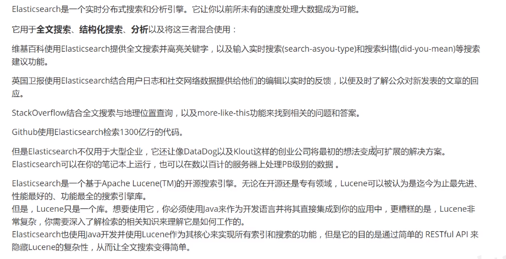

### 2、Solr简介

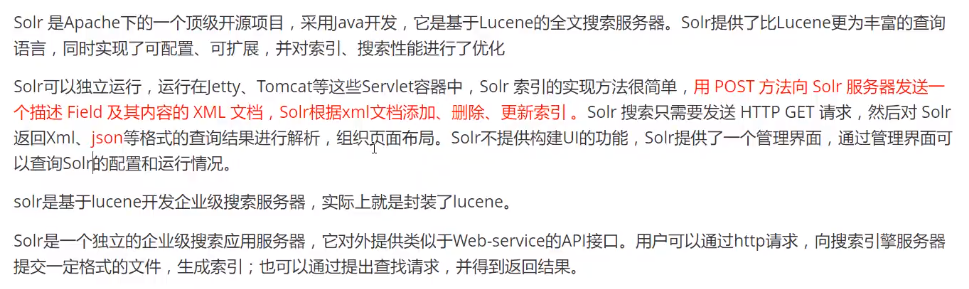

### 3、Lenece简介


### 4、ES与Solr的比较

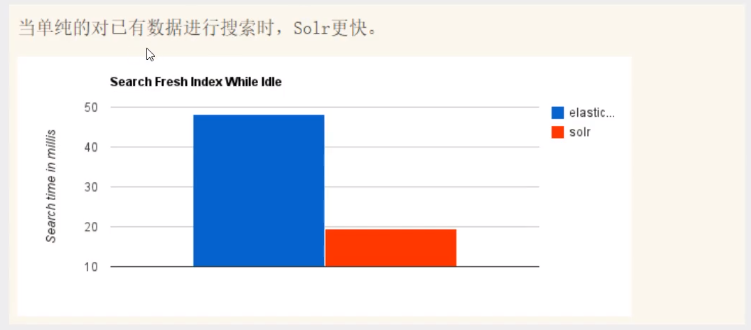


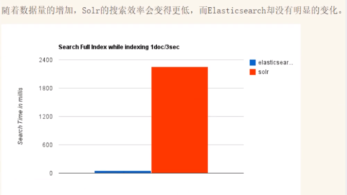


实时+大数据===》ES

已有的数据==》Solr


> ElasticSearch vs Soir总结

1、es基本是开箱即用(解压就可以用!)，非常简单。Solr安装略微复杂一丢丢!

2、 SoIr利用Zookeeper进行分布式管理，而**Elasticsearch自身带有分布式协调管理功能**.                                                              

3、SoIr支持更多格式的数据，比JSON, XML, CSV，而**Elasticsearch仅支持Json文件格式**.

4、SoIr官方提供的功能更多，而**Elasticsearch本身更注重于核心功能**。高级功能多有第三方插件提供，例如图形化界面需要kibana友好支撑。

5、 **SoIr查询快，但更新索引时慢(即插入删除慢)**，主要用于电商等查询多的应用。

-   ES建立索引快(即查询慢)，即实时性查询快，用于facebook新浪等搜索。
-   Solr是传统搜索应用的有力解决方案。但Elasticsearch更适用于新兴的实时搜索应用.

6、 SoIr比较成熟，有一个更大，更成熟的用户、开发和贡献者社区，而Elasticsearch相对开发维护者较少，更新太快，学习使用成本较高。


# 2、ES/head/Kibana安装

```bash
【时间】2021.02.21 周日
【内容】
#安装
5、ES安装及head插件安装 26:42
6、Kibana的安装 12:50
```


> 下载

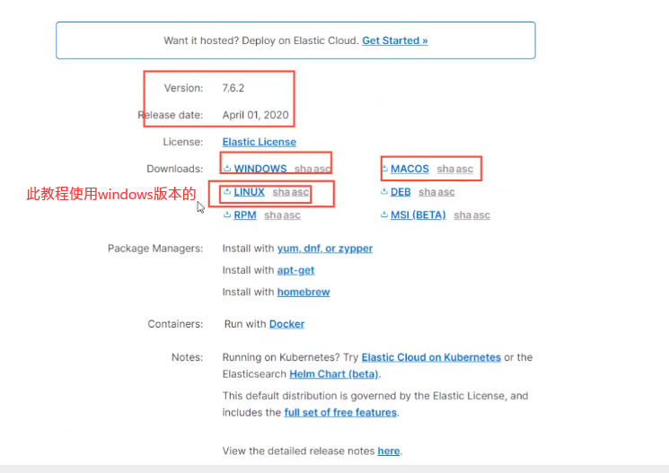


下载地址:https://www. elastic.co/cn/downloads/elasticsearch
官网下载巨慢。翻墙，网盘中下载即可!

我门学习的话Window和Linux都可以学习!
我们这里现在Window下学习!
**ELK**三剑客，解压即用!(web项目!前端环境!需要配置好环境，如NodeJs、python等）。

## 2.1、ES在Windows下安装

> 资源地址：
>
> 链接：https://pan.baidu.com/s/1PT3jLvCksOhq7kgAKzQm7g 提取码：s824

### 1、解压即可使用


### 2、熟悉目录

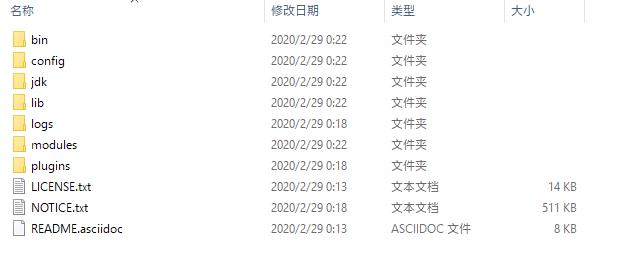

```bash
安装：
     1 解压，
     2 bin
     3 启动
目录：
     bin 启动文件
     config 配置文件
         log4j2 日志配置文件
         jvm.options  java 虚拟机相关的配置
         elasticsearch.yml  elasticsearch 的配置文件！ 默认 9200 端口！ 跨域问题解决！
     lib 相关jar包
     logs 日志！
     modules 功能模块
     plugins 插件！，原生是空的。

```

### 3、启动，访问9200端口


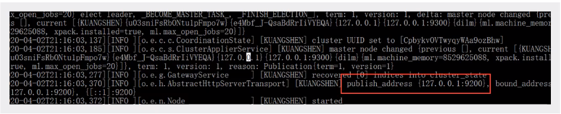

### 4、访问测试

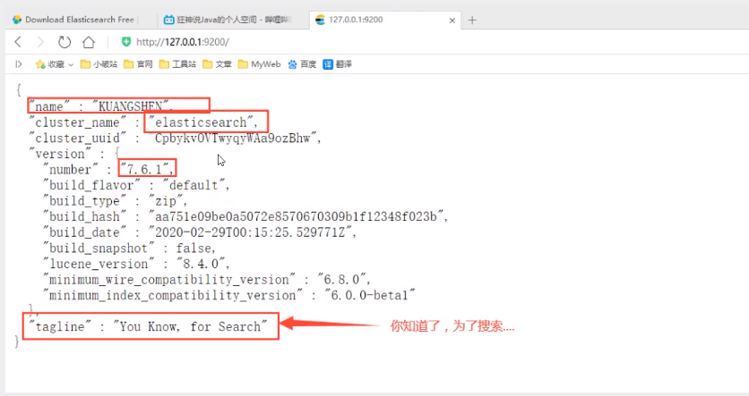

- tagline

```yaml
{
  "name" : "USER-20180304DN",  ##电脑名字
  "cluster_name" : "elasticsearch",
  "cluster_uuid" : "CGNa5-4WSLGon9UBUoD1CA",
  "version" : {
    "number" : "7.6.1",
    "build_flavor" : "default",
    "build_type" : "zip",
    "build_hash" : "aa751e09be0a5072e8570670309b1f12348f023b",
    "build_date" : "2020-02-29T00:15:25.529771Z",
    "build_snapshot" : false,
    "lucene_version" : "8.4.0",
    "minimum_wire_compatibility_version" : "6.8.0",
    "minimum_index_compatibility_version" : "6.0.0-beta1"
  },
  "tagline" : "You Know, for Search"
}
```

## 2.1-1 Linux下安装es

> 参考：https://blog.csdn.net/weixin_43490106/article/details/118058283 【ElasticSearch-linux安装及启动】


### 1、执行解压缩操作

上传成功之后可以在当前页面看到自己上传到虚拟机的具体目录，我上传的默认路径是:/home/itcast/ 。每个人路径不一样，上传完成可以看自己的压缩包上传到虚拟机的哪个位置

> 下载地址：https://www.elastic.co/cn/downloads/elasticsearch

```sh
 # 将elasticsearch-7.4.0-linux-x86_64.tar.gz解压到opt文件夹下. -C 大写

 tar -zxvf elasticsearch-7.4.0-linux-x86_64.tar.gz  -C /opt
```

我这里是将文件解压到了/opt目录下，每个人可以根据自己需求解压到自己想要的目录即可，但是这个目录自己要记住，以后启动啥的，还要从这里进去。

### 3.修改ElasticSearch.yml文件

我们解压缩在/opt目录下，在elasticsearch-7.4.0文件目录下找到config目录，然后进去，找到ElasticSearch.yml文件

```yaml
vim /opt/elasticsearch-7.4.0/config/elasticsearch.yml 
进入文件之后，找到文件最下方，按下i 进入插入模式，接下就可以修改这个文件了，插入如下准备好的配置即可

# ======================== Elasticsearch Configuration =========================

cluster.name: my-application
node.name: node-1
network.host: 0.0.0.0
http.port: 9200
cluster.initial_master_nodes: ["node-1"]
```

- cluster.name：配置elasticsearch的集群名称，默认是elasticsearch。建议修改成一个有意义的名称

- node.name：节点名，elasticsearch会默认随机指定一个名字，建议指定一个有意义的名称，方便管理

- network.host：设置为0.0.0.0允许外网访问

- http.port：Elasticsearch的http访问端口

- cluster.initial_master_nodes：初始化新的集群时需要此配置来选举master


### 4.创建普通用户

因为安全问题，Elasticsearch 不允许root用户直接运行，所以要创建新用户，在root用户中创建新用户,执行如下命令(可以只创建用户，不设置密码也可以)：

```
useradd abc  # 新增abc用户
passwd  123aaa  # 为用户设置密码
```


### 5.为新用户授权

```sh
chown -R abc:abc /opt/elasticsearch-7.4.0 #文件夹所有者
#将 /opt/elasticsearch-7.4.0文件夹授权给abc用户
```


### 6.修改配置文件

新创建的itheima用户最大可创建文件数太小，最大虚拟内存太小，注意需要切换到root用户，编辑下列配置文件， 添加类似如下内容

```sh
# 切换到root用户，如果当前用户还是root用户，就不用切换

su root 
#1. ===最大可创建文件数太小=======
vim /etc/security/limits.conf 

# 在文件末尾中增加下面内容

itheima soft nofile 65536
itheima hard nofile 65536

# =====

vim /etc/security/limits.d/20-nproc.conf

# 在文件末尾中增加下面内容

itheima soft nofile 65536
itheima hard nofile 65536

*  hard    nproc     4096

# 注：* 代表Linux所有用户名称	

#2. ===最大虚拟内存太小=======
vim /etc/sysctl.conf

# 在文件中增加下面内容

vm.max_map_count=655360

# 重新加载，输入下面命令：

sysctl -p
```

### 7.配置内置JDK

如果Linux中之前安装了jdk1.8并配置了环境变量，会导致elasticsearh无法启动，因为jdk的版本低了。我们可以修改bin/elasticsearch-env文件，具体修改内容如下：

将：

```
if [ ! -z "$JAVA_HOME" ]; then
  JAVA="$JAVA_HOME/bin/java"
else
  if [ "$(uname -s)" = "Darwin" ]; then

​    JAVA="$ES_HOME/jdk/Contents/Home/bin/java"

  else
    JAVA="$ES_HOME/jdk/bin/java"
  fi
fi
```

改成

```sh
if [ "$(uname -s)" = "Darwin" ]; then
	JAVA="$ES_HOME/jdk/Contents/Home/bin/java"

else
	JAVA="$ES_HOME/jdk/bin/java"
fi
```

### 8.启动ElasticSearch

```
su abc  # 切换到abc用户启动
cd /opt/elasticsearch-7.4.0/bin
./elasticsearch #启动
```

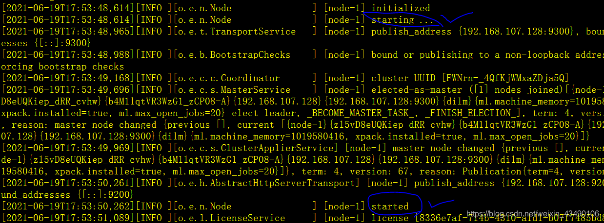


通过上图我们可以看到elasticsearch已经成功启动

### 9.访问ElasticSearch

在访问elasticsearch前，请确保防火墙是关闭的，执行命令：

```
#暂时关闭防火墙
systemctl  stop  firewalld

# 或者

#永久设置防火墙状态
systemctl enable firewalld.service  #打开防火墙永久性生效，重启后不会复原 
systemctl disable firewalld.service #关闭防火墙，永久性生效，重启后不会复原 
```

切换到windows环境下，打开谷歌浏览器，输入浏览器输入http://【自己虚拟机的ip地址】:**9200**/


```sh
{
  "name" : "node-1",
  "cluster_name" : "my-application",
  "cluster_uuid" : "9thdrsSVRCeBTDqklTTemA",
  "version" : {
    "number" : "7.6.1",
    "build_flavor" : "default",
    "build_type" : "tar",
    "build_hash" : "aa751e09be0a5072e8570670309b1f12348f023b",
    "build_date" : "2020-02-29T00:15:25.529771Z",
    "build_snapshot" : false,
    "lucene_version" : "8.4.0",
    "minimum_wire_compatibility_version" : "6.8.0",
    "minimum_index_compatibility_version" : "6.0.0-beta1"
  },
  "tagline" : "You Know, for Search"
}
```

此时elasticsearch已成功启动。


## 2.2、安装可视化插件--**head**

### 1、下载

> 地址：https://github.com/mobz/elasticsearch-head/
>
> 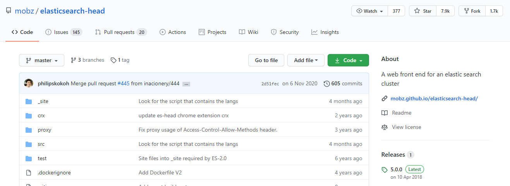

github上下载，解压：

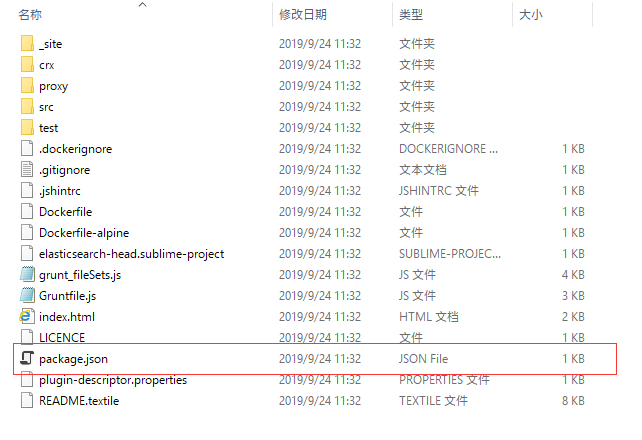

### 2、运行

```bash
Running with built in server
git clone git://github.com/mobz/elasticsearch-head.git
cd elasticsearch-head
npm install  或者 cnpm install
npm run start
##结果
open http://localhost:9100/
This will start a local webserver running on port 9100 serving elasticsearch-head
```


> 补充：需要安装Nodejs依赖

```shell
C：elasticsearch-head-master>cnpm install
'cnpm' 不是内部或外部命令，也不是可运行的程序或批处理文件。


##安装nodejs
##见：https://www.cnblogs.com/aizai846/p/11441693.html
C:\Users\Administrator>npm -v
6.14.11

C:\Users\Administrator>node -v
v14.15.5

##配置缓存位置
npm config set prefix "F:\software_study\nodejs\node_global"

npm config set cache "F:\software_study\nodejs\node_cache"


##配置环境变量
NODE_PATH  F:\software_study\nodejs\node_global\node_modules

“环境变量” -> “用户变量”：编辑用户变量里的Path，将相应npm的路径（“C:\Users\用户名\AppData\Roaming\npm”）改为：“F:\software_study\nodejs\node_global”

##安装cnpm
npm install cnpm -g --registry=https://registry.npm.taobao.org

```

### 3、解决跨域问题

由于跨端口了9100-->9200，造成head查看不了9200端口的ES：


解决方法：

```yaml
elasticsearch->config->elasticsearch.yml配置：
             http.cors.enabled: true
             http.cors.allow-origin: "*"
```

重启ES后：

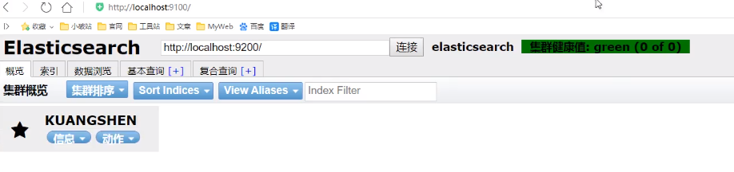

- 你们初学。就把es当做一个数据库!(可以建立索引(库)，文档(库中的数据!))
- 这个head我们就把它当做数据展示工具!我们后面所有的查询，使用==Kibana==


## 2.3、Kibana安装(windows)

> 了解ELK

​		ELK是Elasticsearch, Logstash, Kibana三大开源框架首字母大写简称.市面上也被成为Elastic Stack.

​		其中Elasticsearch是一个基于Lucene、分布式、通过Restfu!方式进行交互的近实时搜**索平台框架**。像类似百度、谷歌这种大数据全文搜索引擎的场景都可以使用Elasticsearch作为底层支持框架，可见Elasticsearch**提供的搜索能力**确实强大，市面上很多时候我们简称Elasticsearch为es.
​		Logstash是**ELK的中央数据流引擎**，用于从不同目标(文件/数据存储/MQ)收集的不同格式数据，经过过滤后支持输出到不同目的地(文件/MQ/redis/elasticsearch/kafk等).

​		**Kibana可以将ES的数据通过友好的页面展示出来**，提供实时分析的功能。

​		市面上很多开发只要提到ELK能够一致说出它是一个日志分析架构技术栈总称，但实际上ELK不仅仅适用于日志分析，它还可以支持其它任何数据分析和收集的场景，日志分析和收集只是更具有代表性.并非唯一性。


收集--》过滤，检索--》展示/分析

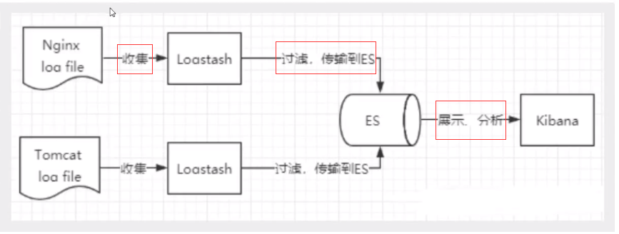


> 安装Kibana

Kibana是一个针对Elasticsearch的**开源分析及可视化平台**，用来搜索、查看交互存储在Elasticsearch索引中的数据。

​		使用Kibana，可以通过各种图表进行高级数据分析及展示.Kibana让海量数据更容易理解。它操作简单，基于浏览器的用户界面可以快速创建仪表板(dashboard)，实时显示Elasticsearch查询动态.

​		设置Kibana非常简单.无需编码或者额外的基础架构，几分钟内就可以完成Kibana安装并启动Elasticsearch索引监测.
​		官网:https://www.eIastic.co/cn/kibana

Kibana的版本要和ES一致。

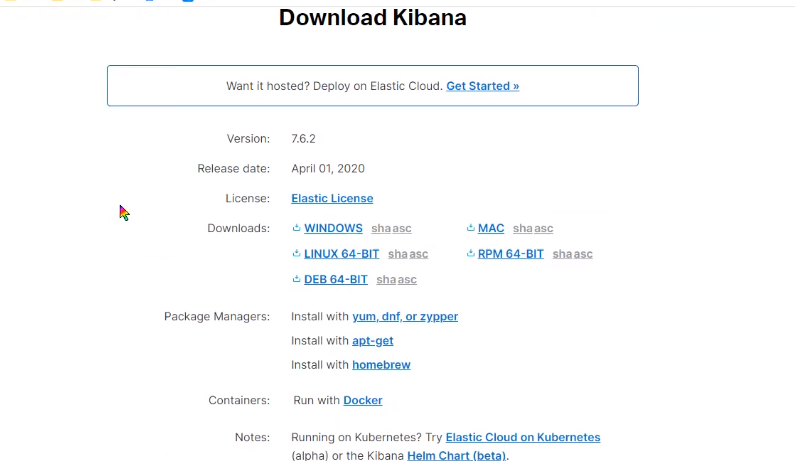

下载完毕后，解压也需要一些时间!是一个标准的工程!
好处:ELK基本上都是拆箱即用!

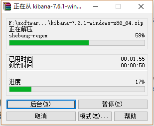


> 启动测试

1、解压后的目录


2、启动


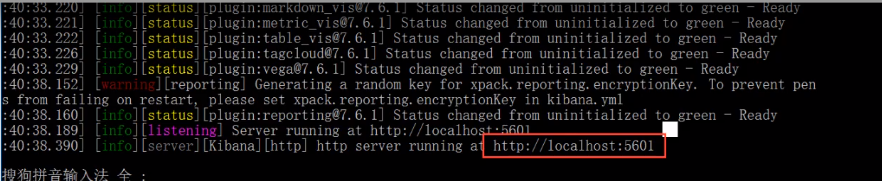


3、访问测试

http://localhost:5601


4、开发工具！ （Post、curl、head、谷歌浏览器插件测试！） 


我们之后的所有操作都在这里进行编写!很多学习大数据的人，卡在搭建环境上：Hadoop!

5、汉化,修改配置文件

```yaml
i18n.locale: "zh-CN"
```


## 2.3-1 Kibana安装(Linux)

> 参考：https://www.jianshu.com/p/d5fd38bfb0bb


> 下载：https://www.elastic.co/cn/downloads/past-releases/kibana-5-2-1

## 2.4 后台启动与关闭

参考：https://www.cnblogs.com/straycats/p/7575910.html 

https://www.cnblogs.com/zlslch/p/6614037.html

### 后台启动

为了解决启动kibana后关闭shell终端kibana自动关闭的问题，记录2种解决方案，试验后均可行。

假设kibana安装的目录为 /usr/local/kibana/

> 方案一：

使用nohup 命令

用途：不挂断地运行命令。

语法：nohup Command [ Arg … ] [　& ]

```
nohup /usr/local/kibana/bin/kibana &
```

 

> 方案二：

使用exit退出shell终端

```
/usr/local/kibana/bin/kibana & 
```


 

等待一会后，加载出status信息，接着输入“exit”回车，shell界面关闭。

 

### 后台关闭

#### 查进程号后kill

```
ps  -aux | grep  ela
```

　　然后，查出其进程。

或者


# 3、ES基础

```bash
【时间】2021.02.21 周日
【内容】
#ES基础
7、ES核心概念理解 13:08
8、IK分词器详解 16:18
9、Rest风格操作 20:59
10、基本操作回顾 18:03
11、花式查询详解43:43
```

## 3.1、ES核心概念

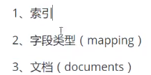


> 概述

在前面的学习中，我们已经掌握了es是什么，同时也把es的服务已经安装启动，

那么es是如何去存储数据，数据结构是什么，又是如何实现搜索的呢?我们先来聊聊ElasticSearch的相关概念吧!

集群cluster，节点node，索引indices，**类型types**，**文档documents**，分片，映射是什么?

> ElasticSearch是**面向文档的**，一切都是json，关系型数据库与ES的客观对比如下：

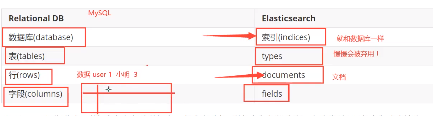

elasticsearch(集群)中可以包含多个**索引(数据库)**，每个索引中可以包含多个**类型(表)**，每个类型下又包含多个**文档(行)**，每个文档中又包含多个**字段(列).**


> **物理设计：**

elasticsearch在后台把**每个索引划分成多个分片**。每分分片可以在集群中的不同服务器间迁移。

一个人就是一个集群!默认的集群名称就是elaticsearch

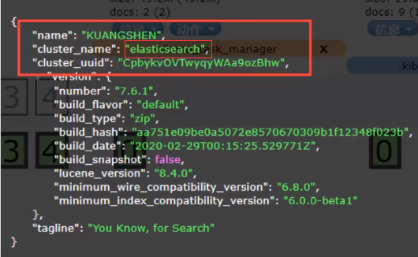

​                                                            T


> **逻辑设计：**

一个索引类型中，包含多个文档，比如说文档1，文档2....当我们索引一篇文档时。可以通过这样的一个顺序找到它:索引->类型->文档ID .

通过这个组合我们就能索引到某个具体的文档。注意:ID不必是整数，实际上它是个字符串。


> 文档

之前说elasticsearch是**面向文档**的，那么就意味着索引和搜索数据的**最小单位是文档**。elasticsearch中，文档有几个重要属性:

-   **自我包含**，一篇文档同时包含字段和对应的值，也就是同时包含key:value!

-   可以是**层次型的**，一个文档中包含自文档，复杂的逻辑实体就是这么来的!（套娃，就是一个json对象，可以**使用fastjson**进行自动转换）

-   灵活的结构，**文档不依赖预先定义的模式**，我们知道关系型数据库中，要提前定义字段才能使用。在elasticsearch中，对于字段是非常灵活的。有时候，我们可以忽略该字段，或者动态的添加一个新的字段。

    

    尽管我们可以随意的新增或者忽略某个字段，但是，每个字段的类型非常重要，比如一个年龄字段类型，可以是字符串也可以是整型.
    因为**elasticsearch会保存字段和类型的映射及其他的设置**。这种映射具体到每个映射的每种类型，这也是为什么在elasticsearch中，类型有时候也称为映射类型-


> 类型

**类型是文档的逻辑容器**。类型包含一个个文档？？？

就像关系型数据库一样。表格是行的容器.类型中对于字段的定义称为映射，比如name映射为字符串类型.


我们说文档是无模式的，它们不需要拥有映射中所定义的所有字段，比如新增一个字段，那么elasticsearch是怎么做的呢?
elasticsearch会自动的将新字段加入映射，但是这个字段的不确定它是什么类型，**elasticsearch就开始猜**，如果这个值是18，那么elasticsearch会认为它是整型·但Elasticsearch也可能猜不对，所以**最安全的方式就是提前定义好所需要的映射**。这点跟关系型数据库殊途同归了，先定义好字段，然后再使用，别整什么幺蛾子。

> 索引

就是数据库！

索引是映射类型的容器，elasticsearch中的索引是一个非常大的文档集台。索引存储了映射类型的字段和其他设置.然后它们被存储到了各个分片上了。我们来研究下分片是如何工作的。


> 物理设计：节点与分片 如何让工作

一个集群至少有一个节点，而一个节点就是一个elasricsearch进程，节点可以有多个默认索引。如果你创建索引，那么索引将会有个**5个分片(primary shard，又称主分片**)构成的，每一个主分片会有**一个副本(replica shard，又称复制分片)**。


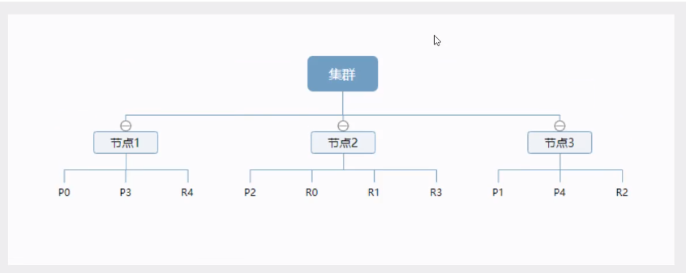


上图是一个有3个节点的集群。可以看到主分片和对应的复制分片都不会在同一个节点内.这样有利于某个节点挂掉了.数据也不至于丢失.

实际上，**一个分片是一个==Lucene索引==，是一个包含==倒排索引==的文件目录，倒排索引的结构使得elasticsearch在不扫描全部文档的倩况下，就能告诉你哪些文档包含特定的关键字**。不过。等等，倒排索引是什么鬼?

> 倒排索引--ES的底层数据结构

elasticsearch使用的是一种称为**倒排索引的结构**，采用Lucene倒排索引作为底层.这种结构适用于快速的全文搜索。

一个索引由文档中所有不重复的列表构成。对于每一个词，都有一个包含它的文档列表。

例如，现在有两个文档，每个文档包含如下内容:


```bash
Study every day, good good up to forever #文档1包含的内容
To forever, study every day, good good up #一文档2包含的内容
```

为了创建倒排索引.我们首先要将每个文档拆分成**独立的词(或称为词条或者tokens)**。然后创建一个包含所有不重复的词条的排序列表，然后列出每个词条出现在哪个文档:

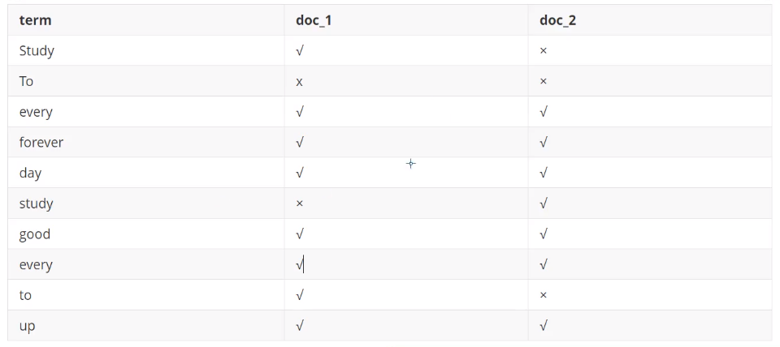

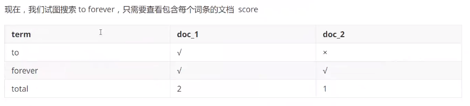

两个文档都匹配，但是第一个文档比第二个匹配程度更高.如果没有别的条件。现在，这两个包含关键字的文档都将返回.再来看一个示例，比如我们通过博客标签来搜索博客文章.那么倒排索引列表就是这样的一个结构:

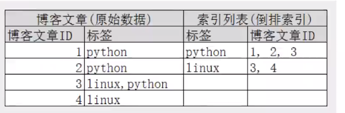

- 文档1和文档2含有标签python----->含有标签python的文档有1，2

如果要搜索含有python标签的文章，那相对于查找所有原始数据而言，查找倒排索引后的数据将会快的多.因为只需要查看标签这一栏，然后获取相关的文章即可。

> elasticsearch的索引和Lucene的索引对比

在elasticsearch中.索引(库)这个词被频繁使用，这就是术语的使用.**在elasticsearch中索引被分为多个分片，每个分片是一个Lucene索引**。

所以**一个elasticsearch索引是由多个Lucene索引组成的**.别问为什么，谁让elasticsearch使用Lucene作为底层呢!如无特指。**说起索引都是指elasticsearch的索引.**接下来的一切操作都在**kibana中Dev Tools下的Console**里完成.

基础操作!


## 3.2、IK分词器插件

### 1、什么是IK分词器

分词：即把一段中文或者别的划分成一个个的关键字，我们在搜索时候会把自己的信息进行分词，会把数据库中或者索引库中的数据进行分词，然后进行一个匹配操作，**默认的中文分词是将每个字看成一个词**，比如‘.我爱狂神”会被分为”我”、“爱”、”狂“、”神“，这显然是不符合要求的。**所以我们需要安装中文分词器ik来解决这个问题**。

IK提供了两个分词算法**:==ik_smart和ik_max_word==**.其中ik_smart为最少切分，ik_max_word为最细粒度划分!一会我门侧试!


### 2、IK分词器安装与使用

安装：
	1、https://github.com/medcl/elasticsearch-analysis-ik
	2、下载完毕之后，**放入到我们的elasticsearch 插件,plugins目录**


​	3、重启观察ES，可以看到ik分词器被加载了！

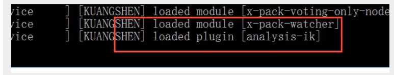

​	4、elasticsearch-plugin list 可以通过这个命令来查看加载进来的插件。

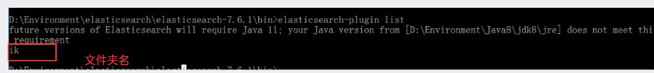

​	5、使用kibana测试！

> 查看不同分词器效果

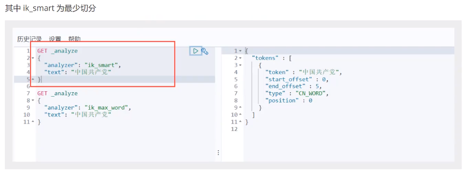


- 将一个text分成一个个词片token
- token、start_offset、end_offset、type、position是啥？
  - token --关键词
  - start_offset--字符串中起始位置（offset）
  - end_offset
  - type
  - position 词出现的位置，第几个词（基0）

```json
GET _analyze
{
"analyzer": "ik_smart",
"text": ["hello world","你好世界"]
}
```

```sh
{
  "tokens" : [
    {
      "token" : "hello",
      "start_offset" : 0,
      "end_offset" : 5,
      "type" : "ENGLISH",
      "position" : 0
    },
    {
      "token" : "world",
      "start_offset" : 6,
      "end_offset" : 11,
      "type" : "ENGLISH",
      "position" : 1
    },
    {
      "token" : "你好",
      "start_offset" : 12,
      "end_offset" : 14,
      "type" : "CN_WORD",
      "position" : 2
    },
    {
      "token" : "世界",
      "start_offset" : 14,
      "end_offset" : 16,
      "type" : "CN_WORD",
      "position" : 3
    }
  ]
}

```


> 添加分词规则--为了使得自己想要的词不被分开（如：狂神说），可以自定义字典

​	插件中**config/IKAnalyzer.cfg.xml**  添加加载分词规则，**main.dic**默认加载 (必定添加main)

```xml
<?xml version="1.0" encoding="UTF-8"?>
<!DOCTYPE properties SYSTEM "http://java.sun.com/dtd/properties.dtd">
<properties>
	<comment>IK Analyzer 扩展配置</comment>
	<!--用户可以在这里配置自己的扩展字典 -->
	<entry key="ext_dict">XXX.dic</entry>
	 <!--用户可以在这里配置自己的扩展停止词字典-->
	<entry key="ext_stopwords"></entry>
	<!--用户可以在这里配置远程扩展字典 -->
	<!-- <entry key="remote_ext_dict">words_location</entry> -->
	<!--用户可以在这里配置远程扩展停止词字典-->
	<!-- <entry key="remote_ext_stopwords">words_location</entry> -->
</properties>

```

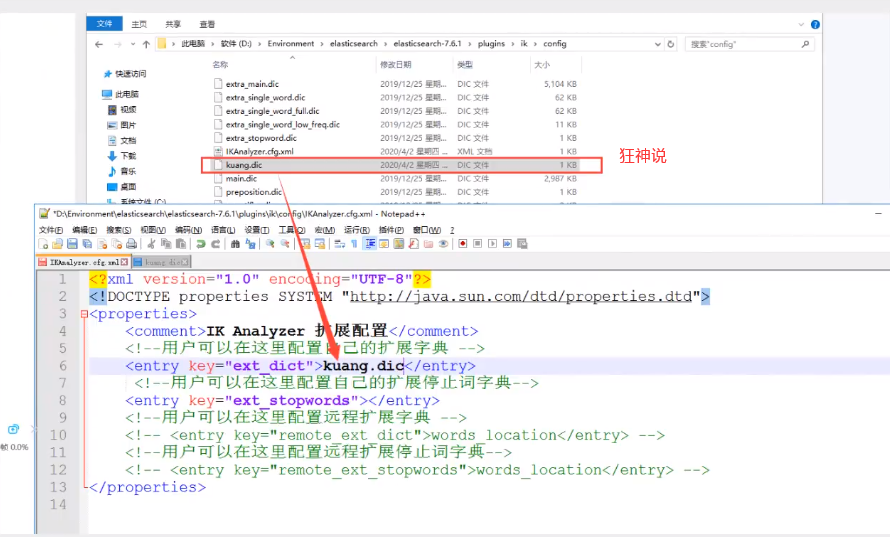


这样“狂神说”就不会被分词了：

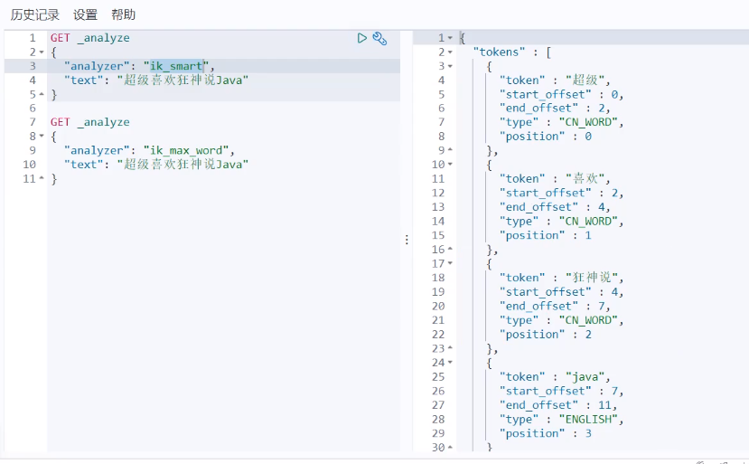

以后的话，我们需要自己配置分词就在自己定义的dic文件中进行配置即可!

问题：如果有多个字典，怎么写？用什么分隔符？|吗？


## 3.3、Rest风格说明

​		一种软件架构风格，而不是标准，只是**提供了一组设计原则和约束条件**。它主要用于客户端和服务器交互类的软件。基于这个风格设计的软件**可以更简洁、更有层次，更易于实现缓存等机制**。

### 1、基本Rest命令说明：


### 2、关于索引的基本操作

#### 1）创建一个索引

> 语法：


> 例子：

```json
PUT /test/user/2
{
"name": "狂神说java",
"age" : 10,
"desc": "还行",
"tags": ["技术宅","帅哥","渣男"]
}
```

> 运行结果：

完成了**自动增加索引**!数据也成功的添加了，这就是我说大家在初期可以把ES当做数据库学习的原因!

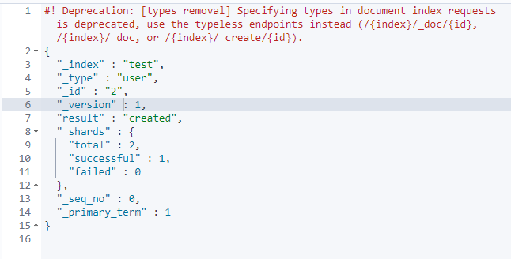

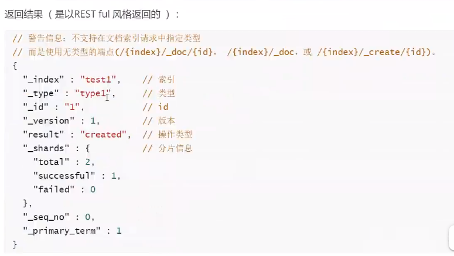


> 数据浏览：


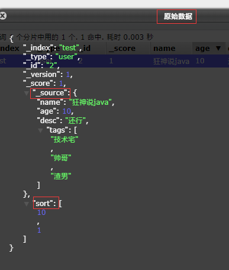


#### 2）数据类型


- **没有字符类型**
- 数值类型比java多了两种浮点的、类型
- date
- binary 二进制类型

> 使用PUT指定属性类型--创建索引规则：

```json
PUT /test2
{
  "mappings": {
    "properties": {
      "name":{
        "type": "text"
      },
      "age":{
        "type": "long"
      },
      "birthday":{
        "type": "date"
      }
      
    }
  }
}
```

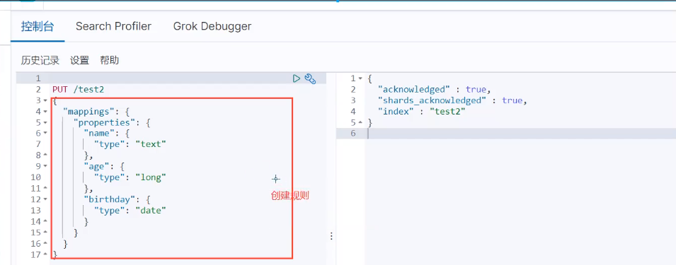

> 获取规则信息--GET

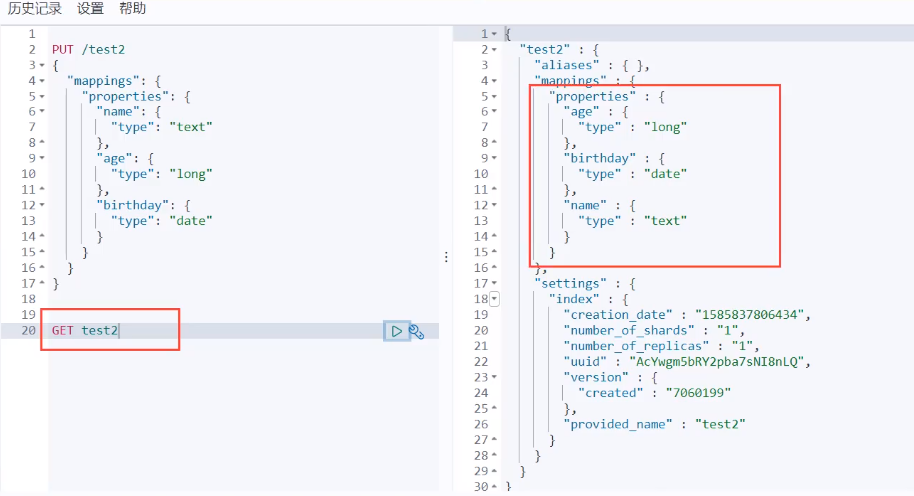

> 默认的规则信息（数据类型）

如果自己的文档字段没有指定.那么es就会给我们默认配置字段类型!

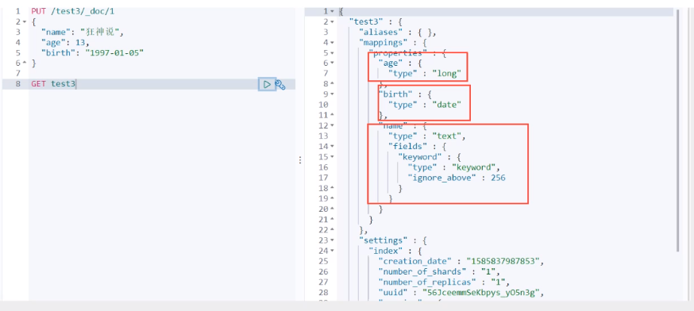


> 扩展：通过GET _cat/ XXX 可以获得ES当前的很多信息

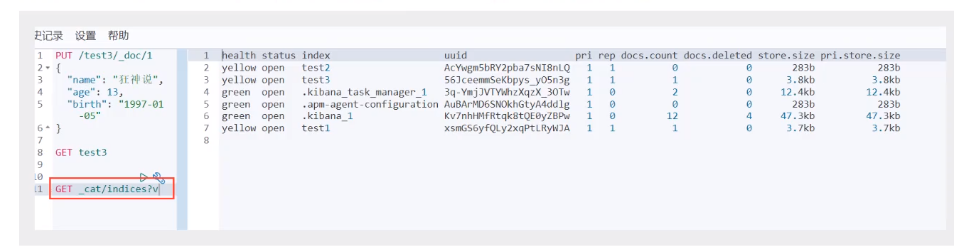


#### 3）修改（更新）

1、提交还是使用PUT即可，完成覆盖操作。

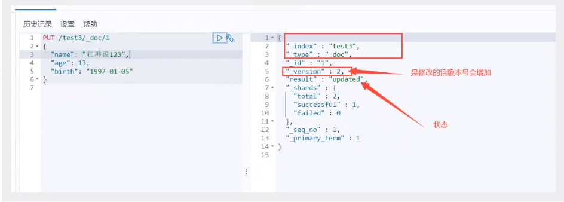

2、使用POST  +  _update


```json
POST /test/user/2/_update
{
  "doc":{
    "name":"abw"
  }
  
  }
```


> 两种方法对比

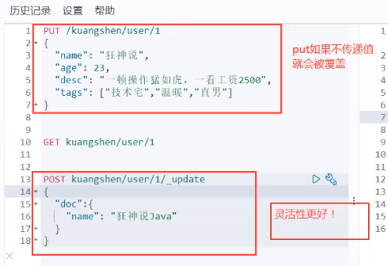


#### 4）删除 --DELETE

通过DELETE命令实现删除、根据你的请求来判断是删除索引怀旱删除文档记录!
使用RES下FUL风格是我们ES推荐大家使用的!

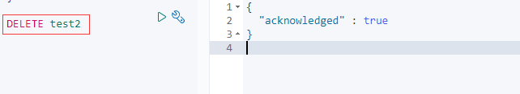

#### 5）没有select


### 3、关于文档的基本操作（重点）

#### 1）GET id 指定id查询

> 存在：

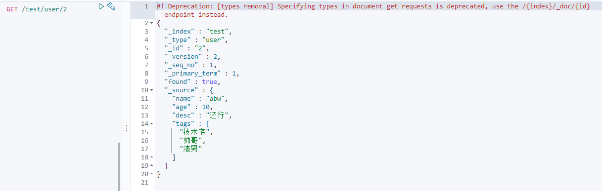

> 不存在：

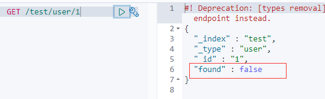

> 查询数据库信息（索引）

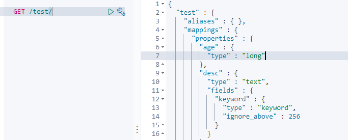

```json

{
  "test" : {
    "aliases" : { },
    "mappings" : {
      "properties" : {
        "age" : {
          "type" : "long"
        },
       
        "name" : {
          "type" : "text",
          "fields" : {
            "keyword" : {
              "type" : "keyword",
              "ignore_above" : 256
            }
          }
        }
    },
    "settings" : {
      "index" : {
        "creation_date" : "1613920724875",
        "number_of_shards" : "1",
        "number_of_replicas" : "1",
        "uuid" : "oTT0H4i9Sea-GRtGH6QyIQ",
        "version" : {
          "created" : "7060199"
        },
        "provided_name" : "test"
      }
    }
  }
}

```

> 不能查询到类型一级，报405错误

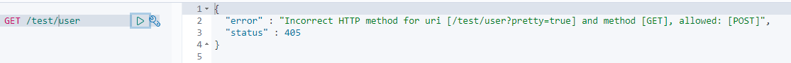


#### 2）简单的条件查询：GET + _search

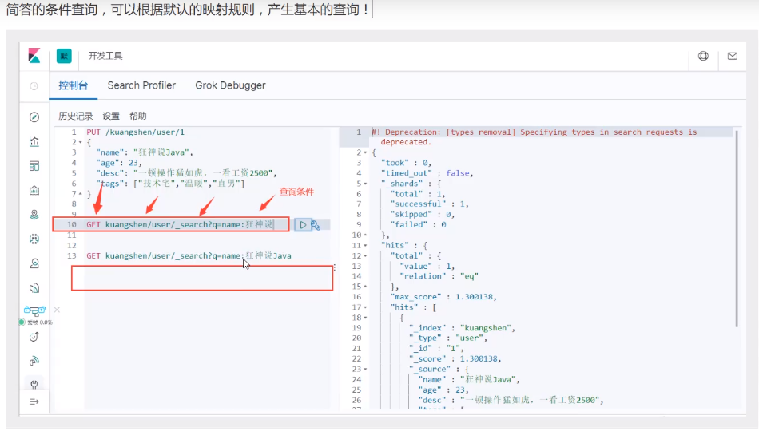

> 是精准匹配，匹配得到：

- 注意：前面的url只到类型（表）一级，相当于查表

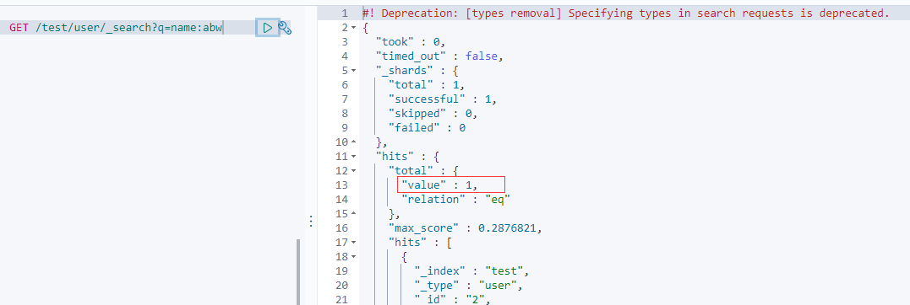

> 匹配不到

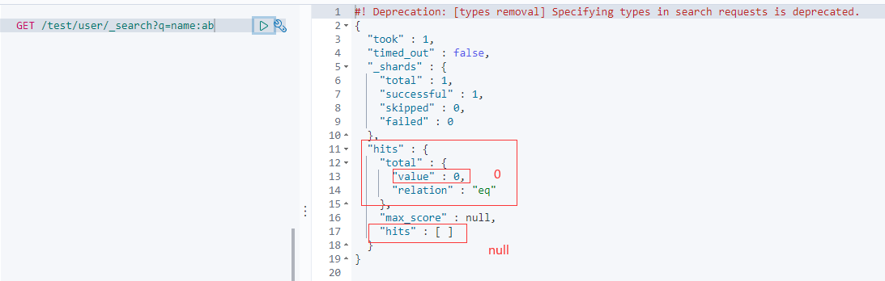


#### 3）复杂操作搜索（排序/分页/高亮/模糊查询/精准查询）


> 创建数据：

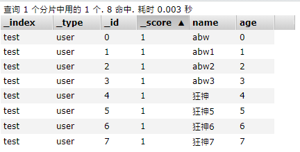


> 基本语法：

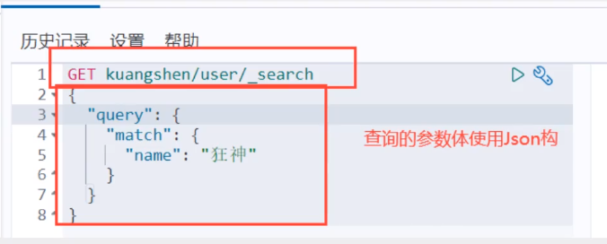


> 伪精准查询：

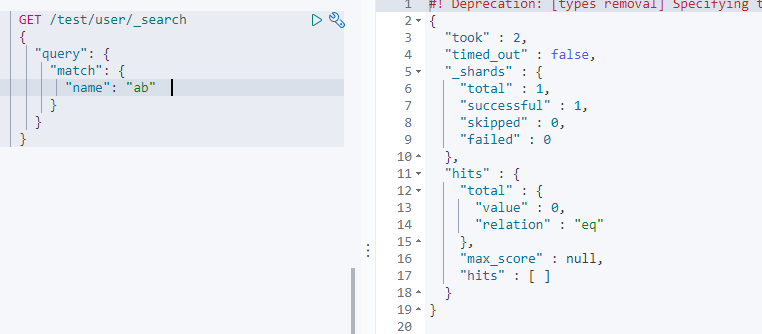

==（待定，可能跟字段类型有关，text与keyword）==

英文是精确匹配，中文可以模糊匹配。（可能跟用了ik中文分词器有关）

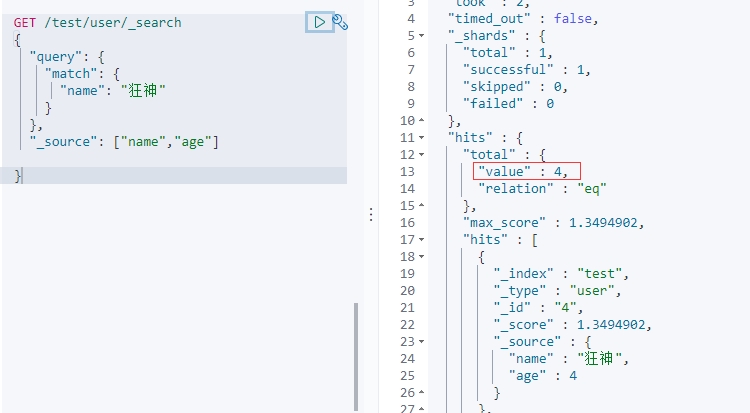


> 结果字段过滤  **_source**

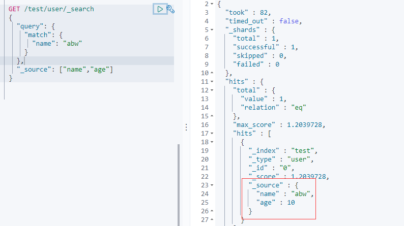

> 排序  sort

- desc降序/asc升序

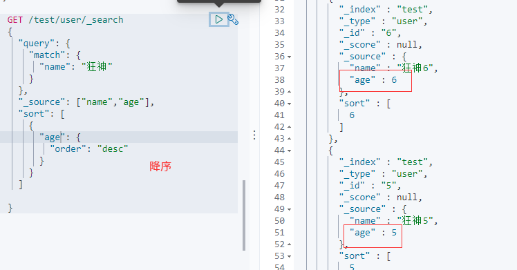

> 分页查询 （from，size）

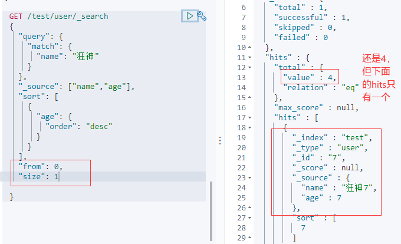

数据下标还是从0开始的，和学的所有数据结构是一样的!
/search/{current}/{pagesize}


> 布尔值查询--bool

实现多条件查询：

- must （and），所有的条件都要符合 where id=1 and name=xxx

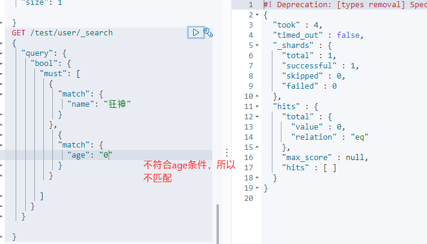

- should （or），部分条件符合 where id=1 or name=xxx

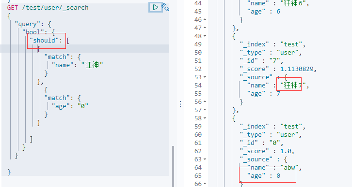

- must_not （no），符合 where id！=1 and name！=xxx


```shell
- [   ]表示数组
- { }表示对象，可以包含多个对象
- value
```

> 过滤器

1、实现取特定数值范围（filter+range+gte/lte）

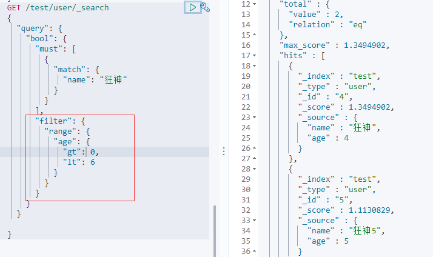


> 数组多条件匹配  （空格）

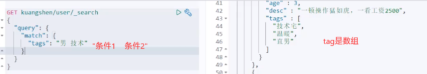


> 精确查询 term

**term**查询是直接通过倒排索引指定的词条进程精确查找的!

- 关于分词:
    - term，直接查询精确的
    - match，**会使用分词器解析**!(先分析文档，然后在通过分析的文档进行查询!)

- 两个类型text keyword

    

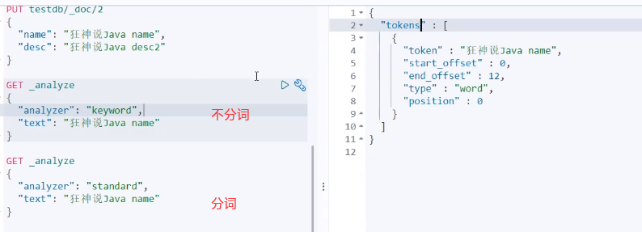

==value为keyword类型不会分词==：

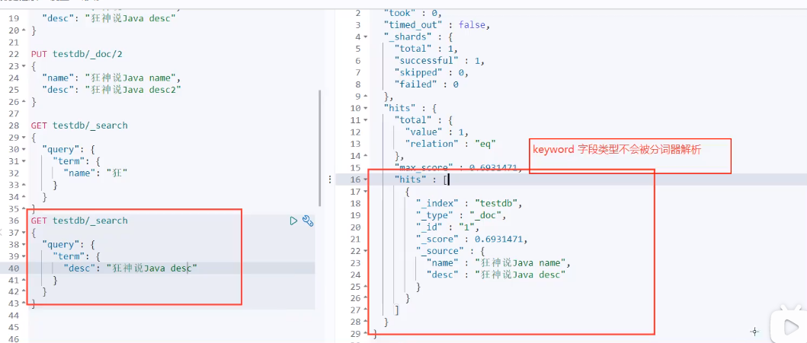

> 多个值匹配精确查询

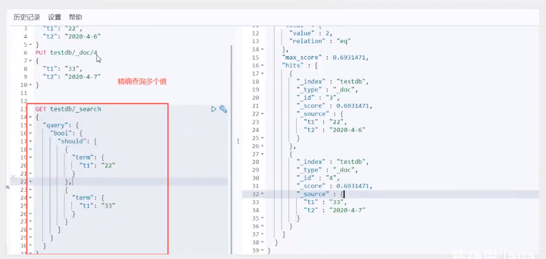


> 高亮查询 highlight

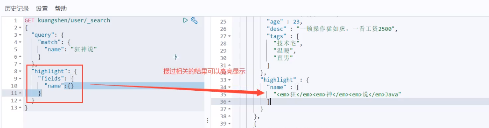

- pre_tags/post_tags:


> 精确查询的意思

这里的精确查询是指关键字能否被拆开，不能被拆开就是精确查询（可能），

有点乱，后面查查。

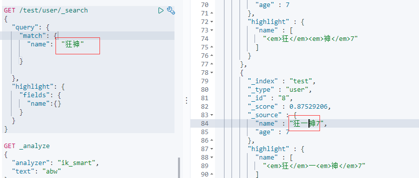


> 小结


#### 4)term和match的区别

> 参考：https://www.jianshu.com/p/d5583dff4157

注意：下面的title是 `text`类型，若是 `keyword`类型则不会进行分词处理和分词存储

##### `term` 和 `match` 总结

在实际的项目查询中，`term`和`match` 是最常用的两个查询，而经常搞不清两者有什么区别，趁机总结有空总结下。

##### `term`用法

先看看term的定义，term是代表完全匹配，也就是精确查询，搜索前不会再对搜索词进行分词拆解。

这里通过例子来说明，先存放一些数据：


```json
{
    "title": "love China",
    "content": "people very love China",
    "tags": ["China", "love"]
}
{
    "title": "love HuBei",
    "content": "people very love HuBei",
    "tags": ["HuBei", "love"]
}
```

来使用`term` 查询下：

```json
{
  "query": {
    "term": {
      "title": "love"
    }
  }
}
```

结果是，上面的两条数据都能查询到：

```json
{
  "took": 1,
  "timed_out": false,
  "_shards": {
    "total": 5,
    "successful": 5,
    "skipped": 0,
    "failed": 0
  },
  "hits": {
    "total": 2,
    "max_score": 0.6931472,
    "hits": [
      {
        "_index": "test",
        "_type": "doc",
        "_id": "8",
        "_score": 0.6931472,
        "_source": {
          "title": "love HuBei",
          "content": "people very love HuBei",
          "tags": ["HuBei","love"]
        }
      },
      {
        "_index": "test",
        "_type": "doc",
        "_id": "7",
        "_score": 0.6931472,
        "_source": {
          "title": "love China",
          "content": "people very love China",
          "tags": ["China","love"]
        }
      }
    ]
  }
}
```

发现，title里有关love的关键字都查出来了，但是我只想精确匹配 `love China`这个，按照下面的写法看看能不能查出来：


```json
{
  "query": {
    "term": {
      "title": "love China"
    }
  }
}
```

执行发现无数据，从概念上看，term属于精确匹配，只能查单个词。我想用term匹配多个词怎么做？可以使用`terms`来：


```json
{
  "query": {
    "terms": {
      "title": ["love", "China"]
    }
  }
}
```

查询结果为：


```json
{
  "took": 1,
  "timed_out": false,
  "_shards": {
    "total": 5,
    "successful": 5,
    "skipped": 0,
    "failed": 0
  },
  "hits": {
    "total": 2,
    "max_score": 0.6931472,
    "hits": [
      {
        "_index": "test",
        "_type": "doc",
        "_id": "8",
        "_score": 0.6931472,
        "_source": {
          "title": "love HuBei",
          "content": "people very love HuBei",
          "tags": ["HuBei","love"]
        }
      },
      {
        "_index": "test",
        "_type": "doc",
        "_id": "7",
        "_score": 0.6931472,
        "_source": {
          "title": "love China",
          "content": "people very love China",
          "tags": ["China","love"]
        }
      }
    ]
  }
}
```

发现全部查询出来，为什么？因为terms里的`[ ]` 多个是或者的关系，只要满足其中一个词就可以。想要通知满足两个词的话，就得使用bool的must来做，如下：


```json
{
  "query": {
    "bool": {
      "must": [
        {
          "term": {
            "title": "love"
          }
        },
        {
          "term": {
            "title": "china"
          }
        }
      ]
    }
  }
}
```

可以看到，我们上面使用`china`是小写的。当使用的是大写的`China` 我们进行搜索的时候，发现搜不到任何信息。这是为什么了？**title这个词在进行存储的时候，进行了分词处理。**我们这里使用的是默认的分词处理器进行了分词处理。我们可以看看如何进行分词处理的？

##### 分词处理器

```bash
GET test/_analyze
{
  "text" : "love China"
}
```

结果为：

```json
{
  "tokens": [
    {
      "token": "love",
      "start_offset": 0,
      "end_offset": 4,
      "type": "<ALPHANUM>",
      "position": 0
    },
    {
      "token": "china",
      "start_offset": 5,
      "end_offset": 10,
      "type": "<ALPHANUM>",
      "position": 1
    }
  ]
}
```

分析出来的为`love`和`china`的两个词。而`term`只能完完整整的匹配上面的词，不做任何改变的匹配。所以，我们使用`China`这样的方式进行的查询的时候，就会失败。稍后会有一节专门讲解分词器。

##### `match` 用法

先用 `love China`来匹配。

```json
GET test/doc/_search
{
  "query": {
    "match": {
      "title": "love China"
    }
  }
}
```

结果是：

```json
{
  "took": 1,
  "timed_out": false,
  "_shards": {
    "total": 5,
    "successful": 5,
    "skipped": 0,
    "failed": 0
  },
  "hits": {
    "total": 2,
    "max_score": 1.3862944,
    "hits": [
      {
        "_index": "test",
        "_type": "doc",
        "_id": "7",
        "_score": 1.3862944,
        "_source": {
          "title": "love China",
          "content": "people very love China",
          "tags": [
            "China",
            "love"
          ]
        }
      },
      {
        "_index": "test",
        "_type": "doc",
        "_id": "8",
        "_score": 0.6931472,
        "_source": {
          "title": "love HuBei",
          "content": "people very love HuBei",
          "tags": [
            "HuBei",
            "love"
          ]
        }
      }
    ]
  }
}
```

发现两个都查出来了，为什么？因为match进行搜索的时候，会先进行分词拆分，拆完后，再来匹配，上面两个内容，他们title的词条为： `love china hubei` ，我们搜索的为`love China` 我们进行分词处理得到为`love china` ，并且属于或的关系，只要任何一个词条在里面就能匹配到。如果想 `love` 和 `China` 同时匹配到的话，怎么做？使用 `match_phrase`

##### `match_phrase` 用法

`match_phrase` 称为短语搜索，要求所有的分词必须同时出现在文档中，同时位置必须紧邻一致。


```json
GET test/doc/_search
{
  "query": {
    "match_phrase": {
      "title": "love china"
    }
  }
}
```

结果为：


```json
{
  "took": 5,
  "timed_out": false,
  "_shards": {
    "total": 5,
    "successful": 5,
    "skipped": 0,
    "failed": 0
  },
  "hits": {
    "total": 1,
    "max_score": 1.3862944,
    "hits": [
      {
        "_index": "test",
        "_type": "doc",
        "_id": "7",
        "_score": 1.3862944,
        "_source": {
          "title": "love China",
          "content": "people very love China",
          "tags": [
            "China",
            "love"
          ]
        }
      }
    ]
  }
}
```

这次好像符合我们的需求了，结果只出现了一条记录。


作者：f22448cd5541
链接：https://www.jianshu.com/p/d5583dff4157
来源：简书
著作权归作者所有。商业转载请联系作者获得授权，非商业转载请注明出处。

# 4、集成springboot

```bash
【时间】2021.02.22 周一
【内容】
#springboot集成ES
12、SpringBoot集成ES详解 24:10
13、关于索引的API操作详解 10:57
14、关于文档的API操作详解 35:21

```

## 4.1、找官方文档！

- 文档连接 https://www.elastic.co/guide/index.html

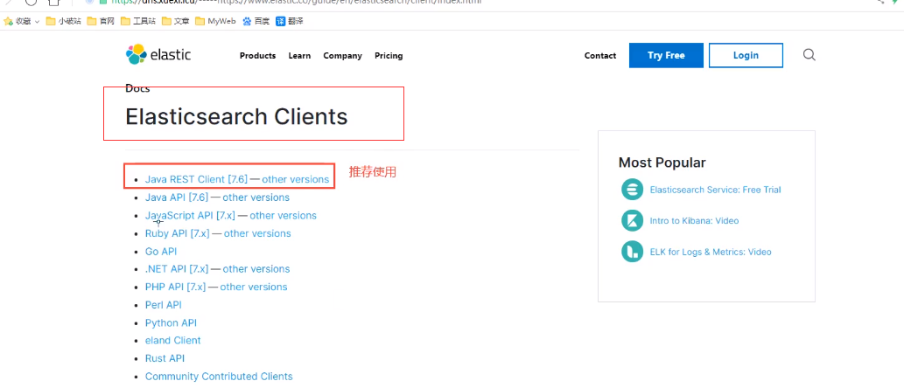


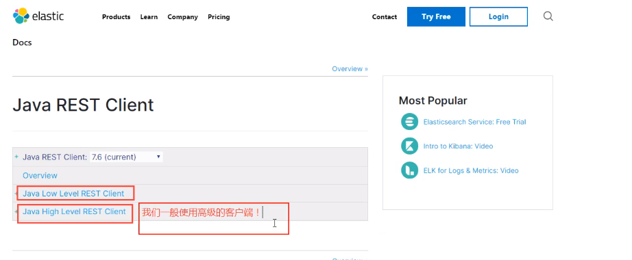

点开有各种API：

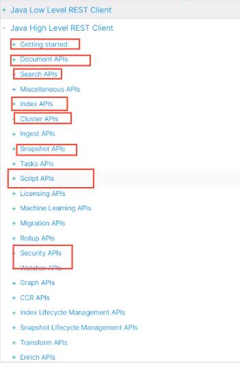

1、找到原生的依赖

```xml
<dependency>
	<groupId>org.elasticsearch.client</groupId>
	<artifactId>elasticsearch-rest-high-level-client</artifactId>
	<version>7.6.2</version>
</dependency>

```

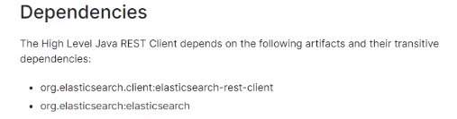


2、找对象
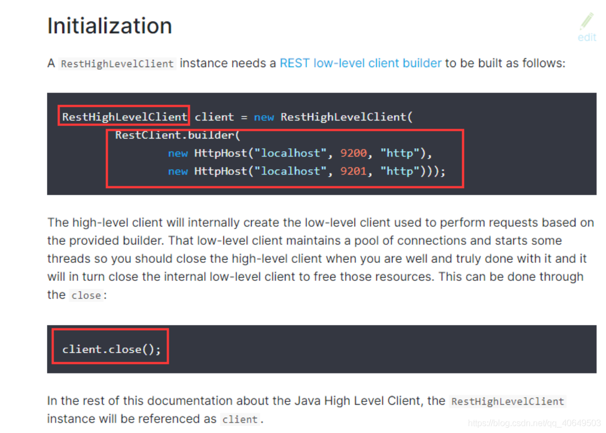

- EwstHightLevelClient类

3、分析这个类中的方法即可！

## 4.2、配置基本的项目

### 1、项目创建

- 先创建一个空项目
- 然后在空项目中创建一个模块
    
    


### 2、修改各种配置（jdk等）

创建完成之后，配置项目设置：在Project Structure中设置，点击右上角图标即可：


- 项目添加加JDK

    

    

- 改版本
    

    

    > 修改jave compiler 版本和javaScript版本(后续要用）

    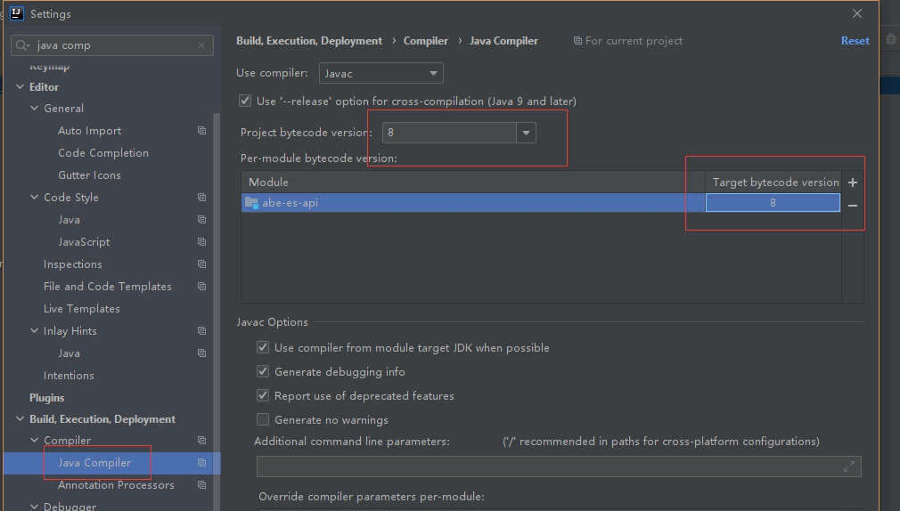

    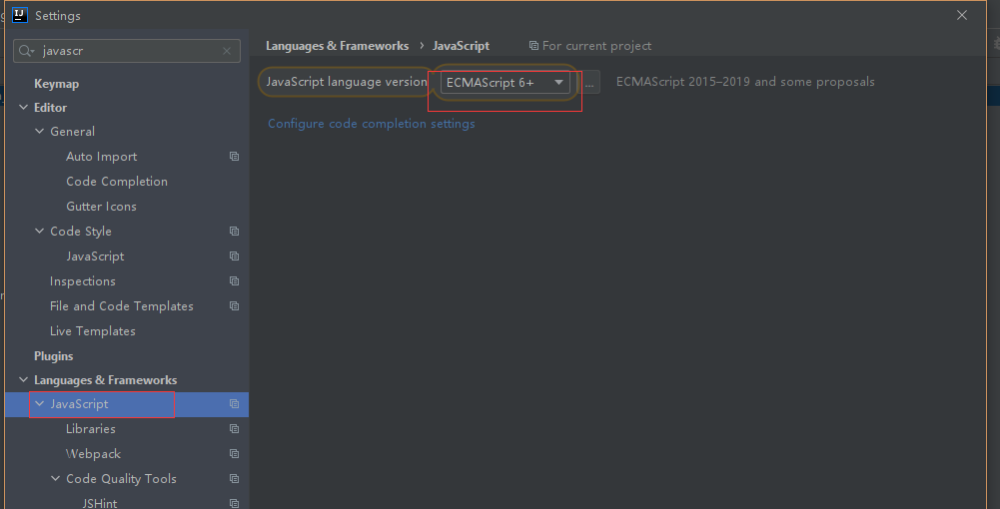

    

    

    

- maven仓库
    

    

- 改编码
    

### 3、修改ES版本依赖

> 问题：一定要保证 我们的导入的依赖和我们的 es 版本一致


查看版本


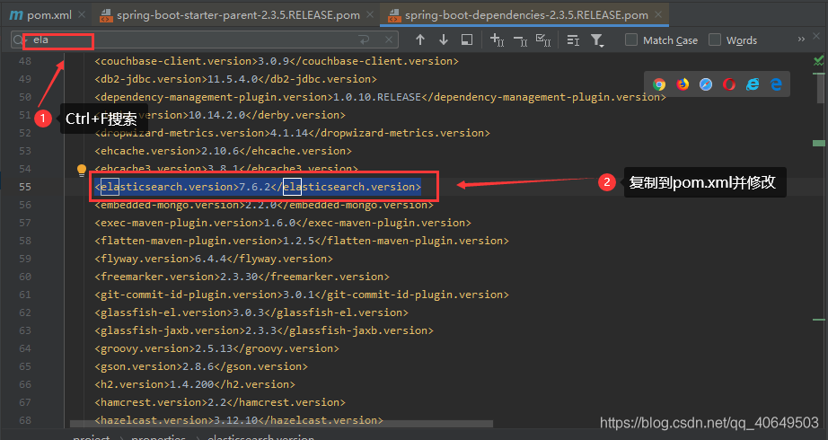

```xml
	<properties>
		<java.version>1.8</java.version>
		<!--自定义es版本依赖,保证和本地一样-->
		<elasticsearch.version>7.6.1</elasticsearch.version>
	</properties>
```


### 4、配置config--将对象注入到spring容器中

> 查找源码中提供对象！

在sprint-boot-autoconfigure包中查找，该包包含了各种集成的jar的默认配置，看下默认配置是怎样的，在此基础上进行修改。

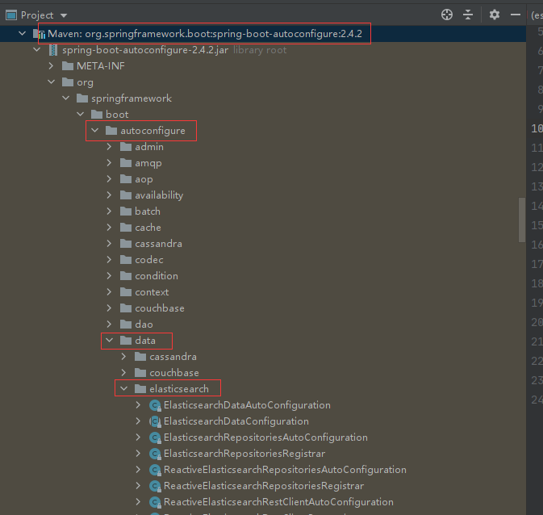 

​      

```java

//ReactiveElasticsearchRestClientAutoConfiguration

@Configuration(proxyBeanMethods = false)
@ConditionalOnMissingBean(RestHighLevelClient.class)  //当RestHightLevelClient对象不存在时，才加载默认配置
static class RestHighLevelClientConfiguration {

   @Bean
   RestHighLevelClient elasticsearchRestHighLevelClient(RestClientBuilder restClientBuilder) {
      return new RestHighLevelClient(restClientBuilder);
   }

}
```


> 虽然这里导入 3 个类，静态内部类，核心类就一个！

```java
    @Configuration(proxyBeanMethods = false)
    @ConditionalOnClass(RestHighLevelClient.class)
    static class RestHighLevelClientConfiguration {
        //  RestHighLevelClient  高级客户端，也是我们这里要讲，后面项目会用到的客户端
        @Bean
        @ConditionalOnMissingBean
        RestHighLevelClient elasticsearchRestHighLevelClient(RestClientBuilder
                                                                     restClientBuilder) {
            return new RestHighLevelClient(restClientBuilder);
        }
```


```java
/*
 * Copyright 2012-2019 the original author or authors.
 *
 * Licensed under the Apache License, Version 2.0 (the "License");
 * you may not use this file except in compliance with the License.
 * You may obtain a copy of the License at
 *
 *      https://www.apache.org/licenses/LICENSE-2.0
 *
 * Unless required by applicable law or agreed to in writing, software
 * distributed under the License is distributed on an "AS IS" BASIS,
 * WITHOUT WARRANTIES OR CONDITIONS OF ANY KIND, either express or implied.
 * See the License for the specific language governing permissions and
 * limitations under the License.
 */
package org.springframework.boot.autoconfigure.elasticsearch.rest;

import java.time.Duration;

import org.apache.http.HttpHost;
import org.apache.http.auth.AuthScope;
import org.apache.http.auth.Credentials;
import org.apache.http.auth.UsernamePasswordCredentials;
import org.apache.http.client.CredentialsProvider;
import org.apache.http.impl.client.BasicCredentialsProvider;
import org.elasticsearch.client.RestClient;
import org.elasticsearch.client.RestClientBuilder;
import org.elasticsearch.client.RestHighLevelClient;
import org.springframework.beans.factory.ObjectProvider;
import org.springframework.boot.autoconfigure.condition.ConditionalOnClass;
import
        org.springframework.boot.autoconfigure.condition.ConditionalOnMissingBean;
import org.springframework.boot.context.properties.PropertyMapper;
import org.springframework.context.annotation.Bean;
import org.springframework.context.annotation.Configuration;

/**
 * Elasticsearch rest client infrastructure configurations.
 *
 * @author Brian Clozel
 * @author Stephane Nicoll
 */
class RestClientConfigurations {
    @Configuration(proxyBeanMethods = false)
    static class RestClientBuilderConfiguration {
        //  RestClientBuilder
        @Bean
        @ConditionalOnMissingBean
        RestClientBuilder elasticsearchRestClientBuilder(RestClientProperties properties,
                                                         ObjectProvider<RestClientBuilderCustomizer> builderCustomizers) {
            HttpHost[] hosts = properties.getUris().stream().map(HttpHost::create).toArray(HttpHost[]::new);
            RestClientBuilder builder = RestClient.builder(hosts);
            PropertyMapper map = PropertyMapper.get();
            map.from(properties::getUsername).whenHasText().to((username) -> {
                CredentialsProvider credentialsProvider = new
                        BasicCredentialsProvider();
                Credentials credentials = new
                        UsernamePasswordCredentials(properties.getUsername(),
                        properties.getPassword());
                credentialsProvider.setCredentials(AuthScope.ANY, credentials);
                builder.setHttpClientConfigCallback(
                        (httpClientBuilder) ->
                                httpClientBuilder.setDefaultCredentialsProvider(credentialsProvider));
            });
            builder.setRequestConfigCallback((requestConfigBuilder) -> {

                map.from(properties::getConnectionTimeout).whenNonNull().asInt(Duration::toMill
                        is)
                        .to(requestConfigBuilder::setConnectTimeout);

                map.from(properties::getReadTimeout).whenNonNull().asInt(Duration::toMillis)
                        .to(requestConfigBuilder::setSocketTimeout);
                return requestConfigBuilder;
            });
            builderCustomizers.orderedStream().forEach((customizer) ->
                    customizer.customize(builder));
            return builder;
        }
    }

    @Configuration(proxyBeanMethods = false)
    @ConditionalOnClass(RestHighLevelClient.class)
    static class RestHighLevelClientConfiguration {
        //  RestHighLevelClient  高级客户端，也是我们这里要讲，后面项目会用到的客户端
        @Bean
        @ConditionalOnMissingBean
        RestHighLevelClient elasticsearchRestHighLevelClient(RestClientBuilder
                                                                     restClientBuilder) {
            return new RestHighLevelClient(restClientBuilder);
        }

        @Bean
        @ConditionalOnMissingBean
        RestClient elasticsearchRestClient(RestClientBuilder builder,
                                           ObjectProvider<RestHighLevelClient> restHighLevelClient) {
            RestHighLevelClient client = restHighLevelClient.getIfUnique();
            if (client != null) {
                return client.getLowLevelClient();
            }
            return builder.build();
        }
    }

    @Configuration(proxyBeanMethods = false)
    static class RestClientFallbackConfiguration {
        // RestClient 普通的客户端！
        @Bean
        @ConditionalOnMissingBean
        RestClient elasticsearchRestClient(RestClientBuilder builder) {
            return builder.build();
        }
    }
}
```

> 据此进行自定义配置文件

```java

package com.abw.esapi.config;

import org.apache.http.HttpHost;
import org.elasticsearch.client.RestClient;
import org.elasticsearch.client.RestHighLevelClient;
import org.springframework.context.annotation.Bean;
import org.springframework.context.annotation.Configuration;

//狂神Spring两步骤
//1.找对象
//2.放到Spring中待用
//3.如果是SpringBoot就分析一波源码
//XXXAutoConfiguration XXXProperties
@Configuration
public class ElasticSearchClientConfig {
    @Bean
    public  RestHighLevelClient restHighLevelClient(){
        RestHighLevelClient client = new RestHighLevelClient(
                RestClient.builder(new HttpHost("127.0.0.1",9200)));
        return client;

    }
}

```

## 4.3 、具体的API测试

### 1、创建索引

```java
	// 测试索引的创建  Request  PUT kuang_index
	@Test
	void testCreateIndex() throws IOException {
		// 1、创建索引请求
		CreateIndexRequest request = new CreateIndexRequest("kuang_index");
		// 2、客户端执行请求 IndicesClient,请求后获得响应
		CreateIndexResponse createIndexResponse =
				client.indices().create(request, RequestOptions.DEFAULT);
		System.out.println(createIndexRespnse);
	}
```

> 测试结果

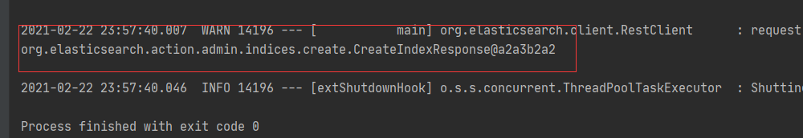

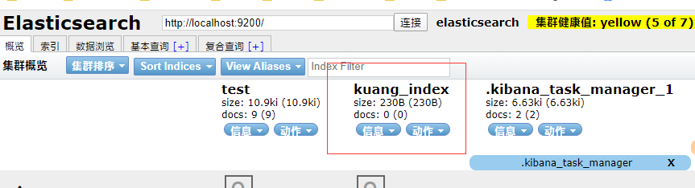


### 2、判断索引是否存在

```java
	//获取索引请求
	//注意导入的包是client下的，import org.elasticsearch.client.indices.GetIndexRequest;
    //action下的参数是流InputStream
	@Test
	void testExistIndex() throws IOException {
		GetIndexRequest request = new GetIndexRequest("kuang_index");
		boolean exists = client.indices().exists(request, RequestOptions.DEFAULT);
		System.out.println(exists);
	}
```


### 3、删除索引

```java
    // 测试删除索引
    @Test
    void testDeleteIndex() throws IOException {
        DeleteIndexRequest request = new DeleteIndexRequest("kuang_index");
        //删除
        AcknowledgedResponse delete = client.indices().delete(request, RequestOptions.DEFAULT);
        System.out.println(delete.isAcknowledged());

    }
```

### 4、创建文档

> 首先创建一个`User`实体类

```java
package com.abw.esapi.pojo;

import lombok.AllArgsConstructor;
import lombok.Data;
import lombok.NoArgsConstructor;
import org.springframework.stereotype.Component;

@Data
@AllArgsConstructor
@NoArgsConstructor
@Component
public class User {
    private String name;
    private int age;
}

```

> 导入依赖--fastjson

```xml
		<dependency>
			<groupId>com.alibaba</groupId>
			<artifactId>fastjson</artifactId>
			<version>1.2.74</version>
		</dependency>
		
```

> 测试

```java

    //测试添加文档
    @Test
    void testAddDocument() throws IOException {
        //创建对象
        User user = new User("狂神说", 3);
        //创建请求
        IndexRequest request = new IndexRequest("kuang_index");
        //规则 put /kuang_index/_doc/1
        request.id("1");
        //request.timeout(TimeValue.timeValueSeconds(1)); //两种设置timeout方式
        request.timeout("1s");
        // 将我们的数据放入请求  json
        request.source(JSON.toJSONString(user), XContentType.JSON);
        // 客户端发送请求 , 获取响应的结果
        IndexResponse indexResponse = client.index(request, RequestOptions.DEFAULT);

        System.out.println(indexResponse.toString());//数据
        System.out.println(indexResponse.status());// 对应我们命令返回的状态CREATED
    }

```

> 结果

```json
IndexResponse[index=kuang_index,type=_doc,id=1,version=1,result=created,seqNo=0,primaryTerm=1,shards={"total":2,"successful":1,"failed":0}]
CREATED

```


### 5、判断文档是否存在

```java
    // 获取文档，判断是否存在 get /index/doc/1
    @Test
    void testIsExists() throws IOException {
        GetRequest getRequest = new GetRequest("kuang_index", "1");
        
        // 不获取返回的 _source 的上下文了，es的查询返回的json结果里"hits"下的"_source"
        getRequest.fetchSourceContext(new FetchSourceContext(false));
        getRequest.storedFields("_none_");//不排序

        boolean exists = client.exists(getRequest, RequestOptions.DEFAULT);
        System.out.println(exists);
    }
```

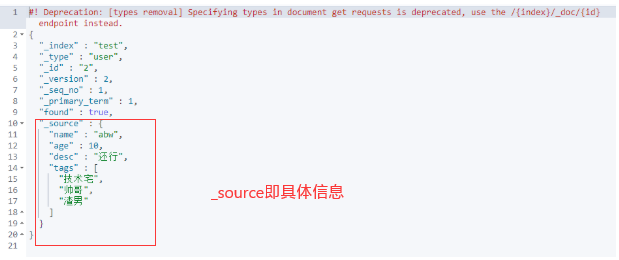


### 6、获取文档信息

```java
    // 获得文档的信息
    @Test
    void testGetDocument() throws IOException {
        GetRequest getRequest = new GetRequest("kuang_index", "1");
        GetResponse getResponse = client.get(getRequest,RequestOptions.DEFAULT);
        System.out.println(getResponse.getSourceAsString()); // 打印文档的内容
        System.out.println(getResponse); // 返回的全部内容和命令式一样的
    }
```

> 结果

```json
{"age":3,"name":"狂神说"}
{"_index":"kuang_index","_type":"_doc","_id":"1","_version":1,"_seq_no":0,"_primary_term":1,"found":true,"_source":{"age":3,"name":"狂神说"}}

```

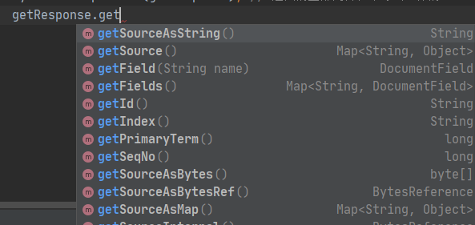

### 7、更新文档的信息

```java
    // 更新文档的信息
    @Test
    void testUpdateRequest() throws IOException {
        UpdateRequest request = new UpdateRequest("kuang_index","1");
        request.timeout("1s");

        User user = new User("狂神说Java", 18);
        request.doc(JSON.toJSONString(user),XContentType.JSON);

        UpdateResponse update = client.update(request, RequestOptions.DEFAULT);
        System.out.println(update);
        System.out.println(update.status());
    }
```

```java
//参考
request.doc(JSON.toJSONString(user),XContentType.JSON);
```


> 结果

```json
UpdateResponse[index=kuang_index,type=_doc,id=1,version=2,seqNo=1,primaryTerm=1,result=noop,shards=ShardInfo{total=0, successful=0, failures=[]}]
OK
```


### 8、删除文档记录

```java
    // 删除文档记录
    @Test
    void testDeleteRequest() throws IOException {
        DeleteRequest request = new DeleteRequest("kuang_index","1");
        request.timeout("1s");
        DeleteResponse deleteResponse = client.delete(request,
                RequestOptions.DEFAULT);
        System.out.println(deleteResponse.status());
    }
```

> 结果

```bash
DeleteResponse[index=kuang_index,type=_doc,id=1,version=5,result=deleted,shards=ShardInfo{total=2, successful=1, failures=[]}]
OK
```


### 9、特殊的，真的项目一般都会批量插入数据！

> 使用bulkRequest和bulkResponse

```bash
bulk - 百度翻译
bulk	英[bʌlk]
美[bʌlk]
n.	主体; 大部分; (大)体积; 大(量); 巨大的体重(或重量、形状、身体等);
v.	变得巨大（重要）; 胀大; 增大; 扩展; （重要性等）增加; 用眼力估计; 毛估（重量; 体积等）;
```


```java
    // 特殊的，真的项目一般都会批量插入数据！
    @Test
    void testBulkRequest() throws IOException {
        BulkRequest bulkRequest = new BulkRequest();
        bulkRequest.timeout("10s");

        List<User> userList = new ArrayList<>();
        userList.add(new User("kuangshen1",20));
        userList.add(new User("kuangshen2",21));
        userList.add(new User("kuangshen3",22));
        userList.add(new User("kuangshen4",23));
        userList.add(new User("kuangshen5",24));

        //批量处理数据
        for (int i = 0; i < userList.size(); i++) {
            //批量删除和修改就在这里操作
            bulkRequest.add(
                    new IndexRequest("kuang_index")
                    .id(""+(i+1))
                    .source(JSON.toJSONString(userList.get(i)),XContentType.JSON)
            );
        }
        BulkResponse bulk = client.bulk(bulkRequest, RequestOptions.DEFAULT);
        System.out.println(bulk.hasFailures());//是否执行失败
    }
```

> 结果

```bash
org.elasticsearch.action.bulk.BulkResponse@4342c13
false

```


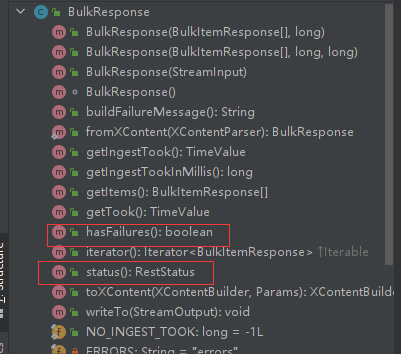


### 10、查询

```java
    // 查询
    // SearchRequest 搜索请求
    // SearchSourceBuilder 条件构造
    //  HighlightBuilder 构建高亮
    //  TermQueryBuilder 精确查询
    //  MatchAllQueryBuilder
    //  xxx QueryBuilder 对应我们刚才看到的命令！

    @Test
    void testSearch() throws IOException {
        SearchRequest searchRequest = new SearchRequest("kuang_index");
        //构建搜索条件
        SearchSourceBuilder sourceBuilder = new SearchSourceBuilder();
        
        //查询条件,我们可以使用SearchSourceBuilder工具来实现
        //匹配所有 QueryBuilders.matchAllQuery()

        //精确匹配QueryBuilders.termQuery()
        TermQueryBuilder termQueryBuilder = QueryBuilders.termQuery("name", "kuangshen1");
        sourceBuilder.query(termQueryBuilder);
        sourceBuilder.timeout(new TimeValue(60, TimeUnit.SECONDS));

        searchRequest.source(sourceBuilder);

        SearchResponse searchResponse = client.search(searchRequest, RequestOptions.DEFAULT);
        System.out.println(JSON.toJSONString(searchResponse));
        System.out.println("+++++++++++++++++++++++++++++++++++++++++");
        for (SearchHit hit : searchResponse.getHits()) {
            System.out.println(hit.getSourceAsMap());
        }
    }
```

> 结果

```go
{"fragment":false,"suggestOnly":false}
+++++++++++++++++++++++++++++++++++++++++
{name=kuangshen1, age=20}
```

> 补充：

1、搜索源建造者的各种methods：

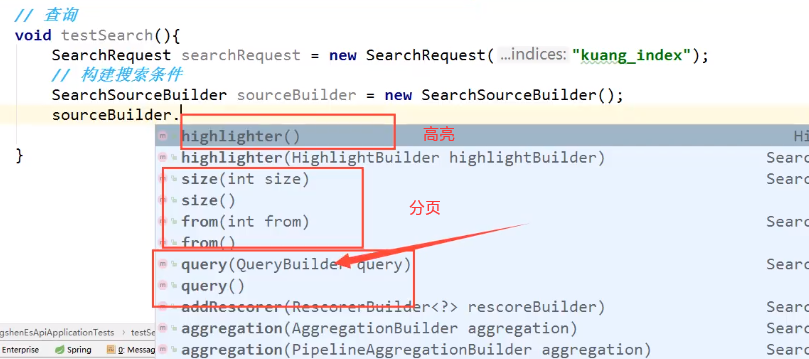

2、各种query条件类

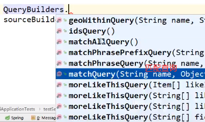


### 11、汇总

```java
package com.abw.esapi;

import com.abw.esapi.pojo.User;
import com.alibaba.fastjson.JSON;
import org.elasticsearch.action.admin.indices.delete.DeleteIndexRequest;
import org.elasticsearch.action.bulk.BulkRequest;
import org.elasticsearch.action.bulk.BulkResponse;
import org.elasticsearch.action.delete.DeleteRequest;
import org.elasticsearch.action.delete.DeleteResponse;
import org.elasticsearch.action.get.GetRequest;
import org.elasticsearch.action.get.GetResponse;
import org.elasticsearch.action.index.IndexRequest;
import org.elasticsearch.action.index.IndexResponse;
import org.elasticsearch.action.search.SearchRequest;
import org.elasticsearch.action.search.SearchResponse;
import org.elasticsearch.action.support.master.AcknowledgedResponse;
import org.elasticsearch.action.update.UpdateRequest;
import org.elasticsearch.action.update.UpdateResponse;
import org.elasticsearch.client.RequestOptions;
import org.elasticsearch.client.RestHighLevelClient;
import org.elasticsearch.client.indices.CreateIndexRequest;
import org.elasticsearch.client.indices.CreateIndexResponse;
import org.elasticsearch.client.indices.GetIndexRequest;
import org.elasticsearch.common.unit.TimeValue;
import org.elasticsearch.common.xcontent.XContentType;
import org.elasticsearch.index.query.QueryBuilders;
import org.elasticsearch.index.query.TermQueryBuilder;
import org.elasticsearch.search.SearchHit;
import org.elasticsearch.search.builder.SearchSourceBuilder;
import org.elasticsearch.search.fetch.subphase.FetchSourceContext;
import org.junit.jupiter.api.Test;
import org.springframework.beans.factory.annotation.Autowired;
import org.springframework.beans.factory.annotation.Qualifier;
import org.springframework.boot.test.context.SpringBootTest;

import java.io.IOException;
import java.util.ArrayList;
import java.util.List;
import java.util.concurrent.TimeUnit;

@SpringBootTest
class EsApiApplicationTests {
	@Autowired
	@Qualifier("restHighLevelClient")
	private RestHighLevelClient client;


	// 测试索引的创建  Request  PUT kuang_index
	@Test
	void testCreateIndex() throws IOException {
		// 1、创建索引请求
		CreateIndexRequest request = new CreateIndexRequest("kuang_index");
		// 2、客户端执行请求 IndicesClient,请求后获得响应
		CreateIndexResponse createIndexResponse =
				client.indices().create(request, RequestOptions.DEFAULT);
		System.out.println("response");
		System.out.println(createIndexResponse);
	}


	//获取索引请求
	//注意导入的包是client下的，import org.elasticsearch.client.indices.GetIndexRequest;
	@Test
	void testExistIndex() throws IOException {
		GetIndexRequest request = new GetIndexRequest("kuang_index");
		boolean exists = client.indices().exists(request, RequestOptions.DEFAULT);
		System.out.println(exists);
	}

	// 测试删除索引
	@Test
	void testDeleteIndex() throws IOException {
		DeleteIndexRequest request = new DeleteIndexRequest("kuang_index");
		//删除
		AcknowledgedResponse delete = client.indices().delete(request, RequestOptions.DEFAULT);
		System.out.println(delete.isAcknowledged());

	}
	//测试添加文档
	@Test
	void testAddDocument() throws IOException {
		//创建对象
		User user = new User("狂神说", 3);
		//创建请求
		IndexRequest request = new IndexRequest("kuang_index");
		//规则 put /kuang_index/_doc/1
		request.id("1");
		request.timeout(TimeValue.timeValueSeconds(1));
		request.timeout("1s");
		// 将我们的数据放入请求  json
		request.source(JSON.toJSONString(user), XContentType.JSON);
		// 客户端发送请求 , 获取响应的结果
		IndexResponse indexResponse = client.index(request, RequestOptions.DEFAULT);

		System.out.println(indexResponse.toString());//数据
		System.out.println(indexResponse.status());// 对应我们命令返回的状态CREATED
	}

	// 获取文档，判断是否存在 get /index/doc/1
	@Test
	void testIsExists() throws IOException {
		GetRequest getRequest = new GetRequest("kuang_index", "1");

		// 不获取返回的 _source 的上下文了
		getRequest.fetchSourceContext(new FetchSourceContext(false));
		getRequest.storedFields("_none_");//不排序

		boolean exists = client.exists(getRequest, RequestOptions.DEFAULT);
		System.out.println(exists);
	}

	// 获得文档的信息
	@Test
	void testGetDocument() throws IOException {
		GetRequest getRequest = new GetRequest("kuang_index", "1");
		GetResponse getResponse = client.get(getRequest,RequestOptions.DEFAULT);
		System.out.println(getResponse.getSourceAsString()); // 打印文档的内容
		System.out.println(getResponse); // 返回的全部内容和命令式一样的
	}

	// 更新文档的信息
	@Test
	void testUpdateRequest() throws IOException {
		UpdateRequest request = new UpdateRequest("kuang_index","1");
		request.timeout("1s");

		User user = new User("狂神说Java", 18);
		request.doc(JSON.toJSONString(user),XContentType.JSON);

		UpdateResponse update = client.update(request, RequestOptions.DEFAULT);
		System.out.println(update);
		System.out.println(update.status());
	}

	// 删除文档记录
	@Test
	void testDeleteRequest() throws IOException {
		DeleteRequest request = new DeleteRequest("kuang_index","1");
		request.timeout("1s");
		DeleteResponse deleteResponse = client.delete(request,
				RequestOptions.DEFAULT);
		System.out.println(deleteResponse);
		System.out.println(deleteResponse.status());
	}

	// 特殊的，真的项目一般都会批量插入数据！
	@Test
	void testBulkRequest() throws IOException {
		BulkRequest bulkRequest = new BulkRequest();
		bulkRequest.timeout("10s");
		List<User> userList = new ArrayList<>();
		userList.add(new User("kuangshen1",20));
		userList.add(new User("kuangshen2",21));
		userList.add(new User("kuangshen3",22));
		userList.add(new User("kuangshen4",23));
		userList.add(new User("kuangshen5",24));

		//批量处理数据
		for (int i = 0; i < userList.size(); i++) {
			//批量删除和修改就在这里操作
			bulkRequest.add(
					new IndexRequest("kuang_index")
							.id(""+(i+1))
							.source(JSON.toJSONString(userList.get(i)),XContentType.JSON)
			);
		}
		BulkResponse bulk = client.bulk(bulkRequest, RequestOptions.DEFAULT);
		System.out.println(bulk);
		System.out.println(bulk.hasFailures());//是否执行失败
	}

	// 查询
	// SearchRequest 搜索请求
	// SearchSourceBuilder 条件构造
	//  HighlightBuilder 构建高亮
	//  TermQueryBuilder 精确查询
	//  MatchAllQueryBuilder
	//  xxx QueryBuilder 对应我们刚才看到的命令！
	// 三层套娃 查询条件QueryBuilder--->搜索源searchSourceBuilder--->搜索请求searchRequest
	@Test
	void testSearch() throws IOException {
		SearchRequest searchRequest = new SearchRequest("kuang_index");
		//构建搜索条件
		SearchSourceBuilder searchSourceBuilder = new SearchSourceBuilder();

		//查询条件,我们可以使用SearchSourceBuilder工具来实现
//		//匹配所有 QueryBuilders.matchAllQuery()
		//精确匹配QueryBuilders.termQuery()
		TermQueryBuilder termQueryBuilder = QueryBuilders.termQuery("name", "kuangshen");
		searchSourceBuilder.query(termQueryBuilder);
		searchSourceBuilder.timeout(new TimeValue(60, TimeUnit.SECONDS));
		searchRequest.source(searchSourceBuilder);

		SearchResponse searchResponse = client.search(searchRequest, RequestOptions.DEFAULT);
		System.out.println(JSON.toJSONString(searchSourceBuilder));
		System.out.println("+++++++++++++++++++++++++++++++++++++++++");
		for (SearchHit hit : searchResponse.getHits()) {
			System.out.println(hit.getSourceAsMap());
		}
	}

}
```


# 5、实战--仿京东搜索项目

```bash
【内容】
##仿京东搜索项目
15、京东搜索：项目搭建 06:00
16、京东搜索：爬取数据 19:47
17、京东搜索：业务编写  18:58
18、京东搜索：前后端交互  10:13
19、京东搜索：关键字高亮实现 09:11


20、狂神聊ES小结02:43
```

## 5.1、准备工作

> 新建一个项目

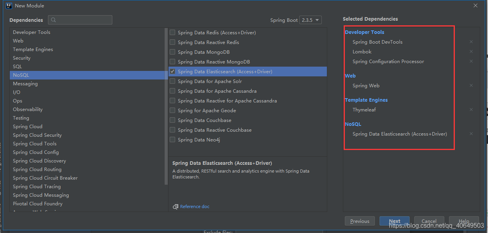
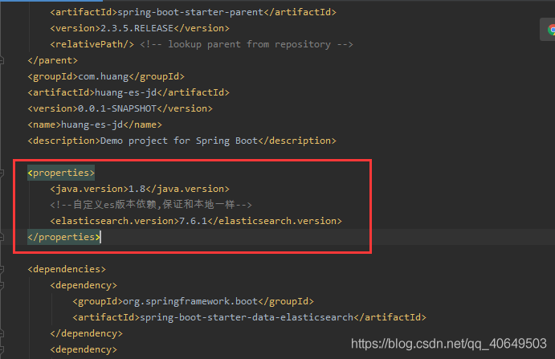

```xml
	<properties>
		<java.version>1.8</java.version>
		<!--自定义es版本依赖,保证和本地一样-->
		<elasticsearch.version>7.6.1</elasticsearch.version>
	</properties>
		<dependency>
			<groupId>com.alibaba</groupId>
			<artifactId>fastjson</artifactId>
			<version>1.2.74</version>
		</dependency>
```

> 配置`application.properties`

```java
server.port=9090
#关闭thymeleaf的缓存
spring.thymeleaf.cache=false
```

获取资料

粘贴到


> 编写`IndexController`

```java
package com.huang.controller;

import org.springframework.stereotype.Controller;
import org.springframework.web.bind.annotation.RequestMapping;

@Controller
public class IndexController {

    @RequestMapping({"/","/index"})
    public String index(){
        return "index";
    }
}
```

启动测试


> 最终要达成的效果！


## 5.2、爬虫

数据问题？**数据库获取，消息队列**中获取中，都可以成为数据源，爬虫！

导入依赖解析网页

- 使用jsoup解析网页
- 补充：要爬取视频用tika包

```xml
		<dependency>
			<groupId>org.jsoup</groupId>
			<artifactId>jsoup</artifactId>
			<version>1.10.2</version>
		</dependency>
```

爬取数据：（获取请求返回的页面信息，筛选出我们想要的数据就可以了！）

> 编写爬虫工具--HtmlParseUtil

爬虫细节（分析要爬取得页面）：

1、包含所有商品得div得id为“J_goodList"


2、每个商品为一个li项

3、价格/名称/图片


```html
   <div class="p-price"> 
    <strong class="J_10023424230933" data-done="1"> <em>￥</em><i>1309.00</i> </strong> 
   </div> 


   <div class="p-name p-name-type-2"> 
   </div> 
   <div class="p-commit"> 
       
       
 


```

4、注意图片是lazy load的。


```java
package com.abw.util;

import com.alibaba.fastjson.JSON;
import com.abw.pojo.Content;
import org.jsoup.Jsoup;
import org.jsoup.nodes.Document;
import org.jsoup.nodes.Element;
import org.jsoup.select.Elements;
import org.springframework.stereotype.Component;

import java.io.IOException;
import java.net.MalformedURLException;
import java.net.URL;
import java.util.ArrayList;
import java.util.List;

@Component
public class HtmlParseUtil {

    public List<Content> parseJD(String keywords) throws IOException {
        //获取请求:     https://search.jd.com/Search?keyword=java&enc=utf-8&wq=java&pvid=f807c58b66dc4baab4c7ed71834c36be
        //前提,联网,ajax不能获得

        String url = "https://search.jd.com/Search?keyword="+keywords+"&enc=utf-8";
        //解析网页。(JIsoup返 回Document就是浏览器Document对象)
        Document document = Jsoup.parse(new URL(url), 30000);
        //所有你在js中可以使用的方法，这里都能用!
        Element element = document.getElementById("J_goodsList");
//        System.out.println(element.html());
        //获取所有的Li元素
        Elements elements = element.getElementsByTag("li");
        //
        List<Content> contents = new ArrayList<>();

        //获取元素中的内容,这野l就是每一 个Li标签了!
        for (Element el : elements) {
            //由于图片是延迟加载
            //data-lazy-img
            String img = el.getElementsByTag("img").eq(0).attr("data-lazy-img");
            String price = el.getElementsByClass("p-price").eq(0).text();
            String title = el.getElementsByClass("p-name").eq(0).text();
//            System.out.println("===============================");
//            System.out.println(img);
//            System.out.println(price);
//            System.out.println(title);
            contents.add(new Content(img,price,title));
        }

        return contents;
    }

    public static void main(String[] args) throws IOException {
        new HtmlParseUtil().parseJD("耐克").forEach(System.out::println);
    }
}

```


## 5.3、后端-核心代码编写

### config

```java
//ElasticSearchClientConfig
    
package com.abw.config;

import org.apache.http.HttpHost;
import org.elasticsearch.client.RestClient;
import org.elasticsearch.client.RestHighLevelClient;
import org.springframework.context.annotation.Bean;
import org.springframework.context.annotation.Configuration;

//狂神Spring两步骤
//1.找对象
//2.放到Spring中待用
//3.如果是SpringBoot就分析一波源码
//XXXAutoConfiguration XXXProperties
@Configuration
public class ElasticSearchClientConfig {

    @Bean
    public RestHighLevelClient restHighLevelClient() {
        RestHighLevelClient client = new RestHighLevelClient(
                RestClient.builder(
                        new HttpHost("localhost", 9200, "http")));
        return client;
    }
}

```

### pojo

```java
//Content.java
package com.abw.pojo;

import lombok.AllArgsConstructor;
import lombok.Data;
import lombok.NoArgsConstructor;

@Data
@AllArgsConstructor
@NoArgsConstructor
public class Content {
    private String img;
    private String price;
    private String title;
}

```

### HtmlParseUtil

爬虫工具类`HtmlParseUtil`

```java
package com.abw.util;

import com.alibaba.fastjson.JSON;
import com.huang.pojo.Content;
import org.jsoup.Jsoup;
import org.jsoup.nodes.Document;
import org.jsoup.nodes.Element;
import org.jsoup.select.Elements;
import org.springframework.stereotype.Component;

import java.io.IOException;
import java.net.MalformedURLException;
import java.net.URL;
import java.util.ArrayList;
import java.util.List;

@Component
public class HtmlParseUtil {

    public List<Content> parseJD(String keywords) throws IOException {
        //获取请求:     https://search.jd.com/Search?keyword=java&enc=utf-8&wq=java&pvid=f807c58b66dc4baab4c7ed71834c36be
        //前提,联网,ajax不能获得

        String url = "https://search.jd.com/Search?keyword="+keywords+"&enc=utf-8";
        //解析网页。(JIsoup返 回Document就是浏览器Document对象)
        Document document = Jsoup.parse(new URL(url), 30000);
        //所有你在js中可以使用的方法，这里都能用!
        Element element = document.getElementById("J_goodsList");
        //System.out.println(element.html());
        //获取所有的Li元素
        Elements elements = element.getElementsByTag("li");
        //
        List<Content> contents = new ArrayList<>();

        //获取元素中的内容,这野l就是每一 个Li标签了!
        for (Element el : elements) {
            //由于图片是延迟加载
            //data-lazy-img
            String img = el.getElementsByTag("img").eq(0).attr("data-lazy-img");
            String price = el.getElementsByClass("p-price").eq(0).text();
            String title = el.getElementsByClass("p-name").eq(0).text();
            /*System.out.println("===============================");
            System.out.println(img);
            System.out.println(price);
            System.out.println(title);*/
            contents.add(new Content(img,price,title));
        }

        return contents;
    }

    public static void main(String[] args) throws IOException {
        new HtmlParseUtil().parseJD("耐克").forEach(System.out::println);
    }
}

```

### controller

```java
//IndexController
package com.abw.controller;

import org.springframework.stereotype.Controller;
import org.springframework.web.bind.annotation.RequestMapping;

@Controller
public class IndexController {

    @RequestMapping({"/","/index"})
    public String index(){
        return "index";
    }
}

//ContentController
package com.abw.controller;

import com.abw.service.ContentService;
import org.springframework.beans.factory.annotation.Autowired;
import org.springframework.web.bind.annotation.GetMapping;
import org.springframework.web.bind.annotation.PathVariable;
import org.springframework.web.bind.annotation.RequestMapping;
import org.springframework.web.bind.annotation.RestController;

import java.io.IOException;
import java.util.List;
import java.util.Map;

//请求编写
@RestController//只返回数据
public class ContentController {

    @Autowired
    private ContentService contentService;

    @GetMapping("/parse/{keyword}")
    public Boolean parse(@PathVariable("keyword") String keyword) throws Exception {
        return contentService.parseContent(keyword);
    }

    @GetMapping("/search/{keyword}/{pageNo}/{pageSize}")
    public List<Map<String, Object>> search(@PathVariable("keyword") String keyword,
                                            @PathVariable("pageNo") int pageNo,
                                            @PathVariable("pageSize") int pageSize) throws IOException {
        //return contentService.searchPage(keyword, pageNo, pageSize);searchPageHighlightBuilder
        return contentService.searchPageHighlightBuilder(keyword, pageNo, pageSize);
    }


}

```

### service

需要先新建索引：


```java
//ContentService
package com.huang.service;

import com.alibaba.fastjson.JSON;
import com.huang.pojo.Content;
import com.huang.util.HtmlParseUtil;
import org.elasticsearch.action.bulk.BulkRequest;
import org.elasticsearch.action.bulk.BulkResponse;
import org.elasticsearch.action.index.IndexRequest;
import org.elasticsearch.action.search.SearchRequest;
import org.elasticsearch.action.search.SearchResponse;
import org.elasticsearch.client.RequestOptions;
import org.elasticsearch.client.RestHighLevelClient;
import org.elasticsearch.client.indices.CreateIndexRequest;
import org.elasticsearch.common.text.Text;
import org.elasticsearch.common.unit.TimeValue;
import org.elasticsearch.common.xcontent.XContentType;
import org.elasticsearch.index.query.QueryBuilders;
import org.elasticsearch.index.query.TermQueryBuilder;
import org.elasticsearch.search.SearchHit;
import org.elasticsearch.search.builder.SearchSourceBuilder;
import org.elasticsearch.search.fetch.subphase.highlight.HighlightBuilder;
import org.elasticsearch.search.fetch.subphase.highlight.HighlightField;
import org.springframework.beans.factory.annotation.Autowired;
import org.springframework.stereotype.Service;

import java.io.IOException;
import java.util.ArrayList;
import java.util.List;
import java.util.Map;
import java.util.concurrent.TimeUnit;

//业务编写
@Service
public class ContentService {

    @Autowired
    private RestHighLevelClient restHighLevelClient;

    // 1.解析数据放入 es索引中
    public Boolean parseContent(String keywords) throws Exception {
        List<Content> contents = new HtmlParseUtil().parseJD(keywords);

        /*// 1、创建索引请求
        CreateIndexRequest request = new CreateIndexRequest("jd_goods");
        // 2、客户端执行请求 IndicesClient,请求后获得响应
        System.out.println("创建开始");
        restHighLevelClient.indices().create(request, RequestOptions.DEFAULT);
        System.out.println("创建成功");*/

        //把查询到的数据放入es中
        BulkRequest bulkRequest = new BulkRequest();
        bulkRequest.timeout("2m");
        for (int i = 0; i < contents.size(); i++) {
            bulkRequest.add(
                    new IndexRequest("jd_goods")
                            .source(JSON.toJSONString(contents.get(i)), XContentType.JSON));
        }
        BulkResponse bulk = restHighLevelClient.bulk(bulkRequest, RequestOptions.DEFAULT);
        return !bulk.hasFailures();
    }

    // 2.获取这些数据实现搜索功能
    public List<Map<String, Object>> searchPage(String keyword, int pageNo, int pageSize) throws IOException {
        if (pageNo <= 1) {
            pageNo = 1;
        }

        //条件搜索
        SearchRequest searchRequest = new SearchRequest("jd_goods");
        SearchSourceBuilder sourceBuilder = new SearchSourceBuilder();
        //分页
        sourceBuilder.from(pageNo);
        sourceBuilder.size(pageSize);
        //精准匹配
        TermQueryBuilder termQueryBuilder = QueryBuilders.termQuery("title", keyword);
        sourceBuilder.query(termQueryBuilder);
        sourceBuilder.timeout(new TimeValue(60, TimeUnit.SECONDS));
        //执行搜索
        searchRequest.source(sourceBuilder);
        SearchResponse searchResponse = restHighLevelClient.search(searchRequest, RequestOptions.DEFAULT);
        //解析结果
        ArrayList<Map<String, Object>> list = new ArrayList<>();
        for (SearchHit documentFields : searchResponse.getHits().getHits()) {
            list.add(documentFields.getSourceAsMap());
        }
        return list;
    }


    // 2.获取这些数据实现搜索高亮功能
    public List<Map<String, Object>> searchPageHighlightBuilder(String keyword, int pageNo, int pageSize) throws IOException {
        if (pageNo <= 1) {
            pageNo = 1;
        }

        //条件搜索
        SearchRequest searchRequest = new SearchRequest("jd_goods");
        SearchSourceBuilder sourceBuilder = new SearchSourceBuilder();
        //分页
        sourceBuilder.from(pageNo);
        sourceBuilder.size(pageSize);
        //精准匹配
        TermQueryBuilder termQueryBuilder = QueryBuilders.termQuery("title", keyword);
        sourceBuilder.query(termQueryBuilder);
        sourceBuilder.timeout(new TimeValue(60, TimeUnit.SECONDS));

        //高亮
        HighlightBuilder highlightBuilder = new HighlightBuilder();
        highlightBuilder.field("title");
        highlightBuilder.requireFieldMatch(false); //多个高亮显示
        highlightBuilder.preTags("<span style='color:red'>");
        highlightBuilder.postTags("</span>");
        sourceBuilder.highlighter(highlightBuilder);


        //执行搜索
        searchRequest.source(sourceBuilder);
        SearchResponse searchResponse = restHighLevelClient.search(searchRequest, RequestOptions.DEFAULT);
        //解析结果
        ArrayList<Map<String, Object>> list = new ArrayList<>();
        for (SearchHit hit : searchResponse.getHits().getHits()) {

            Map<String, HighlightField> highlightFields = hit.getHighlightFields();
            HighlightField title = highlightFields.get("title");
            Map<String, Object> sourceAsMap = hit.getSourceAsMap(); //原来的结果!
            //解析高亮的字段，将原来的字段换为我们高亮的字段即可!
            if (title != null) {
                Text[] fragments = title.fragments();
                String n_title = "";
                for (Text text : fragments) {
                    n_title += text;
                    sourceAsMap.put("title", n_title); //高亮字段替换掉原来的内容即可!
                }
                list.add(sourceAsMap);
            }
        }
        return list;
    }

}
```

补充：

1、@Service是@Compnent的别名，作用域是Type

```java
@Target({ElementType.TYPE})
@Retention(RetentionPolicy.RUNTIME)
@Documented
@Component
public @interface Service {
    @AliasFor(
        annotation = Component.class
    )
    String value() default "";
}

```

@Bean

```java
@Target({ElementType.METHOD, ElementType.ANNOTATION_TYPE})
@Retention(RetentionPolicy.RUNTIME)
@Documented
public @interface Bean {
    @AliasFor("name")
    String[] value() default {};

    @AliasFor("value")
    String[] name() default {};

    /** @deprecated */
    @Deprecated
    Autowire autowire() default Autowire.NO;

    boolean autowireCandidate() default true;

    String initMethod() default "";

    String destroyMethod() default "(inferred)";
}

```


### 补充

1、把用到的的索引、类型汇总成一个枚举类，记得值全部小写

（弹幕说的，啥意思？）


## 5.4、前后端分离

### 1、Vue下载或使用CDN

- 随便创建一个文件夹
- 文件夹下启动`cmd`命令
    
- 执行命令

```java
npm install vue
```

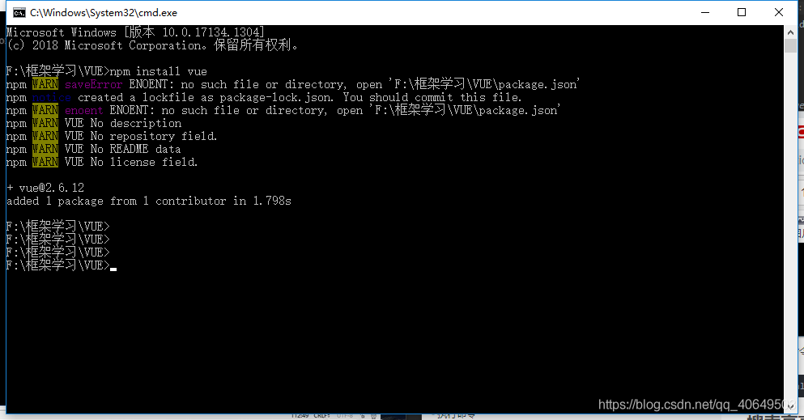


- 然后执行

```java
npm install axios
```

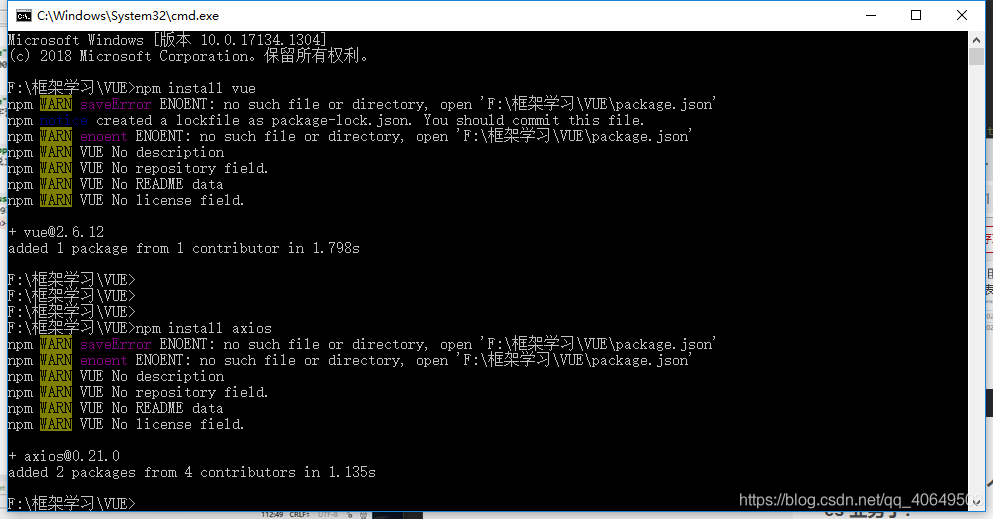


或者直接使用CDN：

```html
    <!--直接使用CDN,需要放在head中-->
    <script src="https://cdn.bootcss.com/axios/0.18.0/axios.min.js"></script>
    <script src="https://cdn.jsdelivr.net/npm/vue@2.5.16/dist/vue.min.js"></script>"

```


### 2、编写Vue代码

```vue
<!--前端使用VUE,实现前后端分离-->
<script th:src="@{/js/axios.min.js}"></script>
<script th:src="@{/js/vue.min.js}"></script>

<script>
    new Vue({
        el:'#app',
        data: {
            keyword: '',
            results: []
        },
        methods:{
            searchKey() {
                let keyword = this.keyword;
                console.log(keyword);
                axios.get('/search/'+keyword+'/0/10')
                    .then(response =>{
                        console.log(response);
                        this.results = response.data;

                })
            }
        }
    });

```

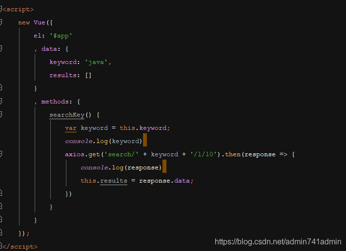


### 3、修改html代码

```html
1、对整个页面div添加id ="app",后面给Vue接管
<div class="page" id="app">
2、对搜索文本框的text使用v-model与vue进行双向绑定
     <input type="text" v-model="keyword" autocomplete="off" value="dd" id="mq"
             class="s-combobox-input" aria-haspopup="true">
                                                       
3、对submit绑定点击时间 @click.prevent=''
<button type="submit" @click.prevent="searchKey" id="searchbtn">搜索</button>

```

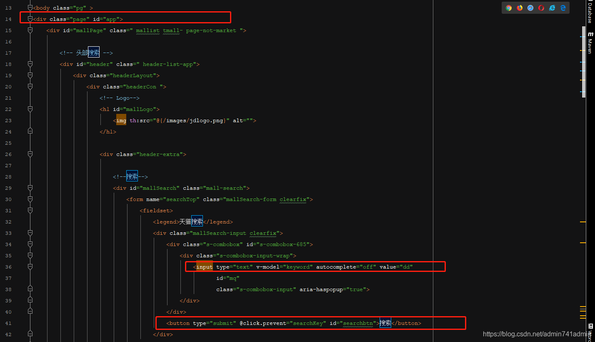


4、使用v-for遍历列表，之后获取对象属性值：

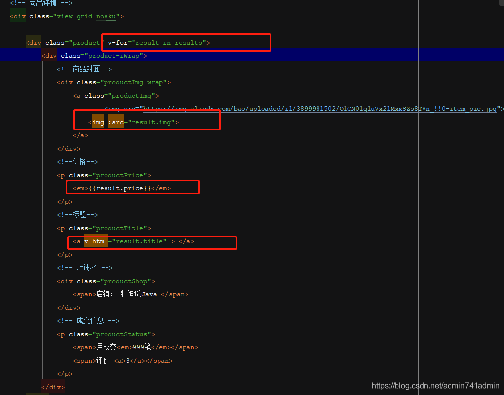


> 最后的index.html

```html
<!DOCTYPE html>
<html xmlns:th="http://www.thymeleaf.org">

<head>
    <meta charset="utf-8"/>
    <title>狂神说Java-ES仿京东实战</title>
    <link rel="stylesheet" th:href="@{/css/style.css}"/>
<!--    <script th:src="@{/js/jquery.min.js}"></script>-->
<!--    &lt;!&ndash;直接使用CDN,需要放在head中&ndash;&gt;-->
<!--    <script src="https://cdn.bootcss.com/axios/0.18.0/axios.min.js"></script>-->
<!--    <script src="https://cdn.jsdelivr.net/npm/vue@2.5.16/dist/vue.min.js"></script>-->

</head>

<body class="pg">
<div class="page" id="app">
    <div id="mallPage" class=" mallist tmall- page-not-market ">

        <!-- 头部搜索 -->
        <div id="header" class=" header-list-app">
            <div class="headerLayout">
                <div class="headerCon ">
                    <!-- Logo-->
                    <h1 id="mallLogo">
                        
                    </h1>

                    <div class="header-extra">

                        <!--搜索-->
                        <div id="mallSearch" class="mall-search">
                            <form name="searchTop" class="mallSearch-form clearfix">
                                <fieldset>
                                    <legend>天猫搜索</legend>
                                    <div class="mallSearch-input clearfix">
                                        <div class="s-combobox" id="s-combobox-685">
                                            <div class="s-combobox-input-wrap">

                                                <input   v-model="keyword" type="text"  autocomplete="off" value="a" id="mq"
                                                       class="s-combobox-input" aria-haspopup="true">
                                            </div>
                                        </div>
                                        <button type="submit" @click.prevent="searchKey" id="searchbtn">搜索</button>
                                    </div>
                                </fieldset>
                            </form>
                            <ul class="relKeyTop">
                                <li><a>狂神说Java</a></li>
                                <li><a>狂神说前端</a></li>
                                <li><a>狂神说Linux</a></li>
                                <li><a>狂神说大数据</a></li>
                                <li><a>狂神聊理财</a></li>
                            </ul>
                        </div>
                    </div>
                </div>
            </div>
        </div>

        <!-- 商品详情页面 -->
        <div id="content">
            <div class="main">
                <!-- 品牌分类 -->
                <form class="navAttrsForm">
                    <div class="attrs j_NavAttrs" style="display:block">
                        <div class="brandAttr j_nav_brand">
                            <div class="j_Brand attr">
                                <div class="attrKey">
                                    品牌
                                </div>
                                <div class="attrValues">
                                    <ul class="av-collapse row-2">
                                        <li><a href="#"> 狂神说 </a></li>
                                        <li><a href="#"> Java </a></li>
                                    </ul>
                                </div>
                            </div>
                        </div>
                    </div>
                </form>

                <!-- 排序规则 -->
                <div class="filter clearfix">
                    <a class="fSort fSort-cur">综合<i class="f-ico-arrow-d"></i></a>
                    <a class="fSort">人气<i class="f-ico-arrow-d"></i></a>
                    <a class="fSort">新品<i class="f-ico-arrow-d"></i></a>
                    <a class="fSort">销量<i class="f-ico-arrow-d"></i></a>
                    <a class="fSort">价格<i class="f-ico-triangle-mt"></i><i class="f-ico-triangle-mb"></i></a>
                </div>

                <!-- 商品详情 -->
                <div class="view grid-nosku">

                    <div class="product" v-for="result in results">
                        <div class="product-iWrap">
                            <!--商品封面-->
                            <div class="productImg-wrap">
                                <a class="productImg">
                                    
                                </a>
                            </div>
                            <!--价格-->
                            <p class="productPrice">
                                <em>{{result.price}}</em>
                            </p>
                            <!--标题-->
                            <p class="productTitle">
                                <a v-html="result.title"> </a>
                            </p>
                            <!-- 店铺名 -->
                            <div class="productShop">
                                <span>店铺： 狂神说Java </span>
                            </div>
                            <!-- 成交信息 -->
                            <p class="productStatus">
                                <span>月成交<em>999笔</em></span>
                                <span>评价 <a>3</a></span>
                            </p>
                        </div>
                    </div>
                </div>
            </div>
        </div>
    </div>
</div>

<!--前端使用VUE,实现前后端分离-->
<script th:src="@{/js/axios.min.js}"></script>
<script th:src="@{/js/vue.min.js}"></script>

<script>
    new Vue({
        el:'#app',
        data: {
            keyword: '',
            results: []
        },
        methods:{
            searchKey() {
                let keyword = this.keyword;
                console.log(keyword);
                axios.get('/search/'+keyword+'/0/10')
                    .then(response =>{
                        console.log(response);
                        this.results = response.data;

                })
            }
        }
    });


</script>

</body>
</html>
```

- > ***ddd***

- [*`11`*](https://www.bilibili.com/video/BV17a4y1x7zq)


## 5.5、搜索高亮显示

```java
//service

// 2.获取这些数据实现搜索高亮功能
    public List<Map<String, Object>> searchPageHighlightBuilder(String keyword, int pageNo, int pageSize) throws IOException {
        if (pageNo <= 0) {
            pageNo = 0;
        }

        //条件搜索
        SearchRequest searchRequest = new SearchRequest("jd_goods");
        SearchSourceBuilder sourceBuilder = new SearchSourceBuilder();
        //分页
        sourceBuilder.from(pageNo);
        sourceBuilder.size(pageSize);
        //精准匹配
        TermQueryBuilder termQueryBuilder = QueryBuilders.termQuery("title", keyword);
        sourceBuilder.query(termQueryBuilder);
        sourceBuilder.timeout(new TimeValue(60, TimeUnit.SECONDS));

        //高亮
        HighlightBuilder highlightBuilder = new HighlightBuilder();
        highlightBuilder.field("title");
        highlightBuilder.requireFieldMatch(false); //多个高亮显示
        highlightBuilder.preTags("<span style='color:red'>");
        highlightBuilder.postTags("</span>");
        sourceBuilder.highlighter(highlightBuilder);


        //执行搜索
        searchRequest.source(sourceBuilder);
        SearchResponse searchResponse = restHighLevelClient.search(searchRequest, RequestOptions.DEFAULT);
        //解析结果
        ArrayList<Map<String, Object>> list = new ArrayList<>();
        for (SearchHit hit : searchResponse.getHits().getHits()) {

            Map<String, HighlightField> highlightFields = hit.getHighlightFields();
            HighlightField title = highlightFields.get("title");
            Map<String, Object> sourceAsMap = hit.getSourceAsMap(); //原来的结果!
            //解析高亮的字段，将原来的字段换为我们高亮的字段即可!
            if (title != null) {
                Text[] fragments = title.fragments();
                String n_title = "";
                for (Text text : fragments) {
                    n_title += text;
                    sourceAsMap.put("title", n_title); //高亮字段替换掉原来的内容即可!
                }
                list.add(sourceAsMap);
            }
        }
        return list;
    }
```

> 最终结果


# 补充

## 01、Elasticsearch－基础介绍及索引原理分析

> https://www.cnblogs.com/dreamroute/p/8484457.html

最近在参与一个基于Elasticsearch作为底层数据框架提供大数据量(亿级)的实时统计查询的方案设计工作，花了些时间学习Elasticsearch的基础理论知识，整理了一下，希望能对Elasticsearch感兴趣/想了解的同学有所帮助。 同时也希望有发现内容不正确或者有疑问的地方，望指明，一起探讨，学习，进步。

### 介绍

Elasticsearch 是一个分布式可扩展的实时搜索和分析引擎,一个建立在全文搜索引擎 Apache Lucene(TM) 基础上的搜索引擎.当然 Elasticsearch 并不仅仅是 Lucene 那么简单，它不仅包括了全文搜索功能，还可以进行以下工作:

- 分布式实时文件存储，并将每一个字段都编入索引，使其可以被搜索。
- 实时分析的分布式搜索引擎。
- 可以扩展到上百台服务器，处理PB级别的结构化或非结构化数据。

### 基本概念

先说Elasticsearch的文件存储，Elasticsearch是面向文档型数据库，一条数据在这里就是一个文档，用JSON作为文档序列化的格式，比如下面这条用户数据：

```
{
    "name" :     "John",
    "sex" :      "Male",
    "age" :      25,
    "birthDate": "1990/05/01",
    "about" :    "I love to go rock climbing",
    "interests": [ "sports", "music" ]
}
```

用Mysql这样的数据库存储就会容易想到建立一张User表，有balabala的字段等，在Elasticsearch里这就是一个*文档*，当然这个文档会属于一个User的*类型*，各种各样的类型存在于一个*索引*当中。这里有一份简易的将Elasticsearch和关系型数据术语对照表:

```
关系数据库     ⇒ 数据库 ⇒ 表    ⇒ 行    ⇒ 列(Columns)

Elasticsearch  ⇒ 索引(Index)   ⇒ 类型(type)  ⇒ 文档(Docments)  ⇒ 字段(Fields)  
```

一个 Elasticsearch 集群可以包含多个索引(数据库)，也就是说其中包含了很多类型(表)。这些类型中包含了很多的文档(行)，然后每个文档中又包含了很多的字段(列)。Elasticsearch的交互，可以使用Java API，也可以直接使用HTTP的Restful API方式，比如我们打算插入一条记录，可以简单发送一个HTTP的请求：

```
PUT /megacorp/employee/1  
{
    "name" :     "John",
    "sex" :      "Male",
    "age" :      25,
    "about" :    "I love to go rock climbing",
    "interests": [ "sports", "music" ]
}
```

更新，查询也是类似这样的操作，具体操作手册可以参见[Elasticsearch权威指南](http://www.learnes.net/data/README.html)


### 索引

Elasticsearch最关键的就是提供强大的索引能力了，其实InfoQ的这篇[时间序列数据库的秘密(2)——索引](http://www.infoq.com/cn/articles/database-timestamp-02?utm_source=infoq&utm_medium=related_content_link&utm_campaign=relatedContent_articles_clk)写的非常好，我这里也是围绕这篇结合自己的理解进一步梳理下，也希望可以帮助大家更好的理解这篇文章。

Elasticsearch索引的精髓：

> 一切设计都是为了提高搜索的性能

另一层意思：为了提高搜索的性能，难免会牺牲某些其他方面，比如插入/更新，否则其他数据库不用混了。前面看到往Elasticsearch里插入一条记录，其实就是直接PUT一个json的对象，这个对象有多个fields，比如上面例子中的*name, sex, age, about, interests*，那么在插入这些数据到Elasticsearch的同时，Elasticsearch还默默[1](http://blog.pengqiuyuan.com/ji-chu-jie-shao-ji-suo-yin-yuan-li-fen-xi/#fn:1)的为这些字段建立索引--倒排索引，因为Elasticsearch最核心功能是搜索。

#### Elasticsearch是如何做到快速索引的

InfoQ那篇文章里说Elasticsearch使用的倒排索引比关系型数据库的B-Tree索引快，为什么呢？

##### 什么是B-Tree索引?

上大学读书时老师教过我们，二叉树查找效率是logN，同时插入新的节点不必移动全部节点，所以用树型结构存储索引，能同时兼顾插入和查询的性能。因此在这个基础上，再结合磁盘的读取特性(顺序读/随机读)，传统关系型数据库采用了B-Tree/B+Tree这样的数据结构：


为了提高查询的效率，减少磁盘寻道次数，将多个值作为一个数组通过连续区间存放，一次寻道读取多个数据，同时也降低树的高度。

##### 什么是倒排索引?


继续上面的例子，假设有这么几条数据(为了简单，去掉about, interests这两个field):

```
| ID | Name | Age  |  Sex     |
| -- |:------------:| -----:| -----:| 
| 1  | Kate         | 24 | Female
| 2  | John         | 24 | Male
| 3  | Bill         | 29 | Male
```

ID是Elasticsearch自建的文档id，那么Elasticsearch建立的索引如下:

**Name:**

```
| Term | Posting List |
| -- |:----:|
| Kate | 1 |
| John | 2 |
| Bill | 3 |
```

**Age:**

```
| Term | Posting List |
| -- |:----:|
| 24 | [1,2] |
| 29 | 3 |
```

**Sex:**

```
| Term | Posting List |
| -- |:----:|
| Female | 1 |
| Male | [2,3] |
```

**Posting List**

Elasticsearch分别为每个field都建立了一个倒排索引，Kate, John, 24, Female这些叫term，而[1,2]就是**Posting List**。Posting list就是一个int的数组，存储了所有符合某个term的文档id。

看到这里，不要认为就结束了，精彩的部分才刚开始...

通过posting list这种索引方式似乎可以很快进行查找，比如要找age=24的同学，爱回答问题的小明马上就举手回答：我知道，id是1，2的同学。但是，如果这里有上千万的记录呢？如果是想通过name来查找呢？

**Term Dictionary**

Elasticsearch为了能快速找到某个term，**将所有的term排个序**，二分法查找term，logN的查找效率，就像通过字典查找一样，这就是**Term Dictionary**。现在再看起来，似乎和传统数据库通过B-Tree的方式类似啊，为什么说比B-Tree的查询快呢？

**Term Index**

B-Tree通过减少磁盘寻道次数来提高查询性能，Elasticsearch也是采用同样的思路，**直接通过内存查找term，不读磁盘**，但是如果term太多，term dictionary也会很大，放内存不现实，于是有了**Term Index**，就像字典里的索引页一样，A开头的有哪些term，分别在哪页，可以理解term index是一颗树：


这棵树不会包含所有的term，它包含的是term的一些前缀。通过term index可以快速地定位到term dictionary的某个offset，然后从这个位置再往后顺序查找。


- Term Index 是一棵前缀树，可以快速定位Term Dictionary的index（类似于hash的做法，先定位前缀，然后顺序查找，这样的好处是Term index不用存储所有的term）

所以term index不需要存下所有的term，而仅仅是他们的一些前缀与Term Dictionary的block之间的映射关系，**再结合FST(Finite State Transducers)的压缩技术（有限状态转换器）**，可以使term index缓存到内存中。从term index查到对应的term dictionary的block位置之后，再去磁盘上找term，大大减少了磁盘随机读的次数。

这时候爱提问的小明又举手了:"那个FST是神马东东啊?"

一看就知道小明是一个上大学读书的时候跟我一样不认真听课的孩子，数据结构老师一定讲过什么是FST。但没办法，我也忘了，这里再补下课：

> FSTs are finite-state machines that **map** a **term (byte sequence)** to an arbitrary **output**.

假设我们现在要将mop, moth, pop, star, stop and top(term index里的term前缀)映射到序号：0，1，2，3，4，5(term dictionary的block位置)。最简单的做法就是定义个Map<string, integer="">，大家找到自己的位置对应入座就好了，但从内存占用少的角度想想，有没有更优的办法呢？答案就是：**FST**([理论依据在此，但我相信99%的人不会认真看完的](http://www.cs.nyu.edu/~mohri/pub/fla.pdf))


⭕️表示一种状态

-->表示状态的变化过程，上面的字母/数字表示状态变化和权重

将单词分成单个字母通过⭕️和-->表示出来，0权重不显示。如果⭕️后面出现分支，就标记权重，最后整条路径上的权重加起来就是这个单词对应的序号。

> FSTs are finite-state machines that map a term (**byte sequence**) to an arbitrary output.

FST以字节的方式存储所有的term，**这种压缩方式可以有效的缩减存储空间，使得term index足以放进内存**，但这种方式也会导致查找时需要更多的CPU资源。

后面的更精彩，看累了的同学可以喝杯咖啡……

#### posting list压缩技巧

Elasticsearch里除了上面说到用FST压缩term index外，对posting list也有压缩技巧。 
小明喝完咖啡又举手了:"posting list不是已经只存储文档id了吗？还需要压缩？"

嗯，我们再看回最开始的例子，如果Elasticsearch需要对同学的性别进行索引(这时传统关系型数据库已经哭晕在厕所……)，会怎样？如果有上千万个同学，而世界上只有男/女这样两个性别，每个posting list都会有至少百万个文档id。 Elasticsearch是如何有效的对这些文档id压缩的呢？

##### Frame Of Reference

> **增量编码压缩**，将大数变小数，按字节存储

首先，Elasticsearch要求posting list是有序的(为了提高搜索的性能，再任性的要求也得满足)，这样做的一个好处是方便压缩，看下面这个图例： 

如果数学不是体育老师教的话，还是比较容易看出来这种压缩技巧的。

原理就是通过增量，将原来的大数变成小数仅存储增量值，再精打细算按bit排好队，最后通过字节存储，而不是大大咧咧的尽管是2也是用int(4个字节)来存储。

##### Roaring bitmaps


说到Roaring bitmaps，就必须先从bitmap说起。Bitmap（位图）是一种数据结构，假设有某个posting list：

[1,3,4,7,10]

对应的bitmap就是：

[1,0,1,1,0,0,1,0,0,1]

非常直观，用0/1表示某个值是否存在，比如10这个值就对应第10位，对应的bit值是1，这样用一个字节就可以代表8个文档id，旧版本(5.0之前)的**Lucene**就是用这样的方式来压缩的，但这样的压缩方式仍然不够高效，如果有1亿个文档，那么需要12.5MB的存储空间，这仅仅是对应一个索引字段(我们往往会有很多个索引字段)。于是有人想出了Roaring bitmaps这样更高效的数据结构。

**Bitmap的缺点是存储空间随着文档个数线性增长**，Roaring bitmaps需要打破这个魔咒就一定要用到某些指数特性：

将posting list按照65535为界限分块，比如第一块所包含的文档id范围在0~65535之间，第二块的id范围是65536~131071，以此类推。再用==<商，余数>==的组合表示每一组id，这样每组里的id范围都在0~65535内了，剩下的就好办了，既然每组id不会变得无限大，那么我们就可以通过最有效的方式对这里的id存储。


细心的小明这时候又举手了:"为什么是以65535为界限?"

**程序员的世界里除了1024外，65535也是一个经典值，因为它=2^16-1，正好是用2个字节能表示的最大数，一个short的存储单位**，注意到上图里的最后一行“If a block has more than 4096 values, encode as a bit set, and otherwise as a simple array using 2 bytes per value”，如果是大块，用节省点用bitset存，小块就豪爽点，2个字节我也不计较了，用一个short[]存着方便。

那为什么用4096来区分大块还是小块呢？

个人理解：都说程序员的世界是二进制的，4096*2bytes ＝ 8192bytes < 1KB, 磁盘一次寻道可以顺序把一个小块的内容都读出来，再大一位就超过1KB了，需要两次读。


#### 联合索引

上面说了半天都是单field索引，如果多个field索引的联合查询，倒排索引如何满足快速查询的要求呢？

- 利用**跳表(Skip list)的数据结构快速做“与”运算**，或者
- 利用上面提到的bitset按位“与”

先看看跳表的数据结构：


将一个有序链表level0，挑出其中几个元素到level1及level2，每个level越往上，选出来的指针元素越少，查找时依次从高level往低查找，比如55，先找到level2的31，再找到level1的47，最后找到55，**一共3次查找，查找效率和2叉树的效率相当，但也是用了一定的空间冗余来换取的**。

- 原本有序链表的查找是O（N）

假设有下面三个posting list需要联合索引：


如果使用跳表，对最短的posting list中的每个id，逐个在另外两个posting list中查找看是否存在，最后得到交集的结果。

如果使用bitset，就很直观了，直接按位与，得到的结果就是最后的交集。

### 总结和思考

Elasticsearch的索引思路:

> 将磁盘里的东西尽量搬进内存，减少磁盘随机读取次数(同时也利用磁盘顺序读特性)，结合各种奇技淫巧的压缩算法，用及其苛刻的态度使用内存。

所以，对于使用Elasticsearch进行索引时需要注意:

- 不需要索引的字段，一定要明确定义出来，因为默认是自动建索引的
- 同样的道理，对于String类型的字段，不需要analysis的也需要明确定义出来，因为默认也是会analysis的
- 选择有规律的ID很重要，随机性太大的ID(比如java的UUID)不利于查询

关于最后一点，个人认为有多个因素:

其中一个(也许不是最重要的)因素: 上面看到的压缩算法，都是对Posting list里的大量ID进行压缩的，那如果ID是顺序的，或者是有公共前缀等具有一定规律性的ID，压缩比会比较高；

另外一个因素: 可能是最影响查询性能的，应该是最后通过Posting list里的ID到磁盘中查找Document信息的那步，因为Elasticsearch是分Segment存储的，根据ID这个大范围的Term定位到Segment的效率直接影响了最后查询的性能，如果ID是有规律的，可以快速跳过不包含该ID的Segment，从而减少不必要的磁盘读次数，具体可以参考这篇[如何选择一个高效的全局ID方案](http://blog.mikemccandless.com/2014/05/choosing-fast-unique-identifier-uuid.html)(评论也很精彩)


## 02、elasticsearch+logstash+kibana+redis（例子）

> 参考：https://www.huaweicloud.com/articles/3269abb067690d6d684db8397af89d77.html

拓扑图：


根据拓扑图精简一下这个实验：

一台web server + logstash (真正生产可能是若干台) ===>192.168.1.13

一台redis(生产下一般会是主备，消息队列的作用) ===>192.168.1.12

一台logstash server (整合数据流的作用) ===>192.168.1.11

一台elasticsearch+kibana(生产中一般会是ES集群) ===>192.168.1.10


- 实际操作

接下来在logstash server这台机器上操作

logstash安装不再演示

```javascript
vim fromredis.conf
input { redis { port => "6379" host => "192.168.1.12" data_type => "list" key => "logstash-Apache" }
}

output { stdout { codec => rubydebug }
}

测试语法是否正确：
[root@linux-node2 conf.d]# logstash -f /etc/logstash/conf.d/fromredis.conf --configtest
Configuration OK
运行：
[root@linux-node2 conf.d]# logstash -f /etc/logstash/conf.d/fromredis.conf
```

至这里，运行结果会把收集到的日志信息，标准输入至屏幕；

打开浏览器输入"http://192.168.1.13" 刷新几次，你会发现logstach server 这台服务器的屏幕会出现日志滚动信息，都是刚刚刷新收集到的最新日志信息；

## 03、Elasticsearch: 权威指南

> https://www.elastic.co/guide/cn/elasticsearch/guide/2.x/index.html
>
> https://hezhiqiang.gitbook.io/elasticsearch/getting_started/api


## 04、es的date类型

> https://blog.csdn.net/lijingjingchn/article/details/100576088

### 1. 概述

#### 1.1 Date 数据类型

Elasticsearch 数据是以 `json`格式存储的，而 `json`中是并没有 `date` 数据类型，因此 Elasticsearch 中虽然有 `date` 类型，但在展示时却要转化成另外的格式。

**`date` 类型在 Elasticsearch 展示的格式有下面几种：**

- 将日期时间格式化后的字符串，如 `"2015-01-01"` 或者 `"2015/01/01 12:10:30"`
- `long` 型的整数，意义是 `milliseconds-since-the-epoch`，翻译一下就是自 1970-01-01 00:00:00 UTC 以来经过的毫秒数。
- `int` 型的整数，意义是 `seconds-since-the-epoch,` 是指自 1970-01-01 00:00:00 UTC 以来经过的秒数。

**UTC**

`UTC(Universal Time Coordinated)` 叫做世界统一时间，中国大陆和 `UTC` 的时差是 `+ 8` ,也就是 `UTC+8`。

不论 date 是什么展示格式，在 Elasticsearch 内部存储时都是转换成 UTC，并且把时区也会计算进去，从而得到 milliseconds-since-the-epoch 并作为存储的格式。


**日期查询**

在es内部，`date`被转为`UTC`，并被存储为一个长整型数字，代表从1970年1月1号0点到现在的毫秒数

date类型字段上的查询会在内部被转为对`long`型值的范围查询，查询的结果类型是字符串。

- 假如插入的时候，值是`"2018-01-01"`，则返回`"2018-01-01"`
- 假如插入的时候，值是`"2018-01-01 12:00:00"`，则返回`"2018-01-01 12:00:00"`
- 假如插入的时候，值是`1514736000000`，则返回`"1514736000000"`。(进去是long型，出来是String型)

在查询日期时，会执行下面的过程：

- 转换成 long 整形格式的范围(range) 查询
- 得到聚合的结果
- 将结果中的 date 类型（long 整型数据）根据 date format 字段转换回对应的展示格式

**`date`的默认格式**

`date`格式可以在`put mapping`的时候用 `format` 参数指定，如果不指定的话，则启用默认格式，是"`strict_date_optional_time||epoch_millis`"。这表明只接受符合"`strict_date_optional_time`"格式的字符串值，或者`long`型数字。

`strict_date_optional_time`是`date_optional_time`的严格级别，这个严格指的是年份、月份、天必须分别以4位、2位、2位表示，不足两位的话第一位需用0补齐。不满足这个格式的日期字符串是放不进`es`中的。

```
date-opt-time = date-element ['T' [time-element] [offset]]
date-element = std-date-element | ord-date-element | week-date-element
std-date-element = yyyy ['-' MM ['-' dd]]
ord-date-element = yyyy ['-' DDD]
week-date-element = xxxx '-W' ww ['-' e]
time-element = HH [minute-element] | [fraction]
minute-element = ':' mm [second-element] | [fraction]
second-element = ':' ss [fraction]
fraction = ('.' | ',') digit+
123456789
```

实测，仅支持如下格式：

- “`yyyy-MM-dd`”
- “`yyyyMMdd`”
- “`yyyyMMddHHmmss`”
- “`yyyy-MM-ddTHH:mm:ss`”
- “`yyyy-MM-ddTHH:mm:ss.SSS`”
- “`yyyy-MM-ddTHH:mm:ss.SSSZ`”，

不支持常用的"`yyyy-MM-dd HH:mm:ss`"等格式。

> 注意：
> “`T`“和”`Z`“是固定的字符，在获取”`yyyy-MM-ddTHH:mm:ss`”、"`yyyy-MM-ddTHH:mm:ss.SSS`"、"`yyyy-MM-ddTHH:mm:ss.SSSZ`"格式字符串值时，不能直接以前面格式格式化`date`，而是需要多次格式化date并且拼接得到。

```
epoch_millis`约束值必须大于等于`Long.MIN_VALUE`，小于等于`Long.MAX_VALUE
```

##### format参数

**`date`类型字段除了`type`参数必须指定为`date`外，还有一个常用的参数 `format` 。**可以通过该参数来显式指定`es`接受的`date`格式，如果有多个的话，多个`date`格式需用`||`分隔。之后`index/create/update`操作时，将依次匹配，如果匹配到合适的格式，则会操作成功，并且查询时，该文档该字段也会以该格式展示。否则，操作不成功。如

```sh
PUT my_index
{
  "mappings": {
    "_doc": {
      "properties": {
        "updated_date": {
          "type":   "date",
          "format": "yyyy-MM-dd HH:mm:ss||yyyy-MM-dd||epoch_millis"
        }
      }
    }
  }
}
```

### 2. `java`操作`es date`类型最佳实践：

创建索引时指定`date`类型`format`为"`yyyy-MM-dd HH:mm:ss`"，限制只能接受"`yyyy-MM-dd HH:mm:ss`"格式的`date`==字符串==

在代码中把`Date`实例或者`LocalDateTime`实例先转化为 "`yyyy-MM-dd HH:mm:ss`“格式的字符串后再存进去，这样取出来时也是”`yyyy-MM-dd HH:mm:ss`"格式。

es中用的也是Java代码：

```sh
GET /twitter/_search
{
    "script_fields": { 
    "now": { 
     "script": "new SimpleDateFormat(\"yyyy-MM-dd HH:mm:ss\" ).format(new Date())"
    } 
    } 
}

```

```sh
{
  "took" : 8,
  "timed_out" : false,
  "_shards" : {
    "total" : 1,
    "successful" : 1,
    "skipped" : 0,
    "failed" : 0
  },
  "hits" : {
    "total" : {
      "value" : 2,
      "relation" : "eq"
    },
    "max_score" : 1.0,
    "hits" : [
      {
        "_index" : "twitter",
        "_type" : "_doc",
        "_id" : "2",
        "_score" : 1.0,
        "fields" : {
          "now" : [
            "2021-07-20 17:27:04"
          ]
        }
      }
    ]
  }
}

```


